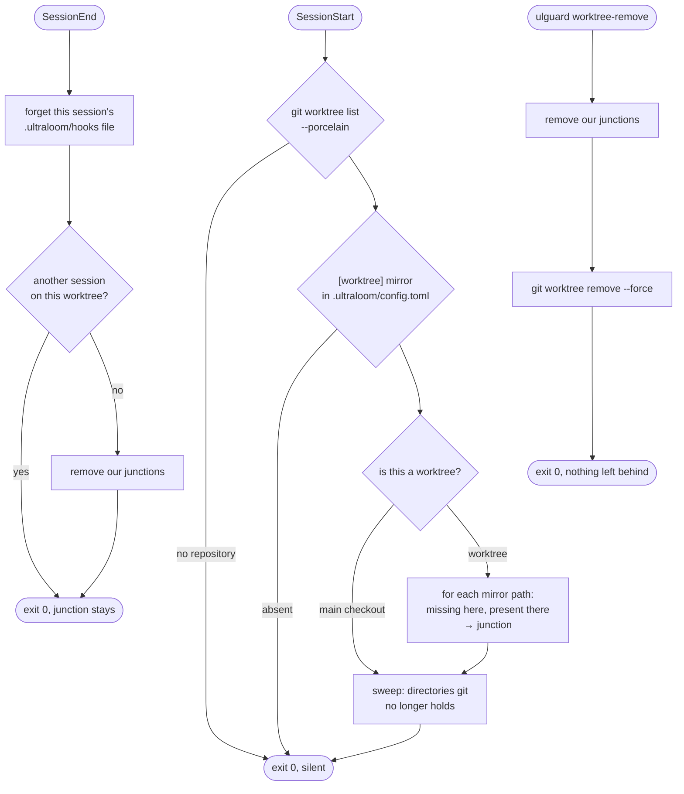

# Worktree-Spiegelung — Umsetzungsplan

> **For agentic workers:** REQUIRED SUB-SKILL: Use
> superpowers:subagent-driven-development (recommended) or
> superpowers:executing-plans to implement this plan task-by-task. Steps use
> checkbox (`- [ ]`) syntax for tracking.

**Goal:** `ulguard` legt gitignorierte Verzeichnisse eines git-Worktrees als
Windows-Junction auf den Haupt-Checkout, löst sie wieder und sammelt verwaiste
ein — datengetrieben aus `[worktree] mirror` in `.ultraloom/config.toml`.

**Architecture:** Vier neue Go-Pakete unter `internal/` (Konfigleser,
Junction-Primitive, Worktree-Topologie, Sitzungszählung), verdrahtet zu drei
Subkommandos in `cmd/guard`. Die Konfiguration ist getrackt und wandert damit
von sich aus in jeden Worktree; das Binary liegt global auf PATH und braucht
keine Laufzeit im Projekt — beides Vorbedingungen dafür, dass der Mechanismus
das Fehlen von `.ultraloom/vendor` überhaupt beheben kann.

**Tech Stack:** Go 1.22, `github.com/BurntSushi/toml` v1.6.0 (vorhanden),
`golang.org/x/sys` v0.18.0 (heute indirekt, wird direkt), `git` als
Unterprozess. Kein `cmd /c mklink`, kein `os.Symlink`.

**Spec:** `docs/.superpowers/specs/2026-09-07-worktree-mirror-design.md`

## Korrekturen nach der Umsetzung

Alle acht Tasks sind umgesetzt und reviewt (Ledger:
`.superpowers/sdd/2026-09-07-worktree-mirror/progress.md`). Jeder Punkt hier
ist eine Stelle, an der eine Messung während der Umsetzung diesem Plan
widersprochen hat — gesammelt, damit der Plan sie nicht weiter lehrt. Wo der
Fehler eine Zahl oder ein einzelner Satz war, ist er unten zusätzlich an der
Stelle selbst korrigiert und mit `Kn` markiert.

**K1 — Go-Coverage-Schwelle.** „≥ 98,5 %" (Global Constraints, und noch einmal
in Task 5, Step 4) war aus einer *Beispielzeile* der README abgelesen. Der
konfigurierte Boden ist 98,0 (`.ultraloom/config.toml:84`,
`hooks/coverage-check.py 98.0`). Am Ende von Task 6 stand der Baum bei 98,4 %.

**K2 — `--git-dir` gegen `--git-common-dir`.** Der Plan schrieb, aus einem
Worktree dieses Repositorys antworte Git „dasselbe Verzeichnis in zwei
Schreibweisen" (Task 3, Paketdoku und Commit-Nachricht). Falsch, selbst
nachgemessen am 2026-09-07: aus `.worktrees/worktree-mirror` antwortet
`--git-dir` `…/.git/worktrees/worktree-mirror` und `--git-common-dir`
`…/.git` — zwei verschiedene absolute Verzeichnisse. `CLAUDE.md` ist deswegen
**nicht** falsch: seine Messung kam aus
`.claude/worktrees/opus-5-enforcement-57de82`, einem Verzeichnis, das den Index
*teilt* und kein Worktree ist. Dort sind die zwei Antworten wirklich ein
Verzeichnis in zwei Schreibweisen, und ein Textvergleich liefert ein
falsch-positives „Worktree". Das Verbot steht, nur diese Begründung war falsch.
Die Commit-Nachricht von `de8a4eb` trägt den Satz weiter: sie ist nicht HEAD,
und ein `--amend` löst das teure Commit-Gate aus.

**K3 — `filepath.IsLocal` ist nicht „the whole test on both platforms".** Auf
POSIX ist ein Backslash ein gewöhnliches Byte, `IsLocal("C:\absolute")` ist
dort also *wahr*. Der Fixture-Fall gilt nur unter Windows.

**K4 — TOML-Fixtures brauchen *literal strings*.** `mirror = ["C:\absolute"]`
stirbt im Parser an `invalid escape '\a'`; der Verweigerungstest war damit aus
dem falschen Grund grün. Mit `'…'` geschrieben prüft er, was er prüfen soll.

**K5 — `x/sys` v0.18.0 trägt das Reparse-Layout doch.** Nur unexportiert:
`symbolicLinkReparseBuffer`, `mountPointReparseBuffer` und `reparseDataBuffer`
(`types_windows.go:1870,1879,1887`), intern benutzt in
`syscall_windows.go:1485-1493`. „x/sys carries the tag and the ioctl but not
the layout" ist daher zu kurz — von außen unbenutzbar ist die richtige
Begründung fürs Selberschreiben. (Ein Review behauptete zuerst das Gegenteil,
„kein Layout überhaupt", und lag ebenfalls falsch.)

**K6 — `var _ = unsafe.Sizeof(uintptr(0))` hielt nichts honest.** Die Zeile war
Zierde und ihr Kommentar eine falsche Behauptung über den Compiler. Zeile und
`unsafe`-Import sind bei der Umsetzung gestrichen worden; die Escape-Hatch
dieses Plans wurde also genommen.

**K7 — `Target` über `os.Lstat` plus `os.Readlink` funktioniert nicht.** Unter
der Voreinstellung ab `go 1.23` (`GODEBUG=winsymlink=1,winreadlinkvolume=1`)
meldet `Lstat` für eine Junction `?rw-rw-rw-` — `ModeIrregular`, **kein**
`ModeSymlink` —, und der Plan-Code hätte für eine echte Junction `""` ohne
Fehler geliefert, also einen blinden Sweep. Umgestellt auf
`GetFileAttributes` plus `FSCTL_GET_REPARSE_POINT`, Signatur unverändert.

**K8 — der gespeicherte Trenner am Ende ist nicht kanonisch.** Gemessen am
2026-09-07: `junction.Create` speichert `\??\C:\dir\` **mit** Trenner,
`mklink /J` speichert `\??\C:\dir` **ohne**, und beides löst auf. `Create`
wurde deshalb *nicht* angeglichen — es gibt keinen Defekt dahinter. Folge, und
sie ist zwingend: jeder Vergleich läuft über Identität (`os.SameFile`) oder
über `filepath.Clean` auf **beiden** Seiten, nie über Text. Ein Textvergleich
brach genau an den von Hand gelegten Junctions, die `space` schon trägt.

**K9 — `sameDir` war in Task 3 zweimal spezifiziert**, in der Implementierung
*und* in der Testdatei desselben Pakets. So übernommen kompiliert das nicht
(`sameDir redeclared in this block`).

**K10 — `parse`-Erwartung `"/a"` ist unter Windows falsch**, weil
`filepath.Clean` `\a` antwortet. Als echtes ROT gemessen.

**K11 — der Suchraum-Lesefehler entsteht nicht über eine *Datei* namens
`.worktrees`.** Unter Windows antwortet `os.ReadDir` darauf
`ERROR_PATH_NOT_FOUND`, `os.IsNotExist` ist **wahr**, und `Orphans`
überspringt sie stillschweigend. Was die Anweisung wirklich erreicht, ist ein
per ACL unlesbares Verzeichnis; vier Kandidaten wurden dafür durchgemessen.

**K12 — `stripNTPrefix` wird in Task 4 genannt und nirgends geschrieben.** Die
Regel: ein führendes `\??\` oder `\?\` abschneiden, alles andere unverändert
durchlassen, dann `filepath.Clean` — der Clean nimmt auch den Trenner aus K8
weg. Der Kommentar des Plans, keines der beiden Präfixe sei „part of a path a
Go call opens", ist für `\?\` außerdem falsch: `os` erzeugt diese Form selbst
in `fixLongPath`.

**K13 — Testhelfer sind in Tasks 4, 5 und 6 benannt und nicht ausgeschrieben**
(`requireWindows`, `worktreeFixture`, `writeConfig`, `mkdirAll`, `writeFile`,
`unregister`, `writeSessionState`, `registered`). Die Prosa war eindeutig
genug; jeder Auftrag trug die Liste mit einem Satz pro Helfer nach.

**K14 — `sweep` und `unlink` fehlt im Plan `standsInside`, und das ist ein
echter Fehler.** `filepath.Join(dir, relative)` stellt „innerhalb" nur über die
Schreibweise fest, und `FILE_FLAG_OPEN_REPARSE_POINT` bewahrt allein die
**letzte** Komponente vor dem Verfolgen. Mit `mirror = [".ultraloom/vendor"]`,
einer von Hand gelegten Junction an `<dir>/.ultraloom` in den Haupt-Checkout
hinein und `main/.ultraloom/vendor` selbst als Junction lesen alle drei
Eigentumsbedingungen als erfüllt — und der Sweep entfernt die Junction **des
Haupt-Checkouts**, also die gepinnte Laufzeit, die jeder andere Hook braucht,
stillschweigend; `link` kann sie dort nicht ersetzen, weil `IsWorktree(main)`
falsch ist. Vor dem Fix reproduziert, dann behoben: jede Komponente strikt
zwischen `dir` und dem Kandidaten muss per `os.Lstat` ein einfaches
Verzeichnis sein. Beide Aufrufer brauchen es, `unlink` genauso wie `sweep`.

**K15 — „the sweep only ever reaches directories git has already given up on"
ist falsch.** `Orphans` heißt *unregistriert*, nicht *aufgegeben*: ein
Verzeichnis der Art, die `CLAUDE.md` beschreibt — teilt den Haupt-Index, ist
kein Worktree — ist lebende Arbeit und wird als Waise genannt. Der Sweep ist
nur deshalb sicher, weil er zusätzlich einen Reparse-Point an einem
konfigurierten Pfad mit Ziel im Haupt-Checkout verlangt. Die Folge ist gewollt
und in `docs/flows/worktree-mirror.md` dokumentiert: so ein Verzeichnis wird
gefegt, auch während jemand darin arbeitet, und `link` legt die Junction dort
nicht wieder an. Verloren ist eine Junction, nie Daten.

**K16 — drei Zweige aus Task 4 sind unerreichbar** und bei der Umsetzung
gestrichen oder ersetzt worden: `!errors.Is(ErrNoRepository)`, weil
`worktreetopo.Read` das Sentinel um **beide** Fehlerrückgaben wickelt;
`!os.IsNotExist` nach `Lstat` in `link`, weil der Stat des Ziels auf demselben
relativen Pfad davor steht (so ein Pfad scheitert jetzt laut an `Create`s
`Mkdir`); und der Sweep-Test des Plans prüfte nichts, weil
`git worktree remove --force` untracked files löscht, solange kein
Reparse-Point es blockiert — die Datei muss **nach** `unregister` geschrieben
werden.

**K17 — `sessionStale` steht auf 24 h, nicht auf 12 h.** Die Asymmetrie ist
nicht knapp: lang zu irren lässt eine Junction stehen, die keinen Platz
kostet, die `link` als vorhanden überspringt und die `sweep` mitnimmt, wenn der
Worktree geht; kurz zu irren zieht sie einer laufenden Sitzung oder einem
offenen Godot-Editor weg, der 4,2 GB dadurch liest. Dazu: die Begründung des
Plans zählte die Schreiber falsch. Es sind vier —
`session_start.py:59`, `stop.py:250` und `:283`, und
`subagent_start.py:38`, letzterer bedingungslos bei **jedem** Subagentenstart.
Und keine Zahl schließt das Loch: der eigentliche Fix ist ein Schreibvorgang
auf der lebenden Seite. Folgearbeit, nicht gebaut.

**K18 — `safeName` darf nicht ASCII-only sein.** `state.py`s Regel ist
`char.isalnum()`, und das ist Unicode: in CPython über alle 0x110000
Codepunkte durchgezählt ist `isalnum()` genau für die Kategorien L* und N*
wahr, also genau `unicode.IsLetter || unicode.IsNumber`. Eine ASCII-Variante
suchte `unnamed.json`, wo Python den Buchstaben geschrieben hat.

**K19 — `bash rm -rf` bleibt nicht an dem Rest hängen.** Der Plan behauptet an
drei Stellen, `rm -rf` weigere sich, das Übriggebliebene wegzuräumen. Das
reproduziert nicht; siehe die gleiche Korrektur in der Spec. Die tragende
Messung — `git worktree remove --force` lässt Verzeichnis und Junction stehen
und meldet Exit 0 — ist bestätigt, inzwischen viermal.

**K20 — `runWorktreeRemove` aus Task 6 hat drei Defekte.** Erstens verweigert
`IsWorktree(target)` den Haupt-Checkout zwar, aber mit der Meldung „git does
not hold %s as a worktree", und die ist falsch über den Pfad, den Git in
seinem eigenen Porcelain zuerst nennt: der Haupt-Checkout braucht eine eigene
Verweigerung davor. Zweitens wird mit `command.Dir = topology.Main` ein
relatives Argument in *einem* Verzeichnis geprüft und in einem *anderen*
gelöscht — weitergegeben wird deshalb Gits eigene Schreibweise aus dem
Porcelain. Drittens druckt der Plan `removed %s` auf Gits Exit 0, ohne
nachzusehen: bei einer Junction, die die Konfiguration nicht nennt, bleibt das
Verzeichnis stehen und das Kommando meldete Erfolg über genau dem Müll, den es
verhindern soll. Ein `os.Lstat` davor macht daraus einen gemeldeten Fehler.
Ein Test hat den Wert der Identitätsvergleiche dabei bewiesen: mit einem
Textvergleich statt `sameDir` rutscht `main` plus Pfadtrenner an **beiden**
Verweigerungen vorbei.

**K21 — Task 7 schreibt `~/.claude/settings.json` nicht.** Die Datei liegt in
einem eigenen Repository außerhalb dieses Projekts; die zwei Hook-Einträge
gehen als Vorschlag an ihren Eigentümer und stehen in
`docs/flows/worktree-mirror.md`. Damit ist auch **nicht** gemessen, ob ein
`SessionEnd`-Ereignis hier tatsächlich ankommt (Step 2 dieses Tasks ist
ausgefallen). Kommt es nicht an, verliert `worktree-unlink` seinen Aufhänger,
und der Sweep in `worktree-link` sowie `worktree-remove` bleiben die zwei
Aufräumwege.

---

## Global Constraints

- **Sprache:** Kommentare, Docstrings, Fehlermeldungen, Commit-Nachrichten
  englisch. Prosa in `docs/` deutsch mit `.de.md`, englisch ohne Suffix.
  Arbeitspapiere unter `docs/.superpowers/` bleiben unübersetzt.
- **Commits:** Nutzer als Author und Committer, kein `Co-Authored-By` für
  Modell oder Agent.
- **Gate:** `uv run ultraloom check all` muss grün sein. Python-Coverage 100 %,
  Go-Coverage ≥ 98,0 % (`.ultraloom/config.toml:84`; heute 98,4 %, K1).
  Jeder Ausschluss mit Begründung.
- **Arbeitsverzeichnis:** Worktree `.worktrees/worktree-mirror`, Zweig
  `claude/worktree-mirror`, HEAD beim Start `1ddc70c`.
- **Vor dem ersten Gate-Lauf im Worktree:** `go build -o ulinit.exe ./cmd/init`
  und `go build -o ulguard.exe ./cmd/guard`. Beide `.exe` sind gitignoriert
  (`.gitignore:33,35`), fehlen im Worktree, und ohne sie stirbt der
  Gate-Eintrag `./ulinit check gofmt`.
- **Bekannter Flatterer:** `tests/test_cli.py::test_check_all_waits_for_the_checks_at_the_same_time`
  misst Wanduhr (`< 1.2s` für drei 0,5-s-Schlafen, `tests/test_cli.py:429`) und
  fällt unter Last um. Einzeln nachfahren, bevor er als Regression gilt.
- **Kein Push.** Ein Lauf darf committen; ob Commits das Remote erreichen,
  entscheidet ein Mensch.
- **Zielplattform Windows.** Jedes Paket, das Reparse-Points anfasst, bekommt
  eine `_windows.go`- und eine `_other.go`-Datei; die zweite gibt einen
  benannten Fehler zurück, damit `go vet` und `go test` auf einer anderen
  Plattform durchlaufen.

---

## File Structure

| Datei | Verantwortung |
|---|---|
| `internal/mirrorcfg/mirrorcfg.go` | liest `[worktree] mirror` aus `.ultraloom/config.toml`; drei No-op-Fälle zu leerer Liste |
| `internal/junction/junction.go` | plattformunabhängige Fassade: `Kind`, `Target`, `Remove` |
| `internal/junction/junction_windows.go` | `Create` über `DeviceIoControl(FSCTL_SET_REPARSE_POINT)` |
| `internal/junction/junction_other.go` | `Create` gibt `ErrUnsupported` zurück |
| `internal/worktreetopo/worktreetopo.go` | `git worktree list --porcelain` lesen: Haupt-Checkout, Worktree-Liste, Suchraum für Waisen |
| `internal/sessions/sessions.go` | zählt und räumt `.ultraloom/hooks/<id>.json` |
| `cmd/guard/worktree.go` | die drei Subkommandos |
| `cmd/guard/main.go` | Dispatch um drei Namen erweitert |
| `docs/flows/worktree-mirror.md` / `.de.md` | Ablauf mit Mermaid-Graph |
| `README.md` / `README.de.md` | die drei Kommandos im Abschnitt zu `ulguard` |

---

### Task 1: Konfigleser für `[worktree] mirror`

**Files:**
- Create: `internal/mirrorcfg/mirrorcfg.go`
- Test: `internal/mirrorcfg/mirrorcfg_test.go`

**Interfaces:**
- Consumes: nichts.
- Produces: `func Mirror(root string) ([]string, error)` — die konfigurierten
  Pfade in Reihenfolge der Datei, slash-normalisiert und relativ; leere Liste
  und `nil`-Fehler für jeden der drei No-op-Fälle.

- [ ] **Step 1: Write the failing test**

```go
package mirrorcfg

import (
	"os"
	"path/filepath"
	"slices"
	"testing"
)

func write(t *testing.T, root, body string) {
	t.Helper()
	if err := os.MkdirAll(filepath.Join(root, ".ultraloom"), 0o755); err != nil {
		t.Fatal(err)
	}
	path := filepath.Join(root, ".ultraloom", "config.toml")
	if err := os.WriteFile(path, []byte(body), 0o644); err != nil {
		t.Fatal(err)
	}
}

func TestMirrorReadsTheConfiguredPaths(t *testing.T) {
	root := t.TempDir()
	write(t, root, "[worktree]\nmirror = [\".tools\", \".ultraloom/vendor\"]\n")

	got, err := Mirror(root)
	if err != nil {
		t.Fatalf("Mirror: %v", err)
	}
	if !slices.Equal(got, []string{".tools", ".ultraloom/vendor"}) {
		t.Fatalf("Mirror = %q, want the two configured paths in order", got)
	}
}

// The three ways of having nothing to do, all of them an empty answer and no
// error: a hook that fires in every project must not report any of them.
func TestTheThreeNoOpCases(t *testing.T) {
	t.Run("no config file", func(t *testing.T) {
		got, err := Mirror(t.TempDir())
		if err != nil || len(got) != 0 {
			t.Fatalf("Mirror = %q, %v; want empty and nil", got, err)
		}
	})
	t.Run("config without the section", func(t *testing.T) {
		root := t.TempDir()
		write(t, root, "[verify]\nlint = \"ruff check .\"\n")
		got, err := Mirror(root)
		if err != nil || len(got) != 0 {
			t.Fatalf("Mirror = %q, %v; want empty and nil", got, err)
		}
	})
	t.Run("section without the key", func(t *testing.T) {
		root := t.TempDir()
		write(t, root, "[worktree]\n")
		got, err := Mirror(root)
		if err != nil || len(got) != 0 {
			t.Fatalf("Mirror = %q, %v; want empty and nil", got, err)
		}
	})
}

// A path that climbs out of the project would junction something outside it.
func TestMirrorRefusesAPathThatLeavesTheProject(t *testing.T) {
	// TOML *literal* strings, or the parser dies at `invalid escape '\a'`
	// before Mirror is ever called and the refusal is green for the wrong
	// reason (K4). `C:\absolute` only leaves the project on Windows (K3).
	for _, entry := range []string{"../elsewhere", "/absolute", "C:\\absolute", ".tools/../.."} {
		root := t.TempDir()
		write(t, root, "[worktree]\nmirror = ['"+entry+"']\n")
		if _, err := Mirror(root); err == nil {
			t.Fatalf("%q was accepted", entry)
		}
	}
}

// Damage is an error, never an empty answer: read as "nothing to mirror", a
// broken file would switch the whole mechanism off without a word.
func TestBrokenTomlIsAnError(t *testing.T) {
	root := t.TempDir()
	write(t, root, "[worktree\nmirror = ")
	if _, err := Mirror(root); err == nil {
		t.Fatal("broken toml was read as an empty answer")
	}
}

func TestAMirrorThatIsNotAListOfStringsIsAnError(t *testing.T) {
	root := t.TempDir()
	write(t, root, "[worktree]\nmirror = \".tools\"\n")
	if _, err := Mirror(root); err == nil {
		t.Fatal("a string was accepted where a list belongs")
	}
}
```

- [ ] **Step 2: Run test to verify it fails**

Run: `go test ./internal/mirrorcfg/`
Expected: FAIL — das Paket existiert nicht (`no Go files` bzw. `undefined: Mirror`).

- [ ] **Step 3: Write minimal implementation**

```go
// Package mirrorcfg reads which directories a worktree must not own itself.
//
// Its own package because the answer is needed before anything else can run
// and by more than one subcommand -- and because it is the only place that
// decides what a configured path may look like.
package mirrorcfg

import (
	"fmt"
	"os"
	"path/filepath"
	"strings"

	"github.com/BurntSushi/toml"
)

// file is the shape this package reads out of config.toml, and nothing else.
// Every other table in that file belongs to the Python side; an unknown one is
// no concern of ours, which is what the pointer expresses: absent stays absent.
type file struct {
	Worktree *struct {
		Mirror []string `toml:"mirror"`
	} `toml:"worktree"`
}

// Mirror returns the configured paths, in the order the file names them.
//
// Three ways of having nothing to do, all of them an empty list and no error:
// no `config.toml`, a `config.toml` without `[worktree]`, and a `[worktree]`
// without `mirror`. A hook that fires in every project on the machine meets
// all three constantly, and reporting any of them as a failure would train
// its user to ignore it.
//
// Damage is the opposite case and *is* an error. Read as "nothing to mirror",
// a broken file would switch the mechanism off silently -- and the thing being
// switched off is what puts `.ultraloom/vendor` in place, so the next symptom
// would be every other hook failing for an unrelated-looking reason.
func Mirror(root string) ([]string, error) {
	path := filepath.Join(root, ".ultraloom", "config.toml")
	data, err := os.ReadFile(path)
	if err != nil {
		if os.IsNotExist(err) {
			return nil, nil
		}
		return nil, fmt.Errorf("reading %s: %w", path, err)
	}
	var parsed file
	if err := toml.Unmarshal(data, &parsed); err != nil {
		return nil, fmt.Errorf("parsing %s: %w", path, err)
	}
	if parsed.Worktree == nil || len(parsed.Worktree.Mirror) == 0 {
		return nil, nil
	}
	cleaned := make([]string, 0, len(parsed.Worktree.Mirror))
	for _, entry := range parsed.Worktree.Mirror {
		relative, err := inside(entry)
		if err != nil {
			return nil, fmt.Errorf("%s: [worktree].mirror: %w", path, err)
		}
		cleaned = append(cleaned, relative)
	}
	return cleaned, nil
}

// inside refuses a path that does not stay below the project.
//
// Checked here rather than at the call site: this is the one entry a project
// controls, and the thing built from it is a link into another directory.
// `filepath.IsLocal` is the only test applied. Everywhere it rejects an empty
// path, an absolute or rooted one and any `..` segment; only on Windows does
// it also reject a device name and read a backslash as a separator. On POSIX a
// backslash is an ordinary byte, so `C:\absolute` is one legal filename there
// and passes -- see K3.
func inside(entry string) (string, error) {
	if entry == "" {
		return "", fmt.Errorf("an empty path names nothing")
	}
	native := filepath.FromSlash(entry)
	if !filepath.IsLocal(native) {
		return "", fmt.Errorf("%q leaves the project", entry)
	}
	return filepath.ToSlash(filepath.Clean(native)), nil
}
```

- [ ] **Step 4: Run test to verify it passes**

Run: `go test ./internal/mirrorcfg/ -cover`
Expected: PASS, `coverage: 100.0% of statements`.

Nachrechnen, nicht annehmen: `filepath.IsLocal` gibt es erst ab Go 1.20, und
`go.mod` sagt `go 1.22` — passt. Fällt der Test für `C:\absolute` auf einer
POSIX-Maschine durch, ist das kein Fehler des Codes, sondern der Grund, warum
dieser Fall dort nicht gilt; dann den Fall hinter `runtime.GOOS == "windows"`
stellen und den Grund in den Test schreiben.

- [ ] **Step 5: Commit**

```bash
git add internal/mirrorcfg
git commit -F <nachrichtendatei>
```

Nachricht (Datei, nicht Heredoc):

```
Read which directories a worktree may not own itself

A worktree gets only what git knows, so the declaration has to live in a
tracked file: .ultraloom/config.toml travels into every worktree by itself.
Three ways of having nothing to do are an empty answer and no error -- a hook
that fires in every project on the machine meets all three constantly.
Damage is an error instead, because "nothing to mirror" would switch the
mechanism off without a word.
```

---

### Task 2: Junction-Primitive

**Files:**
- Create: `internal/junction/junction.go`
- Create: `internal/junction/junction_windows.go`
- Create: `internal/junction/junction_other.go`
- Test: `internal/junction/junction_test.go`

**Interfaces:**
- Consumes: nichts.
- Produces:
  - `func Create(link, target string) error`
  - `func Target(link string) (string, error)` — leerer String und `nil`, wenn
    `link` kein Reparse-Point ist
  - `func Remove(link string) error` — entfernt den Link, nie das Ziel
  - `var ErrUnsupported = errors.New("junctions exist only on windows")`

- [ ] **Step 1: Write the failing test**

Der erste Test ist eine **Messung** und keine Behauptung: wie Go einen Junction
meldet, hängt von der Fassung ab, und der Plan darf das nicht raten.

```go
package junction

import (
	"errors"
	"os"
	"path/filepath"
	"runtime"
	"testing"
)

func requireWindows(t *testing.T) {
	t.Helper()
	if runtime.GOOS != "windows" {
		t.Skip("junctions exist only on windows")
	}
}

// What a junction is, measured rather than assumed: Lstat must not follow it,
// Stat must, and the target must be readable back.
func TestACreatedJunctionLooksLikeOneAndReadsBack(t *testing.T) {
	requireWindows(t)
	root := t.TempDir()
	target := filepath.Join(root, "target")
	if err := os.MkdirAll(filepath.Join(target, "inner"), 0o755); err != nil {
		t.Fatal(err)
	}
	link := filepath.Join(root, "link")

	if err := Create(link, target); err != nil {
		t.Fatalf("Create: %v", err)
	}

	if _, err := os.Stat(filepath.Join(link, "inner")); err != nil {
		t.Fatalf("the junction does not lead into the target: %v", err)
	}
	info, err := os.Lstat(link)
	if err != nil {
		t.Fatalf("Lstat: %v", err)
	}
	if info.Mode()&os.ModeSymlink == 0 {
		t.Fatalf("Lstat mode = %v, want a link bit", info.Mode())
	}
	got, err := Target(link)
	if err != nil {
		t.Fatalf("Target: %v", err)
	}
	if !sameDir(got, target) {
		t.Fatalf("Target = %q, want %q", got, target)
	}
}

// The whole point of the destroy side: removing the link must not touch the
// 4.2 GB behind it.
func TestRemoveTakesTheLinkAndLeavesTheTarget(t *testing.T) {
	requireWindows(t)
	root := t.TempDir()
	target := filepath.Join(root, "target")
	if err := os.MkdirAll(target, 0o755); err != nil {
		t.Fatal(err)
	}
	keep := filepath.Join(target, "keep.txt")
	if err := os.WriteFile(keep, []byte("PRECIOUS"), 0o644); err != nil {
		t.Fatal(err)
	}
	link := filepath.Join(root, "link")
	if err := Create(link, target); err != nil {
		t.Fatal(err)
	}

	if err := Remove(link); err != nil {
		t.Fatalf("Remove: %v", err)
	}

	if _, err := os.Lstat(link); !os.IsNotExist(err) {
		t.Fatalf("the link survived: %v", err)
	}
	if _, err := os.Stat(keep); err != nil {
		t.Fatalf("Remove reached through the junction: %v", err)
	}
}

// An ordinary directory is not ours to remove, and saying so is the guard the
// sweep leans on.
func TestTargetOfAnOrdinaryDirectoryIsEmptyAndNoError(t *testing.T) {
	root := t.TempDir()
	plain := filepath.Join(root, "plain")
	if err := os.MkdirAll(plain, 0o755); err != nil {
		t.Fatal(err)
	}

	got, err := Target(plain)
	if err != nil || got != "" {
		t.Fatalf("Target = %q, %v; want empty and nil", got, err)
	}
}

func TestTargetOfSomethingMissingIsEmptyAndNoError(t *testing.T) {
	got, err := Target(filepath.Join(t.TempDir(), "nowhere"))
	if err != nil || got != "" {
		t.Fatalf("Target = %q, %v; want empty and nil", got, err)
	}
}

func TestCreateRefusesAnOccupiedPath(t *testing.T) {
	requireWindows(t)
	root := t.TempDir()
	target := filepath.Join(root, "target")
	occupied := filepath.Join(root, "occupied")
	for _, dir := range []string{target, occupied} {
		if err := os.MkdirAll(dir, 0o755); err != nil {
			t.Fatal(err)
		}
	}
	if err := Create(occupied, target); err == nil {
		t.Fatal("Create overwrote an existing directory")
	}
}

func TestCreateRefusesATargetThatIsNotADirectory(t *testing.T) {
	requireWindows(t)
	root := t.TempDir()
	notADir := filepath.Join(root, "file.txt")
	if err := os.WriteFile(notADir, nil, 0o644); err != nil {
		t.Fatal(err)
	}
	if err := Create(filepath.Join(root, "link"), notADir); err == nil {
		t.Fatal("Create accepted a file as a target")
	}
}

// On any other platform the answer is a named error, never a symlink: a
// symlink is what cost 3.7 GB once, in the shape of `ln -s`.
func TestCreateIsUnsupportedElsewhere(t *testing.T) {
	if runtime.GOOS == "windows" {
		t.Skip("this is the other platforms' half of the contract")
	}
	root := t.TempDir()
	if err := os.MkdirAll(filepath.Join(root, "target"), 0o755); err != nil {
		t.Fatal(err)
	}
	err := Create(filepath.Join(root, "link"), filepath.Join(root, "target"))
	if !errors.Is(err, ErrUnsupported) {
		t.Fatalf("Create = %v, want ErrUnsupported", err)
	}
}
```

`sameDir` gehört in dieselbe Testdatei: Windows gibt einen Junction-Zielpfad
gern mit `\??\`-Präfix oder in Kurzform zurück, und zwei Schreibweisen
desselben Verzeichnisses als Text zu vergleichen ist genau der Fehler, den
`CLAUDE.md` für `--git-dir` beschreibt.

```go
// sameDir compares two paths by what they open, not by how they are spelled.
func sameDir(a, b string) bool {
	if a == "" || b == "" {
		return false
	}
	left, err := os.Stat(a)
	if err != nil {
		return false
	}
	right, err := os.Stat(b)
	if err != nil {
		return false
	}
	return os.SameFile(left, right)
}
```

- [ ] **Step 2: Run test to verify it fails**

Run: `go test ./internal/junction/`
Expected: FAIL — `undefined: Create`, `undefined: Target`, `undefined: Remove`,
`undefined: ErrUnsupported`.

- [ ] **Step 3: Write minimal implementation**

`internal/junction/junction.go` — was auf jeder Plattform gilt:

```go
// Package junction makes one directory point at another on Windows.
//
// A junction and not a symlink: `os.Symlink` creates a symbolic link, which
// needs a privilege or Developer Mode, and `ln -s` under MSYS silently copies
// instead -- that mistake cost 3.7 GB of Godot editor once. A junction needs
// no privilege and is what the hand-made links in this repository's worktrees
// already are.
package junction

import (
	"errors"
	"fmt"
	"os"
)

// ErrUnsupported is the answer everywhere but Windows. Named rather than
// generic, so a caller can tell "cannot here" from "went wrong".
var ErrUnsupported = errors.New("junctions exist only on windows")

// Target is the directory `link` points at, or "" when it points at nothing.
//
// A path that is not a link, and a path that is not there at all, are both the
// empty answer with no error: the sweep asks this about every candidate it
// scans, and neither case is a fault. Anything else is a fault and says so.
func Target(link string) (string, error) {
	info, err := os.Lstat(link)
	if err != nil {
		if os.IsNotExist(err) {
			return "", nil
		}
		return "", fmt.Errorf("inspecting %s: %w", link, err)
	}
	if info.Mode()&os.ModeSymlink == 0 {
		return "", nil
	}
	target, err := os.Readlink(link)
	if err != nil {
		return "", fmt.Errorf("reading the link %s: %w", link, err)
	}
	return target, nil
}

// Remove takes the link and never what it points at.
//
// `os.Remove` and not `os.RemoveAll`: on a reparse point the first removes the
// point itself, and the second is the call that would walk into 4.2 GB of
// somebody else's directory. Measured on 2026-09-07 for the three ordinary
// delete paths -- none of them reached through the junction -- and this is the
// one place in ultraloom's own code that could.
func Remove(link string) error {
	target, err := Target(link)
	if err != nil {
		return err
	}
	if target == "" {
		return fmt.Errorf("%s is not a link; refusing to remove it", link)
	}
	if err := os.Remove(link); err != nil {
		return fmt.Errorf("removing the link %s: %w", link, err)
	}
	return nil
}
```

`internal/junction/junction_other.go`:

```go
//go:build !windows

package junction

// Create cannot do on another platform what it must do on this one, and says
// so rather than reaching for the symlink that would almost work.
func Create(link, target string) error {
	return ErrUnsupported
}
```

`internal/junction/junction_windows.go`:

```go
//go:build windows

package junction

import (
	"fmt"
	"os"
	"path/filepath"
	"unsafe"

	"golang.org/x/sys/windows"
)

// The header size of the buffer below: the 8-byte REPARSE_DATA_BUFFER head
// plus four uint16 -- SubstituteNameOffset, SubstituteNameLength,
// PrintNameOffset, PrintNameLength. Spelled out because x/sys v0.18.0 carries
// the tag and the ioctl, and the layout only unexported --
// `mountPointReparseBuffer` and its two siblings at
// types_windows.go:1870,1879,1887, unusable from outside (K5).
const mountPointHeaderSize = 8 + 8

// Create makes `link` a junction pointing at `target`.
//
// Three steps, because that is what Windows wants: the directory has to exist
// before it can carry a reparse point, the point is set with an ioctl, and a
// failure has to take the empty directory back out -- an empty directory where
// a junction belongs is worse than nothing, since `Target` reads it as "not a
// link" and the next run would try to create it again.
func Create(link, target string) error {
	info, err := os.Stat(target)
	if err != nil {
		return fmt.Errorf("the target %s is not there: %w", target, err)
	}
	if !info.IsDir() {
		return fmt.Errorf("the target %s is not a directory", target)
	}
	absolute, err := filepath.Abs(target)
	if err != nil {
		return fmt.Errorf("resolving the target %s: %w", target, err)
	}
	// Mkdir and not MkdirAll: an occupied path must be a failure, and MkdirAll
	// is happy with a directory that is already there.
	if err := os.Mkdir(link, 0o755); err != nil {
		return fmt.Errorf("making room for the junction %s: %w", link, err)
	}
	if err := setMountPoint(link, absolute); err != nil {
		// Best effort, and its failure must not hide the first one.
		_ = os.Remove(link)
		return err
	}
	return nil
}

func setMountPoint(link, target string) error {
	// The NT form, which is what a reparse point stores: `\??\C:\dir`. The
	// trailing separator matters to some consumers of a mount point, and
	// costs nothing here.
	substitute, err := windows.UTF16FromString(`\??\` + target + `\`)
	if err != nil {
		return fmt.Errorf("encoding the target %s: %w", target, err)
	}
	print16, err := windows.UTF16FromString(target)
	if err != nil {
		return fmt.Errorf("encoding the target %s: %w", target, err)
	}
	// UTF16FromString appends a NUL that is not part of either length.
	substituteBytes := (len(substitute) - 1) * 2
	printBytes := (len(print16) - 1) * 2

	buffer := make([]byte, mountPointHeaderSize+substituteBytes+2+printBytes+2)
	put32(buffer[0:], windows.IO_REPARSE_TAG_MOUNT_POINT)
	put16(buffer[4:], uint16(8+substituteBytes+2+printBytes+2))
	put16(buffer[6:], 0)
	put16(buffer[8:], 0)
	put16(buffer[10:], uint16(substituteBytes))
	put16(buffer[12:], uint16(substituteBytes+2))
	put16(buffer[14:], uint16(printBytes))
	copyUTF16(buffer[mountPointHeaderSize:], substitute)
	copyUTF16(buffer[mountPointHeaderSize+substituteBytes+2:], print16)

	path, err := windows.UTF16PtrFromString(link)
	if err != nil {
		return fmt.Errorf("encoding the link %s: %w", link, err)
	}
	// FILE_FLAG_OPEN_REPARSE_POINT, so the open lands on the directory itself
	// rather than following what may already be there; FILE_FLAG_BACKUP_SEMANTICS,
	// because a directory cannot be opened without it.
	handle, err := windows.CreateFile(
		path,
		windows.GENERIC_WRITE,
		0,
		nil,
		windows.OPEN_EXISTING,
		windows.FILE_FLAG_OPEN_REPARSE_POINT|windows.FILE_FLAG_BACKUP_SEMANTICS,
		0,
	)
	if err != nil {
		return fmt.Errorf("opening %s: %w", link, err)
	}
	defer windows.CloseHandle(handle)

	var returned uint32
	if err := windows.DeviceIoControl(
		handle,
		windows.FSCTL_SET_REPARSE_POINT,
		&buffer[0],
		uint32(len(buffer)),
		nil,
		0,
		&returned,
		nil,
	); err != nil {
		return fmt.Errorf("pointing %s at %s: %w", link, target, err)
	}
	return nil
}

func put16(destination []byte, value uint16) {
	destination[0] = byte(value)
	destination[1] = byte(value >> 8)
}

func put32(destination []byte, value uint32) {
	destination[0] = byte(value)
	destination[1] = byte(value >> 8)
	destination[2] = byte(value >> 16)
	destination[3] = byte(value >> 24)
}

func copyUTF16(destination []byte, source []uint16) {
	for index, unit := range source[:len(source)-1] {
		put16(destination[index*2:], unit)
	}
}

// Kept honest by the compiler rather than by a comment: the buffer above is
// handed to the kernel as a pointer, so its layout has to be exactly the
// bytes written, and nothing may be added to it without moving these offsets.
var _ = unsafe.Sizeof(uintptr(0))
```

- [ ] **Step 4: Run test to verify it passes**

Run: `go test ./internal/junction/ -cover -v`
Expected: PASS. Erwartet wird auch, dass `TestACreatedJunctionLooksLikeOneAndReadsBack`
die Messung bestätigt. Tut es das **nicht** — meldet `Lstat` kein Link-Bit oder
gibt `os.Readlink` einen Fehler —, dann ist die Annahme über diese Go-Fassung
falsch und **nicht** der Test: in diesem Fall `Target` auf
`windows.GetFileAttributes` plus `FSCTL_GET_REPARSE_POINT` umstellen und den
gemessenen Grund in den Docstring schreiben. Der Rest des Plans hängt nur an
der Signatur, nicht am Weg.

**Korrigiert (K7):** Diese Escape-Hatch wurde genommen. Unter der
Voreinstellung ab `go 1.23` meldet `Lstat` für eine Junction
`?rw-rw-rw-` — `ModeIrregular`, kein `ModeSymlink` —, der Plan-Code hätte
also `""` ohne Fehler geliefert. `Target` läuft jetzt über
`GetFileAttributes` plus `FSCTL_GET_REPARSE_POINT`, Signatur unverändert.
Und zum Zielpfad selbst siehe K8: der Trenner am Ende ist nicht kanonisch.

Die Prüfung, dass `unsafe` wirklich gebraucht wird, ist Kür: ist die
`var _ = unsafe.Sizeof(...)`-Zeile nur Zierde, streiche sie samt Import — ein
Kommentar, der etwas behauptet, was der Code nicht tut, ist der häufigste
Befund in diesem Repo.

**Korrigiert (K6):** Genau das war der Fall. Die Zeile hielt nichts honest,
und sie ist samt `unsafe`-Import bei der Umsetzung gestrichen worden.

- [ ] **Step 5: `x/sys` von indirekt auf direkt setzen**

Run: `go mod tidy && git diff go.mod`
Expected: `golang.org/x/sys v0.18.0` steht ohne `// indirect` im ersten
`require`-Block. Die Fassung darf sich nicht ändern; tut sie es, mit
`go mod edit -require=golang.org/x/sys@v0.18.0` festnageln und `go mod tidy`
erneut laufen lassen.

- [ ] **Step 6: Commit**

```bash
git add internal/junction go.mod go.sum
git commit -F <nachrichtendatei>
```

Nachricht:

```
Point one directory at another without copying it

A junction, not a symlink: os.Symlink needs a privilege or Developer Mode,
and `ln -s` under MSYS copies instead -- that mistake cost 3.7 GB of Godot
editor once. Remove uses os.Remove and never os.RemoveAll, because the thing
behind the link is the 4.2 GB this exists to avoid duplicating.

Create is a named ErrUnsupported on every other platform. Reaching for the
symlink that would almost work is how the copy happened in the first place.
```

---

### Task 3: Worktree-Topologie aus `git worktree list --porcelain`

**Files:**
- Create: `internal/worktreetopo/worktreetopo.go`
- Test: `internal/worktreetopo/worktreetopo_test.go`

**Interfaces:**
- Consumes: `gitenv.Environ()` aus `internal/gitenv` (Commit `8792418`) — jeder
  Git-Aufruf hier muss die geerbten `GIT_DIR`-Zeiger loswerden, sonst antwortet
  Git über das Repository, dessen Hook läuft.
- Produces:
  - `type Topology struct { Main string; Worktrees []string }`
  - `func Read(dir string) (Topology, error)`
  - `func (t Topology) IsWorktree(dir string) bool` — true, wenn `dir` ein
    Worktree und **nicht** der Haupt-Checkout ist
  - `func (t Topology) Orphans() ([]string, error)` — Verzeichnisse unter
    `<Main>/.claude/worktrees/*` und `<Main>/.worktrees/*`, die in
    `Worktrees` nicht vorkommen
  - `var ErrNoRepository = errors.New("not a git repository")`

- [ ] **Step 1: Write the failing test**

```go
package worktreetopo

import (
	"errors"
	"os"
	"os/exec"
	"path/filepath"
	"slices"
	"testing"

	"github.com/xidus90/ultra-loom/internal/gitenv"
)

func git(t *testing.T, dir string, argv ...string) {
	t.Helper()
	command := exec.Command("git", argv...)
	command.Dir = dir
	// The same clean environment the code under test uses: a leaked GIT_DIR
	// would build the fixture inside the repository whose hook is running.
	command.Env = gitenv.Environ()
	if out, err := command.CombinedOutput(); err != nil {
		t.Fatalf("git %v: %v (%s)", argv, err, out)
	}
}

// A main checkout with one worktree in each of the two conventions this
// repository actually uses.
func fixture(t *testing.T) (main string, claudeWt string, plainWt string) {
	t.Helper()
	main = t.TempDir()
	git(t, main, "init", "-q", "-b", "main")
	if err := os.WriteFile(filepath.Join(main, "a.txt"), []byte("x\n"), 0o644); err != nil {
		t.Fatal(err)
	}
	git(t, main, "add", "-A")
	git(t, main, "-c", "user.name=t", "-c", "user.email=t@t", "commit", "-qm", "first")

	claudeWt = filepath.Join(main, ".claude", "worktrees", "one")
	plainWt = filepath.Join(main, ".worktrees", "two")
	git(t, main, "worktree", "add", "-q", claudeWt, "-b", "one")
	git(t, main, "worktree", "add", "-q", plainWt, "-b", "two")
	return main, claudeWt, plainWt
}

func TestReadNamesTheMainCheckoutFirst(t *testing.T) {
	main, claudeWt, plainWt := fixture(t)

	for _, from := range []string{main, claudeWt, plainWt} {
		topology, err := Read(from)
		if err != nil {
			t.Fatalf("Read(%s): %v", from, err)
		}
		if !sameDir(topology.Main, main) {
			t.Fatalf("from %s: Main = %q, want %q", from, topology.Main, main)
		}
		if len(topology.Worktrees) != 3 {
			t.Fatalf("from %s: Worktrees = %q, want three entries", from, topology.Worktrees)
		}
	}
}

// The question the whole mechanism turns on, and the one CLAUDE.md forbids
// answering by comparing --git-dir against --git-common-dir as text.
func TestIsWorktreeSeparatesTheMainCheckoutFromTheRest(t *testing.T) {
	main, claudeWt, plainWt := fixture(t)
	topology, err := Read(main)
	if err != nil {
		t.Fatal(err)
	}

	if topology.IsWorktree(main) {
		t.Fatal("the main checkout was taken for a worktree")
	}
	for _, worktree := range []string{claudeWt, plainWt} {
		if !topology.IsWorktree(worktree) {
			t.Fatalf("%s was not taken for a worktree", worktree)
		}
	}
}

func TestOrphansFindsADirectoryGitNoLongerKnows(t *testing.T) {
	main, claudeWt, _ := fixture(t)
	// What `git worktree remove` leaves behind when a junction is in the way:
	// the registration is gone, the directory is not.
	git(t, main, "worktree", "remove", "--force", claudeWt)
	if err := os.MkdirAll(claudeWt, 0o755); err != nil {
		t.Fatal(err)
	}

	topology, err := Read(main)
	if err != nil {
		t.Fatal(err)
	}
	orphans, err := topology.Orphans()
	if err != nil {
		t.Fatalf("Orphans: %v", err)
	}
	if len(orphans) != 1 || !sameDir(orphans[0], claudeWt) {
		t.Fatalf("Orphans = %q, want just %q", orphans, claudeWt)
	}
}

func TestOrphansIsEmptyWhileEveryDirectoryIsRegistered(t *testing.T) {
	main, _, _ := fixture(t)
	topology, err := Read(main)
	if err != nil {
		t.Fatal(err)
	}
	orphans, err := topology.Orphans()
	if err != nil || len(orphans) != 0 {
		t.Fatalf("Orphans = %q, %v; want empty and nil", orphans, err)
	}
}

// Neither convention directory has to exist, and their absence is not a fault.
func TestOrphansOfARepositoryWithoutWorktreeDirectoriesIsEmpty(t *testing.T) {
	main := t.TempDir()
	git(t, main, "init", "-q", "-b", "main")
	topology, err := Read(main)
	if err != nil {
		t.Fatal(err)
	}
	orphans, err := topology.Orphans()
	if err != nil || len(orphans) != 0 {
		t.Fatalf("Orphans = %q, %v; want empty and nil", orphans, err)
	}
}

func TestADirectoryOutsideAnyRepositoryIsANamedError(t *testing.T) {
	if _, err := Read(t.TempDir()); !errors.Is(err, ErrNoRepository) {
		t.Fatalf("Read = %v, want ErrNoRepository", err)
	}
}

// An inherited GIT_DIR outranks the working directory, so a hook would
// otherwise be told about the repository it was started from.
func TestAnInheritedGitDirDoesNotRedirectTheAnswer(t *testing.T) {
	main, _, _ := fixture(t)
	elsewhere := t.TempDir()
	git(t, elsewhere, "init", "-q", "-b", "main")

	t.Setenv("GIT_DIR", filepath.Join(elsewhere, ".git"))
	t.Setenv("GIT_WORK_TREE", elsewhere)

	topology, err := Read(main)
	if err != nil {
		t.Fatalf("Read: %v", err)
	}
	if !sameDir(topology.Main, main) {
		t.Fatalf("Main = %q, want %q", topology.Main, main)
	}
}

func TestReadIgnoresTheOrderOfUnrelatedPorcelainFields(t *testing.T) {
	parsed := parse("worktree /a\nHEAD abc\nbranch refs/heads/main\n\nworktree /b\ndetached\n\n")
	if !slices.Equal(parsed, []string{"/a", "/b"}) {
		t.Fatalf("parse = %q, want the two worktree lines", parsed)
	}
}
```

`sameDir` ist dieselbe Hilfe wie in Task 2 und gehört auch hier in die
Testdatei — zwei Pakete, zwei Kopien einer sechszeiligen Testhilfe ist billiger
als ein geteiltes Testpaket, das beide importieren müssten.

**Korrigiert (K9):** aber nur *einmal* pro Paket. Dieser Plan schreibt
`sameDir` sowohl hier als auch in Step 3 unten aus, und das kompiliert nicht
(`sameDir redeclared in this block`). Es gehört in die Implementierung, wo
`IsWorktree` es braucht; der Test benutzt es von dort.

- [ ] **Step 2: Run test to verify it fails**

Run: `go test ./internal/worktreetopo/`
Expected: FAIL — `undefined: Read`, `undefined: ErrNoRepository`, `undefined: parse`.

- [ ] **Step 3: Write minimal implementation**

```go
// Package worktreetopo answers where the main checkout is and which
// directories git holds as worktrees.
//
// One git call for both answers, and that call is `git worktree list
// --porcelain`. Not a comparison of `--git-dir` against `--git-common-dir`:
// those two are not comparable as text. CLAUDE.md records a directory under
// `.claude/worktrees/` that shared the main index, where git answered
// `C:/Users/micro/Documents/#GIT/ultraloom/.git` for the first and
// `../../../.git` for the second -- one directory in two spellings, which as
// text differ, so the comparison called a shared-index directory a worktree.
// From a real worktree the two answers are different absolute directories:
// see K2, where this plan's first phrasing had it wrong.
package worktreetopo

import (
	"errors"
	"fmt"
	"os"
	"os/exec"
	"path/filepath"
	"strings"

	"github.com/xidus90/ultra-loom/internal/gitenv"
)

// ErrNoRepository is the answer for a directory git has nothing to say about.
// Named, because a hook that fires in every project on the machine meets it
// constantly and must treat it as "nothing to do" rather than as a fault.
var ErrNoRepository = errors.New("not a git repository")

// Where a worktree is put in this repository's practice. Both, because both
// exist side by side in `space` -- the path is no evidence either way, which
// is exactly why the registration and not the location decides.
var conventionDirs = []string{
	filepath.Join(".claude", "worktrees"),
	".worktrees",
}

// Topology is what one `git worktree list` call says.
type Topology struct {
	// Main is the main checkout, which is the first entry git prints and the
	// directory every junction points into.
	Main string
	// Worktrees is every registered working tree, Main included.
	Worktrees []string
}

// Read asks git about `dir`.
func Read(dir string) (Topology, error) {
	command := exec.Command("git", "worktree", "list", "--porcelain")
	command.Dir = dir
	// See gitenv: GIT_DIR and its relatives outrank command.Dir, and git
	// exports them to every hook it runs.
	command.Env = gitenv.Environ()
	out, err := command.Output()
	if err != nil {
		// Every failure here is the same answer. Telling a broken git from an
		// unrepositoried directory would buy a second failure mode for a
		// caller that treats both as "nothing to do".
		return Topology{}, fmt.Errorf("%w: %s: %v", ErrNoRepository, dir, err)
	}
	worktrees := parse(string(out))
	if len(worktrees) == 0 {
		return Topology{}, fmt.Errorf("%w: %s: git named no working tree", ErrNoRepository, dir)
	}
	return Topology{Main: worktrees[0], Worktrees: worktrees}, nil
}

// parse takes the `worktree <path>` lines and nothing else.
//
// Porcelain output is a block per working tree, and the first line of each
// block is the path. HEAD, branch, bare and detached are none of our business
// here -- a worktree without a commit still owns its directory.
func parse(output string) []string {
	var paths []string
	for _, line := range strings.Split(output, "\n") {
		rest, found := strings.CutPrefix(strings.TrimRight(line, "\r"), "worktree ")
		if found && rest != "" {
			paths = append(paths, filepath.Clean(rest))
		}
	}
	return paths
}

// IsWorktree says whether `dir` is one of git's working trees and not the
// main checkout.
//
// Compared by what the paths open rather than by how they are spelled: git
// prints forward slashes on Windows and a caller hands over whatever the hook
// gave it, and two spellings of one directory compared as text is the mistake
// this package exists to avoid.
func (t Topology) IsWorktree(dir string) bool {
	if sameDir(dir, t.Main) {
		return false
	}
	for _, worktree := range t.Worktrees {
		if sameDir(dir, worktree) {
			return true
		}
	}
	return false
}

// Orphans are the directories under the two conventions that git no longer
// holds as working trees.
//
// They have to be scanned for, because being unregistered is what makes them
// orphans -- `git worktree list` is the one answer that cannot name them. One
// level deep, which is where `git worktree add` puts them.
func (t Topology) Orphans() ([]string, error) {
	var orphans []string
	for _, convention := range conventionDirs {
		parent := filepath.Join(t.Main, convention)
		entries, err := os.ReadDir(parent)
		if err != nil {
			if os.IsNotExist(err) {
				// Neither convention has to be in use. Absent is not a fault.
				continue
			}
			return nil, fmt.Errorf("scanning %s: %w", parent, err)
		}
		for _, entry := range entries {
			if !entry.IsDir() {
				continue
			}
			candidate := filepath.Join(parent, entry.Name())
			if !t.registered(candidate) {
				orphans = append(orphans, candidate)
			}
		}
	}
	return orphans, nil
}

func (t Topology) registered(dir string) bool {
	for _, worktree := range t.Worktrees {
		if sameDir(dir, worktree) {
			return true
		}
	}
	return false
}

// sameDir compares two paths by what they open, not by how they are spelled.
func sameDir(a, b string) bool {
	if a == "" || b == "" {
		return false
	}
	left, err := os.Stat(a)
	if err != nil {
		return false
	}
	right, err := os.Stat(b)
	if err != nil {
		return false
	}
	return os.SameFile(left, right)
}
```

- [ ] **Step 4: Run test to verify it passes**

Run: `go test ./internal/worktreetopo/ -cover`
Expected: PASS. Bleibt die Coverage unter 100 %, fehlen die Fehlerpfade — für
`Orphans` einen nicht lesbaren Elternpfad, für `Read` ein Verzeichnis ohne
Repository; beides ist in den Tests oben schon angelegt bis auf den
Lesefehler. Dann `TestOrphansReportsAnUnreadableSearchSpace` ergänzen.

**Korrigiert (K11):** eine *Datei* namens `.worktrees` erreicht diesen Pfad
**nicht**. Unter Windows antwortet `os.ReadDir` darauf `ERROR_PATH_NOT_FOUND`,
`os.IsNotExist` ist wahr, und `Orphans` überspringt sie still. Was ihn
erreicht, ist ein per ACL unlesbares Verzeichnis.

- [ ] **Step 5: Commit**

```bash
git add internal/worktreetopo
git commit -F <nachrichtendatei>
```

Nachricht:

```
Ask git which directories it holds as working trees

One `git worktree list --porcelain` call answers both questions the mirror
needs: where the main checkout is, which is what every junction points into,
and whether the directory we stand in is a worktree of it.

Not a comparison of --git-dir against --git-common-dir: the two are not
comparable as text. CLAUDE.md's measurement comes from a directory that
shares the main index and is no worktree, where the two answers are one
directory in two spellings -- so the comparison names such a directory a
worktree. From a real worktree they are different absolute directories.

Orphans have to be scanned for, because being unregistered is what makes them
orphans: `git worktree remove` leaves the directory behind when a junction is
in it, and reports success.
```

---

### Task 4: `ulguard worktree-link`

**Files:**
- Create: `cmd/guard/worktree.go`
- Modify: `cmd/guard/main.go:15-33` (Dispatch)
- Test: `cmd/guard/worktree_test.go`

**Interfaces:**
- Consumes: `mirrorcfg.Mirror`, `junction.Create/Target/Remove/ErrUnsupported`,
  `worktreetopo.Read/IsWorktree/Orphans/ErrNoRepository`.
- Produces: `func runWorktreeLink(stdout, stderr io.Writer, root string) int`
  und den Dispatch-Namen `worktree-link`. Exit 0 für jeden No-op,
  `ExitInternal` für eine Junction, die nötig war und nicht entstand.

- [ ] **Step 1: Write the failing test**

```go
package main

import (
	"bytes"
	"os"
	"path/filepath"
	"runtime"
	"testing"
)

// The case the whole mechanism is for: a fresh worktree without .tools and
// without .ultraloom/vendor, both configured, both put in place.
func TestWorktreeLinkPutsTheConfiguredDirectoriesInPlace(t *testing.T) {
	requireWindows(t)
	main, worktree := worktreeFixture(t)
	writeConfig(t, main, "[worktree]\nmirror = [\".tools\", \".ultraloom/vendor\"]\n")
	mkdirAll(t, filepath.Join(main, ".tools", "godot"))
	mkdirAll(t, filepath.Join(main, ".ultraloom", "vendor", "ultraloom"))

	stdout, stderr := &bytes.Buffer{}, &bytes.Buffer{}
	if code := runWorktreeLink(stdout, stderr, worktree); code != ExitOK {
		t.Fatalf("exit = %d, want 0 (stderr: %s)", code, stderr)
	}

	for _, relative := range []string{".tools/godot", ".ultraloom/vendor/ultraloom"} {
		if _, err := os.Stat(filepath.Join(worktree, filepath.FromSlash(relative))); err != nil {
			t.Fatalf("%s is not reachable from the worktree: %v", relative, err)
		}
	}
}

// A directory the worktree already has of its own is not touched: it may be a
// build output that belongs to this tree.
func TestWorktreeLinkLeavesARealDirectoryAlone(t *testing.T) {
	main, worktree := worktreeFixture(t)
	writeConfig(t, main, "[worktree]\nmirror = [\".tools\"]\n")
	mkdirAll(t, filepath.Join(main, ".tools"))
	own := filepath.Join(worktree, ".tools", "mine.txt")
	mkdirAll(t, filepath.Dir(own))
	writeFile(t, own, "mine")

	stdout, stderr := &bytes.Buffer{}, &bytes.Buffer{}
	if code := runWorktreeLink(stdout, stderr, worktree); code != ExitOK {
		t.Fatalf("exit = %d, want 0 (stderr: %s)", code, stderr)
	}
	if _, err := os.Stat(own); err != nil {
		t.Fatalf("the worktree's own directory was replaced: %v", err)
	}
}

// Running twice must be the same as running once: this fires at every session
// start.
func TestWorktreeLinkIsIdempotent(t *testing.T) {
	requireWindows(t)
	main, worktree := worktreeFixture(t)
	writeConfig(t, main, "[worktree]\nmirror = [\".tools\"]\n")
	mkdirAll(t, filepath.Join(main, ".tools", "godot"))

	for round := 1; round <= 2; round++ {
		stdout, stderr := &bytes.Buffer{}, &bytes.Buffer{}
		if code := runWorktreeLink(stdout, stderr, worktree); code != ExitOK {
			t.Fatalf("round %d: exit = %d (stderr: %s)", round, code, stderr)
		}
	}
	if _, err := os.Stat(filepath.Join(worktree, ".tools", "godot")); err != nil {
		t.Fatalf("the junction did not survive the second round: %v", err)
	}
}

// A configured path that is not in the main checkout either is nothing to
// mirror -- and nothing to complain about.
func TestWorktreeLinkSkipsAPathTheMainCheckoutDoesNotHave(t *testing.T) {
	main, worktree := worktreeFixture(t)
	writeConfig(t, main, "[worktree]\nmirror = [\".tools\"]\n")

	stdout, stderr := &bytes.Buffer{}, &bytes.Buffer{}
	if code := runWorktreeLink(stdout, stderr, worktree); code != ExitOK {
		t.Fatalf("exit = %d, want 0 (stderr: %s)", code, stderr)
	}
	if _, err := os.Lstat(filepath.Join(worktree, ".tools")); !os.IsNotExist(err) {
		t.Fatalf("something was created for a path that does not exist: %v", err)
	}
}

// In the main checkout there is nothing to mirror: the directories are there.
func TestWorktreeLinkDoesNothingInTheMainCheckout(t *testing.T) {
	main, _ := worktreeFixture(t)
	writeConfig(t, main, "[worktree]\nmirror = [\".tools\"]\n")
	mkdirAll(t, filepath.Join(main, ".tools"))

	stdout, stderr := &bytes.Buffer{}, &bytes.Buffer{}
	if code := runWorktreeLink(stdout, stderr, main); code != ExitOK {
		t.Fatalf("exit = %d, want 0 (stderr: %s)", code, stderr)
	}
	if stdout.Len() != 0 {
		t.Fatalf("stdout = %q, want silence", stdout)
	}
}

// The three no-op cases, exit 0 and silent. This hook fires in every project
// on the machine.
func TestTheNoOpCasesAreSilentAndSuccessful(t *testing.T) {
	t.Run("no repository", func(t *testing.T) {
		assertSilentOK(t, t.TempDir())
	})
	t.Run("no config", func(t *testing.T) {
		_, worktree := worktreeFixture(t)
		assertSilentOK(t, worktree)
	})
	t.Run("config without the section", func(t *testing.T) {
		main, worktree := worktreeFixture(t)
		writeConfig(t, main, "[verify]\nlint = \"ruff check .\"\n")
		assertSilentOK(t, worktree)
	})
}

func assertSilentOK(t *testing.T, root string) {
	t.Helper()
	stdout, stderr := &bytes.Buffer{}, &bytes.Buffer{}
	if code := runWorktreeLink(stdout, stderr, root); code != ExitOK {
		t.Fatalf("exit = %d, want 0 (stderr: %s)", code, stderr)
	}
	if stdout.Len() != 0 || stderr.Len() != 0 {
		t.Fatalf("stdout = %q, stderr = %q; want silence", stdout, stderr)
	}
}

// Damage is the one case that is a failure: read as "nothing to mirror", it
// would switch the mechanism off without a word.
func TestBrokenConfigIsAFailure(t *testing.T) {
	main, worktree := worktreeFixture(t)
	writeConfig(t, main, "[worktree\n")

	stdout, stderr := &bytes.Buffer{}, &bytes.Buffer{}
	if code := runWorktreeLink(stdout, stderr, worktree); code != ExitInternal {
		t.Fatalf("exit = %d, want ExitInternal (stderr: %s)", code, stderr)
	}
	if stderr.Len() == 0 {
		t.Fatal("a failure said nothing")
	}
}

// The sweep: a directory git no longer knows, with our junction still in it.
func TestWorktreeLinkSweepsAnOrphanedJunction(t *testing.T) {
	requireWindows(t)
	main, worktree := worktreeFixture(t)
	writeConfig(t, main, "[worktree]\nmirror = [\".tools\"]\n")
	mkdirAll(t, filepath.Join(main, ".tools", "godot"))
	if code := runWorktreeLink(&bytes.Buffer{}, &bytes.Buffer{}, worktree); code != ExitOK {
		t.Fatal("the fixture's own link was not created")
	}
	unregister(t, main, worktree)

	stdout, stderr := &bytes.Buffer{}, &bytes.Buffer{}
	if code := runWorktreeLink(stdout, stderr, main); code != ExitOK {
		t.Fatalf("exit = %d, want 0 (stderr: %s)", code, stderr)
	}
	if _, err := os.Lstat(filepath.Join(worktree, ".tools")); !os.IsNotExist(err) {
		t.Fatalf("the orphaned junction survived: %v", err)
	}
	if _, err := os.Stat(filepath.Join(main, ".tools", "godot")); err != nil {
		t.Fatalf("the sweep reached through the junction: %v", err)
	}
}

// A real directory in an orphaned worktree is somebody's data, not our link.
func TestTheSweepLeavesARealDirectoryInAnOrphanAlone(t *testing.T) {
	main, worktree := worktreeFixture(t)
	writeConfig(t, main, "[worktree]\nmirror = [\".tools\"]\n")
	mkdirAll(t, filepath.Join(main, ".tools"))
	keep := filepath.Join(worktree, ".tools", "mine.txt")
	mkdirAll(t, filepath.Dir(keep))
	writeFile(t, keep, "mine")
	unregister(t, main, worktree)

	if code := runWorktreeLink(&bytes.Buffer{}, &bytes.Buffer{}, main); code != ExitOK {
		t.Fatal("the sweep failed")
	}
	if _, err := os.Stat(keep); err != nil {
		t.Fatalf("the sweep removed a real directory: %v", err)
	}
}
```

Die Helfer `requireWindows`, `worktreeFixture`, `writeConfig`, `mkdirAll`,
`writeFile` und `unregister` gehören in dieselbe Testdatei.
`worktreeFixture` baut Haupt-Checkout plus einen Worktree unter
`.worktrees/one` mit derselben `git`-Hilfe wie Task 3 (samt
`command.Env = gitenv.Environ()`), `unregister` ruft
`git worktree remove --force` und legt das Verzeichnis danach wieder an —
genau das, was Git auf einer echten Junction hinterlässt.

**Korrigiert (K13):** ausgeschrieben ist keiner dieser Helfer, hier so wenig
wie in Task 5 und 6. Die Prosa reichte, aber der Plan hätte sie zeigen
müssen. Und **K16**: der Sweep-Test unten prüft nichts, solange seine Datei
vor `unregister` geschrieben wird — `git worktree remove --force` löscht
untracked files, solange kein Reparse-Point es blockiert.

- [ ] **Step 2: Run test to verify it fails**

Run: `go test ./cmd/guard/ -run Worktree`
Expected: FAIL — `undefined: runWorktreeLink`.

- [ ] **Step 3: Write minimal implementation**

```go
// The worktree side of the guard: what a working tree cannot own itself.
package main

import (
	"errors"
	"fmt"
	"io"
	"os"
	"path/filepath"

	"github.com/xidus90/ultra-loom/internal/junction"
	"github.com/xidus90/ultra-loom/internal/mirrorcfg"
	"github.com/xidus90/ultra-loom/internal/worktreetopo"
)

// runWorktreeLink puts the configured directories in place and sweeps what is
// left of gone worktrees.
//
// Silent on success, because it runs at every session start in every project
// on the machine. The only thing it reports is a junction that was needed and
// could not be made -- and that one it reports loudly, since the directory it
// stands for may be the pinned runtime every other hook needs.
func runWorktreeLink(stdout, stderr io.Writer, root string) int {
	topology, err := worktreetopo.Read(root)
	if err != nil {
		if errors.Is(err, worktreetopo.ErrNoRepository) {
			return ExitOK
		}
		fmt.Fprintf(stderr, "ultraloom-guard worktree-link: %v\n", err)
		return ExitInternal
	}
	mirror, err := mirrorcfg.Mirror(topology.Main)
	if err != nil {
		fmt.Fprintf(stderr, "ultraloom-guard worktree-link: %v\n", err)
		return ExitInternal
	}
	if len(mirror) == 0 {
		return ExitOK
	}

	code := ExitOK
	if topology.IsWorktree(root) {
		if err := link(root, topology.Main, mirror); err != nil {
			fmt.Fprintf(stderr, "ultraloom-guard worktree-link: %v\n", err)
			code = ExitInternal
		}
	}
	// The sweep runs whether or not this directory is a worktree: a session in
	// the main checkout is the ordinary way to notice that a worktree is gone.
	if err := sweep(topology, mirror); err != nil {
		fmt.Fprintf(stderr, "ultraloom-guard worktree-link: %v\n", err)
		code = ExitInternal
	}
	return code
}

// link makes every configured path in `worktree` lead into `main`.
//
// A path the worktree already owns is left alone, and so is one the main
// checkout does not have: the first may be this tree's own build output, and
// the second is nothing to mirror. Only an *absent* path here is ours to fill.
func link(worktree, main string, mirror []string) error {
	for _, relative := range mirror {
		target := filepath.Join(main, filepath.FromSlash(relative))
		if info, err := os.Stat(target); err != nil || !info.IsDir() {
			continue
		}
		path := filepath.Join(worktree, filepath.FromSlash(relative))
		if _, err := os.Lstat(path); err == nil {
			continue
		} else if !os.IsNotExist(err) {
			return fmt.Errorf("inspecting %s: %w", path, err)
		}
		// The parent may be missing -- `.ultraloom/vendor` sits below a
		// directory that is tracked, but `.claude/local` need not be.
		if err := os.MkdirAll(filepath.Dir(path), 0o755); err != nil {
			return fmt.Errorf("making room for %s: %w", path, err)
		}
		if err := junction.Create(path, target); err != nil {
			return fmt.Errorf("%s: %w", relative, err)
		}
	}
	return nil
}

// sweep removes our junctions from directories git no longer holds.
//
// What makes a junction ours is where it is and what it points at: a reparse
// point at a configured path inside an unregistered worktree directory,
// leading into the main checkout. No ledger -- a list of junctions we made
// would be a second state that can drift, and after a `Remove-Item -Recurse`
// on a worktree it would be wrong immediately. The price is that the
// hand-made junctions in this repository's worktrees are adopted, which is
// right: they are indistinguishable from ours by target and place, and they
// were made for the same reason. What is NOT true is that the sweep only
// reaches directories git has given up on: `Orphans` means unregistered, and
// a shared-index directory of the kind CLAUDE.md describes is live work. See
// K15. And this loop is missing `standsInside` -- see K14, which is a real
// bug and not a wording defect.
func sweep(topology worktreetopo.Topology, mirror []string) error {
	orphans, err := topology.Orphans()
	if err != nil {
		return err
	}
	for _, orphan := range orphans {
		for _, relative := range mirror {
			path := filepath.Join(orphan, filepath.FromSlash(relative))
			target, err := junction.Target(path)
			if err != nil {
				return err
			}
			if target == "" {
				// Not a link: somebody's directory, and none of our business.
				continue
			}
			if !leadsInto(target, topology.Main) {
				continue
			}
			if err := junction.Remove(path); err != nil {
				return err
			}
		}
	}
	return nil
}

// leadsInto says whether a link target sits inside the main checkout.
//
// The stored target of a junction is an NT path -- `\??\C:\dir\` -- so it is
// not a path any Go call opens directly. Stat is asked about it after the
// prefix is taken off, and the comparison is then by what the two paths open
// rather than by how they are spelled.
func leadsInto(target, main string) bool {
	cleaned := filepath.Clean(stripNTPrefix(target))
	for path := cleaned; ; path = filepath.Dir(path) {
		if sameDir(path, main) {
			return true
		}
		if parent := filepath.Dir(path); parent == path {
			return false
		}
	}
}
```

`stripNTPrefix` und `sameDir` gehören daneben; `sameDir` ist dieselbe
`os.SameFile`-Hilfe wie in den beiden Paketen davor.

**Korrigiert (K12):** `stripNTPrefix` wird hier genannt und nirgends
geschrieben. Die Regel ist: ein führendes `\??\` oder `\?\` abschneiden,
alles andere unverändert durchlassen, dann `filepath.Clean` — der nimmt auch
den Trenner am Ende weg, den K8 beschreibt. Der Satz oben, der gespeicherte
Zielpfad sei „not a path any Go call opens directly", gilt übrigens nur für
`\??\`: die Form `\?\` erzeugt `os` selbst in `fixLongPath`.

Dispatch in `cmd/guard/main.go`, hinter dem `post-edit`-Block und im selben
Muster:

```go
	if len(args) > 0 && args[0] == "worktree-link" {
		flags := flag.NewFlagSet("ultraloom-guard worktree-link", flag.ContinueOnError)
		flags.SetOutput(stderr)
		root := flags.String("root", ".", "path to the project root")
		if err := flags.Parse(args[1:]); err != nil {
			return ExitInternal
		}
		return runWorktreeLink(os.Stdout, stderr, *root)
	}
```

- [ ] **Step 4: Run test to verify it passes**

Run: `go test ./cmd/guard/ -cover`
Expected: PASS.

- [ ] **Step 5: Am echten Fall messen, nicht nur am Fixture**

```bash
go build -o ulguard.exe ./cmd/guard
./ulguard.exe worktree-link --root "C:/Users/micro/Documents/#GIT/ultraloom/.worktrees/worktree-mirror"; echo "exit=$?"
./ulguard.exe worktree-link --root "C:/Users/micro/Documents/#GIT/ultraloom"; echo "exit=$?"
./ulguard.exe worktree-link --root "$HOME"; echo "exit=$?"
```

Expected: dreimal `exit=0` und keine Ausgabe — `ultraloom` hat heute keinen
`[worktree]`-Abschnitt, der Haupt-Checkout ist kein Worktree, und `$HOME` ist
kein Repository. Sagt einer der drei etwas, ist das ein Befund und kein
Rauschen.

- [ ] **Step 6: Commit**

```bash
git add cmd/guard/worktree.go cmd/guard/worktree_test.go cmd/guard/main.go
git commit -F <nachrichtendatei>
```

Nachricht:

```
Put in a worktree what git could not bring along

A worktree gets only what git knows, so .tools and .ultraloom/vendor are
missing there -- and the second one is why no ultraloom hook runs in a fresh
worktree at all. worktree-link makes both lead into the main checkout.

Silent on success and exit 0 for every no-op: no repository, no config, no
[worktree] section, a path the main checkout does not have, a directory the
worktree already owns. This fires at every session start in every project on
the machine. The one thing it reports is a junction that was needed and could
not be made.

The sweep takes our junctions out of directories git no longer holds -- what
`git worktree remove` leaves behind while reporting success. Ours is a
reparse point at a configured path leading into the main checkout; no ledger,
because a second state would drift from the first.
```

---

### Task 5: Sitzungszählung und `ulguard worktree-unlink`

**Files:**
- Create: `internal/sessions/sessions.go`
- Test: `internal/sessions/sessions_test.go`
- Modify: `cmd/guard/worktree.go` (`runWorktreeUnlink`)
- Modify: `cmd/guard/main.go` (Dispatch)
- Modify: `cmd/guard/worktree_test.go`

**Interfaces:**
- Consumes: `junction.Target/Remove`, `worktreetopo.Read/IsWorktree`,
  `mirrorcfg.Mirror`.
- Produces:
  - `func Others(root, sessionID string, stale time.Duration) (int, error)` —
    wie viele **andere** Sitzungen noch auf `root` stehen
  - `func Forget(root, sessionID string) error`
  - `const StateDir = ".ultraloom/hooks"`
  - `func runWorktreeUnlink(stdout, stderr io.Writer, stdin io.Reader, root string) int`

**Warum eine Staleness-Grenze:** die Zustandsdateien unter
`.ultraloom/hooks/` werden heute von **niemandem** gelöscht (nachgesehen am
2026-09-07: kein `unlink` in `src/ultraloom/hooks/`). Ohne Grenze zählt eine
Datei aus einer längst beendeten Sitzung für immer mit, und die Junction wäre
nie zu lösen. `Forget` behebt es für jede Sitzung, die diesen Hook durchläuft;
die Grenze behebt es für alle, die es nicht getan haben.

- [ ] **Step 1: Write the failing test**

```go
package sessions

import (
	"os"
	"path/filepath"
	"testing"
	"time"
)

func state(t *testing.T, root, id string, age time.Duration) string {
	t.Helper()
	dir := filepath.Join(root, filepath.FromSlash(StateDir))
	if err := os.MkdirAll(dir, 0o755); err != nil {
		t.Fatal(err)
	}
	path := filepath.Join(dir, id+".json")
	if err := os.WriteFile(path, []byte(`{"blocks":0,"snapshots":{}}`), 0o644); err != nil {
		t.Fatal(err)
	}
	when := time.Now().Add(-age)
	if err := os.Chtimes(path, when, when); err != nil {
		t.Fatal(err)
	}
	return path
}

func TestOthersCountsEveryOtherLivingSession(t *testing.T) {
	root := t.TempDir()
	state(t, root, "mine", 0)
	state(t, root, "yours", time.Minute)

	got, err := Others(root, "mine", 12*time.Hour)
	if err != nil {
		t.Fatal(err)
	}
	if got != 1 {
		t.Fatalf("Others = %d, want 1", got)
	}
}

// Nobody deletes these files today, so an old one must not hold a junction
// hostage for ever.
func TestOthersIgnoresAStaleFile(t *testing.T) {
	root := t.TempDir()
	state(t, root, "mine", 0)
	state(t, root, "ancient", 48*time.Hour)

	got, err := Others(root, "mine", 12*time.Hour)
	if err != nil {
		t.Fatal(err)
	}
	if got != 0 {
		t.Fatalf("Others = %d, want 0", got)
	}
}

func TestOthersOfADirectoryWithoutStateIsZero(t *testing.T) {
	got, err := Others(t.TempDir(), "mine", 12*time.Hour)
	if err != nil || got != 0 {
		t.Fatalf("Others = %d, %v; want 0 and nil", got, err)
	}
}

// The id comes from outside, so it may not decide which file is read -- the
// same reasoning as ultraloom/hooks/state.py's own path builder.
func TestForgetRemovesOnlyThisSessionsFile(t *testing.T) {
	root := t.TempDir()
	mine := state(t, root, "mine", 0)
	yours := state(t, root, "yours", 0)

	if err := Forget(root, "mine"); err != nil {
		t.Fatal(err)
	}
	if _, err := os.Stat(mine); !os.IsNotExist(err) {
		t.Fatalf("the file survived: %v", err)
	}
	if _, err := os.Stat(yours); err != nil {
		t.Fatalf("somebody else's file was removed: %v", err)
	}
}

func TestForgetAnUnknownSessionIsNotAnError(t *testing.T) {
	if err := Forget(t.TempDir(), "nobody"); err != nil {
		t.Fatalf("Forget = %v, want nil", err)
	}
}

func TestASeparatorInTheIdCannotClimbOut(t *testing.T) {
	root := t.TempDir()
	outside := filepath.Join(root, "outside.json")
	if err := os.WriteFile(outside, nil, 0o644); err != nil {
		t.Fatal(err)
	}
	if err := Forget(root, "../outside"); err != nil {
		t.Fatalf("Forget = %v, want nil", err)
	}
	if _, err := os.Stat(outside); err != nil {
		t.Fatalf("a file outside the state directory was removed: %v", err)
	}
}
```

Dazu in `cmd/guard/worktree_test.go`:

```go
// The reason unlink counts first: CLAUDE.md documents sessions that share a
// checkout, and .tools must not vanish under a running Godot editor.
func TestWorktreeUnlinkKeepsTheJunctionWhileAnotherSessionHoldsIt(t *testing.T) {
	requireWindows(t)
	main, worktree := worktreeFixture(t)
	writeConfig(t, main, "[worktree]\nmirror = [\".tools\"]\n")
	mkdirAll(t, filepath.Join(main, ".tools", "godot"))
	if code := runWorktreeLink(&bytes.Buffer{}, &bytes.Buffer{}, worktree); code != ExitOK {
		t.Fatal("the fixture's own link was not created")
	}
	writeSessionState(t, worktree, "other")

	payload := bytes.NewBufferString(`{"session_id":"mine"}`)
	stdout, stderr := &bytes.Buffer{}, &bytes.Buffer{}
	if code := runWorktreeUnlink(stdout, stderr, payload, worktree); code != ExitOK {
		t.Fatalf("exit = %d, want 0 (stderr: %s)", code, stderr)
	}
	if _, err := os.Stat(filepath.Join(worktree, ".tools", "godot")); err != nil {
		t.Fatalf("the junction was removed while another session held it: %v", err)
	}
}

func TestWorktreeUnlinkTakesTheJunctionWhenItWasTheLastSession(t *testing.T) {
	requireWindows(t)
	main, worktree := worktreeFixture(t)
	writeConfig(t, main, "[worktree]\nmirror = [\".tools\"]\n")
	mkdirAll(t, filepath.Join(main, ".tools", "godot"))
	if code := runWorktreeLink(&bytes.Buffer{}, &bytes.Buffer{}, worktree); code != ExitOK {
		t.Fatal("the fixture's own link was not created")
	}
	writeSessionState(t, worktree, "mine")

	payload := bytes.NewBufferString(`{"session_id":"mine"}`)
	stdout, stderr := &bytes.Buffer{}, &bytes.Buffer{}
	if code := runWorktreeUnlink(stdout, stderr, payload, worktree); code != ExitOK {
		t.Fatalf("exit = %d, want 0 (stderr: %s)", code, stderr)
	}
	if _, err := os.Lstat(filepath.Join(worktree, ".tools")); !os.IsNotExist(err) {
		t.Fatalf("the junction survived: %v", err)
	}
	if _, err := os.Stat(filepath.Join(main, ".tools", "godot")); err != nil {
		t.Fatalf("unlink reached through the junction: %v", err)
	}
}

// A payload without an id is not a reason to unlink somebody else's link.
func TestWorktreeUnlinkWithoutASessionIdDoesNothing(t *testing.T) {
	requireWindows(t)
	main, worktree := worktreeFixture(t)
	writeConfig(t, main, "[worktree]\nmirror = [\".tools\"]\n")
	mkdirAll(t, filepath.Join(main, ".tools", "godot"))
	if code := runWorktreeLink(&bytes.Buffer{}, &bytes.Buffer{}, worktree); code != ExitOK {
		t.Fatal("the fixture's own link was not created")
	}

	stdout, stderr := &bytes.Buffer{}, &bytes.Buffer{}
	if code := runWorktreeUnlink(stdout, stderr, bytes.NewBufferString("{}"), worktree); code != ExitOK {
		t.Fatalf("exit = %d, want 0 (stderr: %s)", code, stderr)
	}
	if _, err := os.Stat(filepath.Join(worktree, ".tools", "godot")); err != nil {
		t.Fatalf("the junction was removed without an id to go on: %v", err)
	}
}

func TestWorktreeUnlinkInTheMainCheckoutDoesNothing(t *testing.T) {
	main, _ := worktreeFixture(t)
	writeConfig(t, main, "[worktree]\nmirror = [\".tools\"]\n")
	mkdirAll(t, filepath.Join(main, ".tools", "godot"))

	stdout, stderr := &bytes.Buffer{}, &bytes.Buffer{}
	payload := bytes.NewBufferString(`{"session_id":"mine"}`)
	if code := runWorktreeUnlink(stdout, stderr, payload, main); code != ExitOK {
		t.Fatalf("exit = %d, want 0 (stderr: %s)", code, stderr)
	}
	if _, err := os.Stat(filepath.Join(main, ".tools", "godot")); err != nil {
		t.Fatalf("the main checkout's own directory was touched: %v", err)
	}
}
```

- [ ] **Step 2: Run test to verify it fails**

Run: `go test ./internal/sessions/ ./cmd/guard/ -run "Session|Others|Forget|Unlink"`
Expected: FAIL — `undefined: Others`, `undefined: Forget`, `undefined: StateDir`,
`undefined: runWorktreeUnlink`.

- [ ] **Step 3: Write minimal implementation**

```go
// Package sessions counts the agent sessions standing on one working tree.
//
// One file per session under `.ultraloom/hooks/`, which is what the Python
// hooks already write (src/ultraloom/hooks/state.py). Read here rather than
// through them, because the reader is a Go binary that must run in a worktree
// where the Python runtime is exactly what is still missing.
package sessions

import (
	"fmt"
	"os"
	"path/filepath"
	"strings"
	"time"
)

// StateDir is where a session's file lives, relative to the working tree.
// The same constant as state.py's STATE_DIR; two spellings of one directory
// would drift, and the Python side is the one that writes.
const StateDir = ".ultraloom/hooks"

// Others counts the sessions on `root` that are not `sessionID`.
//
// Nothing deletes these files today (checked on 2026-09-07: no removal
// anywhere in src/ultraloom/hooks), so a file older than `stale` is not
// counted. Without that, one abandoned session would hold a junction for
// ever, and the fix for the case this whole count exists for -- a second
// session in the same tree -- would have broken the ordinary case instead.
func Others(root, sessionID string, stale time.Duration) (int, error) {
	dir := filepath.Join(root, filepath.FromSlash(StateDir))
	entries, err := os.ReadDir(dir)
	if err != nil {
		if os.IsNotExist(err) {
			// No session ever wrote here. Nobody else is holding anything.
			return 0, nil
		}
		return 0, fmt.Errorf("reading %s: %w", dir, err)
	}
	mine := safeName(sessionID) + ".json"
	cutoff := time.Now().Add(-stale)
	count := 0
	for _, entry := range entries {
		if entry.IsDir() || !strings.HasSuffix(entry.Name(), ".json") || entry.Name() == mine {
			continue
		}
		info, err := entry.Info()
		if err != nil {
			// Gone between the listing and the question is one session fewer,
			// not a failure.
			continue
		}
		if info.ModTime().Before(cutoff) {
			continue
		}
		count++
	}
	return count, nil
}

// Forget removes this session's own file.
//
// Nobody did this before, which is why `Others` needs a staleness rule at all.
// A file that is not there is not an error: a session that never wrote state
// still ends.
func Forget(root, sessionID string) error {
	path := filepath.Join(root, filepath.FromSlash(StateDir), safeName(sessionID)+".json")
	if err := os.Remove(path); err != nil && !os.IsNotExist(err) {
		return fmt.Errorf("removing %s: %w", path, err)
	}
	return nil
}

// safeName is state.py's rule, spelled in Go: the id comes from outside, so
// it may not decide where the file lands. Anything but a letter, a number, a
// dash or an underscore is dropped, and an id that leaves nothing becomes
// "unnamed" rather than the directory itself.
//
// Letter and number in the UNICODE sense, because state.py's own test is
// `char.isalnum()`, which is true for exactly the L* and N* categories. An
// ASCII-only rule -- which is what this plan first wrote -- would look for
// unnamed.json where Python wrote the letter. See K18.
func safeName(sessionID string) string {
	var builder strings.Builder
	for _, char := range sessionID {
		if unicode.IsLetter(char) || unicode.IsNumber(char) || char == '-' || char == '_' {
			builder.WriteRune(char)
		}
	}
	if builder.Len() == 0 {
		return "unnamed"
	}
	return builder.String()
}
```

In `cmd/guard/worktree.go`:

```go
// How long a session's state file counts for. A day: nothing deletes these
// files, so the mtime is the only liveness there is, and erring long leaves a
// junction that costs nothing while erring short takes one out from under a
// live session or an open Godot editor reading 4.2 GB through it. Four writers
// keep the file young -- session_start.py:59, stop.py:250 and :283, and
// subagent_start.py:38 on every subagent dispatch. See K17: this plan first
// said twelve hours and named the writers wrong.
const sessionStale = 24 * time.Hour

// runWorktreeUnlink takes the junctions back out -- but only if this was the
// last session on the tree.
//
// CLAUDE.md documents sessions that share a checkout. Unlinking
// unconditionally would pull `.tools` out from under a session still running,
// or under an open Godot editor, and the 4.2 GB behind it is exactly what
// that editor is reading from.
func runWorktreeUnlink(stdout, stderr io.Writer, stdin io.Reader, root string) int {
	var payload struct {
		SessionID string `json:"session_id"`
	}
	// A payload we cannot read is not a reason to remove anything: without an
	// id there is no way to tell our own state file from somebody else's, and
	// the count would then always say "somebody else is here".
	if err := json.NewDecoder(stdin).Decode(&payload); err != nil || payload.SessionID == "" {
		return ExitOK
	}

	topology, err := worktreetopo.Read(root)
	if err != nil {
		if errors.Is(err, worktreetopo.ErrNoRepository) {
			return ExitOK
		}
		fmt.Fprintf(stderr, "ultraloom-guard worktree-unlink: %v\n", err)
		return ExitInternal
	}
	if !topology.IsWorktree(root) {
		return ExitOK
	}
	mirror, err := mirrorcfg.Mirror(topology.Main)
	if err != nil {
		fmt.Fprintf(stderr, "ultraloom-guard worktree-unlink: %v\n", err)
		return ExitInternal
	}
	if len(mirror) == 0 {
		return ExitOK
	}

	// Our own file goes first, so the count that follows does not include it
	// and the next session start finds no leftover.
	if err := sessions.Forget(root, payload.SessionID); err != nil {
		fmt.Fprintf(stderr, "ultraloom-guard worktree-unlink: %v\n", err)
		return ExitInternal
	}
	others, err := sessions.Others(root, payload.SessionID, sessionStale)
	if err != nil {
		fmt.Fprintf(stderr, "ultraloom-guard worktree-unlink: %v\n", err)
		return ExitInternal
	}
	if others > 0 {
		return ExitOK
	}
	if err := unlink(root, topology.Main, mirror); err != nil {
		fmt.Fprintf(stderr, "ultraloom-guard worktree-unlink: %v\n", err)
		return ExitInternal
	}
	return ExitOK
}

// unlink removes the configured junctions from one worktree.
//
// A configured path that is a real directory is left alone: it was never ours.
// The target is checked as well -- a junction pointing somewhere else is
// somebody's own arrangement, and removing it would be the same overreach as
// removing a real directory.
//
// Missing here, and required: `standsInside(worktree, relative)` before
// junction.Target, exactly as in `sweep`. Same exposure, same reason -- see
// K14.
func unlink(worktree, main string, mirror []string) error {
	for _, relative := range mirror {
		path := filepath.Join(worktree, filepath.FromSlash(relative))
		target, err := junction.Target(path)
		if err != nil {
			return err
		}
		if target == "" || !leadsInto(target, main) {
			continue
		}
		if err := junction.Remove(path); err != nil {
			return err
		}
	}
	return nil
}
```

Dispatch in `cmd/guard/main.go`, im Muster der anderen, mit `stdin`:

```go
	if len(args) > 0 && args[0] == "worktree-unlink" {
		flags := flag.NewFlagSet("ultraloom-guard worktree-unlink", flag.ContinueOnError)
		flags.SetOutput(stderr)
		root := flags.String("root", ".", "path to the project root")
		if err := flags.Parse(args[1:]); err != nil {
			return ExitInternal
		}
		return runWorktreeUnlink(os.Stdout, stderr, stdin, *root)
	}
```

- [ ] **Step 4: Run test to verify it passes**

Run: `go test ./internal/sessions/ ./cmd/guard/ -cover`
Expected: PASS, beide Pakete ≥ 98,0 % (K1).

- [ ] **Step 5: Commit**

```bash
git add internal/sessions cmd/guard
git commit -F <nachrichtendatei>
```

Nachricht:

```
Take the junctions out only when the last session leaves

CLAUDE.md documents sessions that share a checkout, so an unconditional
unlink at session end would pull .tools out from under a running session or an
open Godot editor -- and the 4.2 GB behind the link is what that editor reads
from. So the hook counts first, over the per-session files the Python hooks
already write.

Those files are deleted by nobody today, which is why Others ignores one older
than twelve hours: without that, a single abandoned session would hold a
junction for ever. Forget fixes it going forward for every session that runs
this hook.

A payload without a session id removes nothing. There would be no way to tell
our own state file from somebody else's, and the count would always say that
somebody is still here.
```

---

### Task 6: `ulguard worktree-remove`

**Files:**
- Modify: `cmd/guard/worktree.go`
- Modify: `cmd/guard/main.go`
- Modify: `cmd/guard/worktree_test.go`

**Interfaces:**
- Consumes: `unlink`, `worktreetopo.Read`, `mirrorcfg.Mirror`.
- Produces: `func runWorktreeRemove(stdout, stderr io.Writer, target string) int`.
  Anders als die beiden Hook-Kommandos nimmt es den Worktree als Argument und
  nicht als `--root`: es wird von Hand gerufen, und der Aufrufer steht dabei
  gerade nicht in dem Verzeichnis, das verschwinden soll.

- [ ] **Step 1: Write the failing test**

```go
// The measured reason this command exists: `git worktree remove --force`
// leaves the junction behind and reports success (2026-09-07). What it leaves
// is a directory git no longer knows with a link into the main checkout in
// it. The claim that `bash rm -rf` then stumbles over that leftover does not
// reproduce -- see K19.
func TestWorktreeRemoveLeavesNothingBehind(t *testing.T) {
	requireWindows(t)
	main, worktree := worktreeFixture(t)
	writeConfig(t, main, "[worktree]\nmirror = [\".tools\"]\n")
	mkdirAll(t, filepath.Join(main, ".tools", "godot"))
	if code := runWorktreeLink(&bytes.Buffer{}, &bytes.Buffer{}, worktree); code != ExitOK {
		t.Fatal("the fixture's own link was not created")
	}

	stdout, stderr := &bytes.Buffer{}, &bytes.Buffer{}
	if code := runWorktreeRemove(stdout, stderr, worktree); code != ExitOK {
		t.Fatalf("exit = %d, want 0 (stderr: %s)", code, stderr)
	}

	if _, err := os.Lstat(worktree); !os.IsNotExist(err) {
		t.Fatalf("the worktree directory survived: %v", err)
	}
	if _, err := os.Stat(filepath.Join(main, ".tools", "godot")); err != nil {
		t.Fatalf("remove reached through the junction: %v", err)
	}
	if registered(t, main, worktree) {
		t.Fatal("git still holds the worktree")
	}
}

func TestWorktreeRemoveRefusesTheMainCheckout(t *testing.T) {
	main, _ := worktreeFixture(t)
	stdout, stderr := &bytes.Buffer{}, &bytes.Buffer{}
	if code := runWorktreeRemove(stdout, stderr, main); code != ExitInternal {
		t.Fatalf("exit = %d, want ExitInternal (stderr: %s)", code, stderr)
	}
	if _, err := os.Stat(main); err != nil {
		t.Fatalf("the main checkout was touched: %v", err)
	}
}

func TestWorktreeRemoveOfADirectoryGitDoesNotHoldIsAFailure(t *testing.T) {
	main, _ := worktreeFixture(t)
	stranger := filepath.Join(main, ".worktrees", "stranger")
	mkdirAll(t, stranger)

	stdout, stderr := &bytes.Buffer{}, &bytes.Buffer{}
	if code := runWorktreeRemove(stdout, stderr, stranger); code != ExitInternal {
		t.Fatalf("exit = %d, want ExitInternal (stderr: %s)", code, stderr)
	}
	if _, err := os.Stat(stranger); err != nil {
		t.Fatalf("a directory git does not hold was removed anyway: %v", err)
	}
}
```

`registered` liest `git worktree list --porcelain` im Haupt-Checkout und
antwortet, ob der Pfad darin vorkommt.

- [ ] **Step 2: Run test to verify it fails**

Run: `go test ./cmd/guard/ -run WorktreeRemove`
Expected: FAIL — `undefined: runWorktreeRemove`.

- [ ] **Step 3: Write minimal implementation**

```go
// runWorktreeRemove is the safe way to get rid of a worktree.
//
// `git worktree remove --force` deregisters the tree, leaves the junction
// standing and exits 0 -- measured four times on 2026-09-07. The
// directory then looks like a worktree to nobody and like rubbish to
// everybody. So the junctions come out first, and git is asked afterwards.
// (That `bash rm -rf` refuses to finish it off does not reproduce -- K19.)
//
// Refuses the main checkout. The code below does NOT do that correctly --
// see K20 for all three of its defects, and cmd/guard/worktree.go for what
// landed instead: a separate identity refusal for the main checkout, git's
// own spelling passed on to the removal, and an os.Lstat before the success
// is printed.
func runWorktreeRemove(stdout, stderr io.Writer, target string) int {
	topology, err := worktreetopo.Read(target)
	if err != nil {
		fmt.Fprintf(stderr, "ultraloom-guard worktree-remove: %v\n", err)
		return ExitInternal
	}
	if !topology.IsWorktree(target) {
		fmt.Fprintf(stderr,
			"ultraloom-guard worktree-remove: git does not hold %s as a worktree\n", target)
		return ExitInternal
	}
	mirror, err := mirrorcfg.Mirror(topology.Main)
	if err != nil {
		fmt.Fprintf(stderr, "ultraloom-guard worktree-remove: %v\n", err)
		return ExitInternal
	}
	if err := unlink(target, topology.Main, mirror); err != nil {
		fmt.Fprintf(stderr, "ultraloom-guard worktree-remove: %v\n", err)
		return ExitInternal
	}
	command := exec.Command("git", "worktree", "remove", "--force", target)
	command.Dir = topology.Main
	command.Env = gitenv.Environ()
	if out, err := command.CombinedOutput(); err != nil {
		fmt.Fprintf(stderr, "ultraloom-guard worktree-remove: git: %v (%s)\n", err, out)
		return ExitInternal
	}
	fmt.Fprintf(stdout, "removed %s\n", target)
	return ExitOK
}
```

Anders als die Hook-Kommandos redet dieses auf stdout: es wird von Hand
gerufen, und ein Mensch, der etwas löscht, soll lesen, was gelöscht wurde.

Dispatch in `cmd/guard/main.go` — mit Argument statt `--root`:

```go
	if len(args) > 0 && args[0] == "worktree-remove" {
		if len(args) != 2 {
			fmt.Fprintln(stderr, "usage: ulguard worktree-remove <worktree path>")
			return ExitInternal
		}
		return runWorktreeRemove(os.Stdout, stderr, args[1])
	}
```

- [ ] **Step 4: Run test to verify it passes**

Run: `go test ./cmd/guard/ -cover`
Expected: PASS.

- [ ] **Step 5: Commit**

```bash
git add cmd/guard
git commit -F <nachrichtendatei>
```

Nachricht:

```
Remove a worktree without leaving the junction behind

Measured on 2026-09-07: `git worktree remove --force` deregisters the tree,
leaves the junction standing and exits 0. The directory is then a tree git no
longer knows with a link into the main checkout still in it. So this takes
the junctions out first and asks git afterwards.

The main checkout is refused by name. A wrapper whose worst outcome is
deleting the repository says no to that one before it does anything else.
```

---

### Task 7: Registrierung und Dokumentation

**Files:**
- Modify: `~/.claude/settings.json` (global, **außerhalb des Repos**)
- Create: `docs/flows/worktree-mirror.md`
- Create: `docs/flows/worktree-mirror.de.md`
- Modify: `README.md` (Abschnitt „Policy Guard & Hook Dispatcher")
- Modify: `README.de.md` (derselbe Abschnitt)

**Interfaces:**
- Consumes: die drei Kommandos aus Task 4–6.
- Produces: keine Signatur; die Wirkung ist, dass die Kommandos ohne
  Zutun laufen.

**Wichtig:** `~/.claude/settings.json` ist ein eigenes Git-Repo
(`git rev-parse --show-toplevel` dort antwortet `C:/Users/micro/.claude`) und
gehört **nicht** zu diesem Plan-Commit. Änderung dort separat committen, im
dortigen Repo, mit dortigen Regeln.

- [ ] **Step 1: Die beiden Hook-Einträge global eintragen**

In `~/.claude/settings.json`, `hooks.SessionStart` bekommt einen zweiten
Eintrag neben `write-cc-version.ps1`, und `hooks.SessionEnd` entsteht neu:

```json
    "SessionStart": [
      {
        "hooks": [
          {
            "type": "command",
            "command": "pwsh -NoProfile -Command \"& (Join-Path ([Environment]::GetFolderPath('UserProfile')) '.claude/scripts/write-cc-version.ps1')\""
          },
          {
            "type": "command",
            "command": "ulguard worktree-link --root \"${CLAUDE_PROJECT_DIR}\"",
            "timeout": 20
          }
        ]
      }
    ],
    "SessionEnd": [
      {
        "hooks": [
          {
            "type": "command",
            "command": "ulguard worktree-unlink --root \"${CLAUDE_PROJECT_DIR}\"",
            "timeout": 20
          }
        ]
      }
    ]
```

`ulguard` ohne Pfad, weil `~/go/bin` auf PATH liegt (`which ulguard` antwortet
`/c/Users/micro/go/bin/ulguard`).

- [ ] **Step 2: Nachweisen, dass beide Ereignisse wirklich feuern**

`SessionEnd` ist als Ereignis belegt — die Zeichenkette steht 50 Mal im
gebündelten `claude.exe` neben `SessionStart`, `PreCompact` und
`SubagentStop`. Dass sie *hier* ankommt, ist damit nicht gezeigt. Also
messen: `ulguard` vorübergehend durch einen Mitschreiber ersetzen —

```bash
# in ~/.claude/settings.json, statt des ulguard-Aufrufs, für einen Lauf:
pwsh -NoProfile -Command "Add-Content $HOME/.claude/hook-probe.log ('{0} SessionEnd {1}' -f (Get-Date -Format o), $env:CLAUDE_PROJECT_DIR)"
```

— eine Sitzung starten und beenden, `~/.claude/hook-probe.log` lesen, den
Mitschreiber wieder gegen `ulguard` tauschen und die Datei löschen. Kommt
für `SessionEnd` keine Zeile, ist Task 5 nicht wertlos, aber sein Aufhänger
fehlt: dann bleibt der Sweep aus Task 4 der einzige Aufräumweg, `worktree-remove`
der zweite, und das gehört als gemessener Befund in die Spec.

- [ ] **Step 3: Ablaufdoku schreiben**

`docs/flows/worktree-mirror.md` (englisch, der Standard) mit Mermaid-Graph und
Erklärung, `docs/flows/worktree-mirror.de.md` daneben; jede Variante verlinkt
unter der Überschrift auf die andere, wie `docs/flows/session-hooks.md` es
vormacht. Der Graph:

````markdown

````

Die Erklärung muss vier Sachen benennen, weil sie sonst als Willkür lesen:
warum die Konfiguration in einer getrackten Datei steht, warum das Binary Go
und nicht Python ist, warum `SessionEnd` erst zählt, und warum
`git worktree remove` einen Wrapper braucht.

- [ ] **Step 4: README ergänzen**

In `README.md` unter „### 2. Policy Guard & Hook Dispatcher (Go / `ulguard`)"
die drei Kommandos aufnehmen, in `README.de.md` dieselbe Stelle:

```bash
ulguard worktree-link --root .
ulguard worktree-unlink --root .
ulguard worktree-remove <worktree path>
```

- [ ] **Step 5: Gate und Commit**

```bash
uv run ultraloom check all
git add docs/flows/worktree-mirror.md docs/flows/worktree-mirror.de.md README.md README.de.md
git commit -F <nachrichtendatei>
```

`tests/test_flow_docs.py` prüft diese Seite **nicht**: es hält die Seiten der
gebündelten Flow-Module gegen den Graphen, den das Modul baut, und
`worktree-mirror` ist kein Flow, sondern ein Hook. Es liegt trotzdem richtig
in `docs/flows/` — `policy.md` und `session-hooks.md` sind aus demselben Grund
dort. Heißt aber: den Graphen hält hier niemand automatisch gegen die
Wirklichkeit, also gehört er bei jeder Änderung an den drei Kommandos von Hand
mitgezogen.

Nachricht:

```
Explain the worktree mirror and name its commands

The flow doc carries the graph and the four decisions that would otherwise
read as arbitrary: why the declaration lives in a tracked file, why the
mechanism is the Go binary rather than a Python hook, why session end counts
before it unlinks, and why `git worktree remove` needs a wrapper.
```

---

### Task 8: Teststrecke `space`

**Files:** keine im ultraloom-Repo. Änderungen in
`C:/Users/micro/Documents/#GIT/space` (`.ultraloom/config.toml`) gehören dort
committet, nicht hier.

**Interfaces:**
- Consumes: die installierten Binaries und die globalen Hook-Einträge.
- Produces: eine Messung, kein Code.

- [ ] **Step 1: Binary installieren und `space` konfigurieren**

```bash
cd "C:/Users/micro/Documents/#GIT/ultraloom/.worktrees/worktree-mirror"
go install ./cmd/guard
```

Dann in `space/.ultraloom/config.toml` den Abschnitt eintragen:

```toml
# What a worktree must not own itself. `.tools` is 4.2 GB of engine, jdk and
# android-sdk; `.ultraloom/vendor` is the pinned runtime every hook here needs,
# and a worktree without it runs none of them.
[worktree]
mirror = [".tools", ".ultraloom/vendor"]
```

- [ ] **Step 2: Den Worktree ohne `vendor` heilen**

`space/.worktrees/okf-bundle-root` hat heute weder `.tools` noch
`.ultraloom/vendor` — der Fall, mit dem dieser Plan begann.

```bash
cd "C:/Users/micro/Documents/#GIT/space"
ulguard worktree-link --root ".worktrees/okf-bundle-root"; echo "exit=$?"
ls ".worktrees/okf-bundle-root/.tools" | head -3
ls -d ".worktrees/okf-bundle-root/.ultraloom/vendor/ultraloom"
du -sh ".worktrees/okf-bundle-root"
```

Expected: `exit=0`, beide Verzeichnisse begehbar, und `du -sh` bleibt im
zweistelligen Megabereich. Zeigt es 4 GB, ist eine Kopie entstanden statt
einer Junction — dann sofort anhalten, den Ordner mit `Remove-Item -Recurse`
löschen (gemessen: greift nicht durch die Junction) und Task 2 nachrechnen.

- [ ] **Step 3: Prüfen, dass die Hooks dort jetzt laufen**

```bash
cd "C:/Users/micro/Documents/#GIT/space/.worktrees/okf-bundle-root"
uv run --project ".ultraloom/vendor/ultraloom" ultraloom --version; echo "exit=$?"
```

Expected: eine Fassung und `exit=0`. Das ist der eigentliche Nachweis: vor
diesem Plan lief in diesem Verzeichnis kein ultraloom-Hook.

- [ ] **Step 4: Einen eigenen Worktree anlegen, spiegeln und wieder abräumen**

```bash
cd "C:/Users/micro/Documents/#GIT/space"
git worktree add ".worktrees/mirror-probe" -b claude/mirror-probe
ulguard worktree-link --root ".worktrees/mirror-probe"; echo "link=$?"
ls ".worktrees/mirror-probe/.tools" | head -3

ulguard worktree-remove ".worktrees/mirror-probe"; echo "remove=$?"
ls -d ".worktrees/mirror-probe" 2>&1
git worktree list
ls ".tools" | head -3
du -sh ".tools"
git branch -D claude/mirror-probe
```

Expected: `link=0`, `.tools` im Worktree begehbar, `remove=0`, das Verzeichnis
weg, `git worktree list` ohne den Eintrag, `.tools` im Haupt-Checkout
unverändert und weiterhin 4,2 GB.

- [ ] **Step 5: Den Sweep an einem echten Waisen messen**

```bash
cd "C:/Users/micro/Documents/#GIT/space"
git worktree add ".worktrees/sweep-probe" -b claude/sweep-probe
ulguard worktree-link --root ".worktrees/sweep-probe"
git worktree remove --force ".worktrees/sweep-probe"   # lässt die Junction liegen
ls -a ".worktrees/sweep-probe"                          # erwartet: nur .tools und .ultraloom
ulguard worktree-link --root .                          # der Sweep
ls -d ".worktrees/sweep-probe" 2>&1                     # erwartet: nur noch leere Hüllen oder weg
du -sh ".tools"
git branch -D claude/sweep-probe
```

Was von der Hülle bleibt, nachdem die Junctions weg sind, ist ein leeres
Verzeichnis. Ob der Sweep das auch entfernen soll, ist beim Schreiben dieses
Plans **nicht** entschieden — messen, dann entscheiden und die Entscheidung in
die Spec schreiben. Ein leeres Verzeichnis stört niemanden; eines, das der Hook
löscht, obwohl ein Mensch es gerade angelegt hat, schon.

- [ ] **Step 6: Messwerte festhalten**

`AGENTS.md` verlangt Messungen chronologisch in `docs/benchmarks.md` und
`docs/benchmarks.de.md`, mit Datum, Uhrzeit, Beschreibung und
kalt/warm-Vergleich. Hier gehört hinein: die Laufzeit von
`ulguard worktree-link` in `space` kalt und warm (`hyperfine` oder drei
Läufe von Hand), gemessen im Worktree mit fehlenden Verzeichnissen und im
Haupt-Checkout ohne etwas zu tun. Der zweite Wert ist der wichtige — er steht
an jedem Sitzungsstart in jedem Projekt auf der Rechnung.

```bash
cd "C:/Users/micro/Documents/#GIT/space"
for i in 1 2 3; do
  start=$(date +%s%3N)
  ulguard worktree-link --root . >/dev/null
  echo "$(( $(date +%s%3N) - start )) ms"
done
```

- [ ] **Step 7: Commit in `space` und in `ultraloom`**

In `space`: `.ultraloom/config.toml`. Vorher Zweig und HEAD lesen und
`git diff --cached --stat` ansehen — in diesem Checkout arbeiten fremde
Sitzungen.

```
Name what a worktree here must not own itself

.tools is 4.2 GB of engine, jdk and android-sdk, and .ultraloom/vendor is the
pinned runtime every hook needs. A worktree gets neither, because git knows
neither -- and without the second one no hook in a fresh worktree runs at all.
```

In `ultraloom`: die Benchmarks.

```
Record what the worktree mirror costs at every session start

The number that matters is the second one: the main checkout with nothing to
do is what every session in every project pays.
```

---

## Self-Review

**1. Spec coverage.**

| Spec-Abschnitt | Task |
|---|---|
| Warum `ulguard` und nicht `ulinit` | 4 (Dispatch), begründet in Spec und Doku Task 7 |
| Konfiguration `[worktree] mirror` | 1 |
| Drei No-op-Fälle | 1 (Leser), 4 (Kommando) |
| `.ultraloom/vendor` als Vorgabe | 8 Step 1 (`space`-Konfig), Task 4 Test |
| Die drei Kommandos | 4, 5, 6 |
| Worktree-Erkennung über Porcelain | 3 |
| Sweep: Suchraum und Eigentum | 3 (`Orphans`), 4 (`sweep`) |
| SessionEnd und Fremdsitzungen | 5 |
| Löschwege, gemessen | 6 (Wrapper), 2 (`Remove` statt `RemoveAll`) |
| `GIT_DIR`-Vorbedingung | erledigt in `8792418`, verbraucht in 3, 6 |
| `.exe` fehlt im Worktree | Global Constraints |
| Junction-Weg offen | 2 Step 3 entschieden: `DeviceIoControl`, mit Messung in Step 4 |
| Teststrecke `space` | 8 |

Zwei Sachen stehen in der Spec und **nicht** in einer Task, absichtlich:

- Die Registrierung durch `ulinit` („`ulinit` bekommt nur, was seiner Rolle
  entspricht: die Hook-Einträge in `settings.json` schreiben") ist in Task 7
  Handarbeit an `~/.claude/settings.json`. Ein `ulinit`, das *globale*
  Einstellungen schreibt, gibt es heute nicht — `internal/settings` schreibt
  Projekteinstellungen. Das wäre eine eigene Spec; hier steht ein Eintrag von
  Hand, der einmal geschrieben wird und stehen bleibt.
- Der Kommentar in `gitenv` behauptet für `GIT_PREFIX`, es benenne „ein
  Repository, einen Index oder einen Objektspeicher". Das trifft nicht zu, es
  ist der Unterverzeichnis-Präfix. Beim nächsten Anfassen von `gitenv.go` und
  `gitenv.py` mitkorrigieren; das Entfernen der Variablen bleibt richtig.

**2. Placeholder scan.** Keine „TBD"/„TODO"/„später". Eine Stelle ist
absichtlich offen und als solche benannt: Task 8 Step 5 lässt offen, ob der
Sweep die leere Hülle mitnimmt — mit der Anweisung, erst zu messen und die
Entscheidung dann in die Spec zu schreiben. Das ist kein Platzhalter im Code,
sondern eine Messung vor einer Entscheidung.

**3. Type consistency.** Nachgezählt: `Mirror` (Task 1) →
`mirrorcfg.Mirror(topology.Main)` in 4, 5, 6. `Create/Target/Remove` (Task 2) →
`junction.Create` in 4, `junction.Target/Remove` in 4, 5. `Read/IsWorktree/
Orphans/ErrNoRepository` (Task 3) → alle vier in 4, `Read/IsWorktree` in 5, 6.
`Others/Forget/StateDir` (Task 5) → `sessions.Others/Forget` im selben Task,
`StateDir` in dessen Test. `leadsInto` und `sameDir` in Task 4 definiert, in
Task 5 (`unlink`) und Task 6 mitbenutzt — beide liegen in
`cmd/guard/worktree.go`, also im selben Paket. `gitenv.Environ()` aus
`8792418` in 3 und 6.

Ein Name wurde beim Nachzählen geradegezogen: Task 3 heißt durchweg
`worktreetopo` und nicht `worktreetopology`, und das Feld ist `Main`, nicht
`MainCheckout`.
