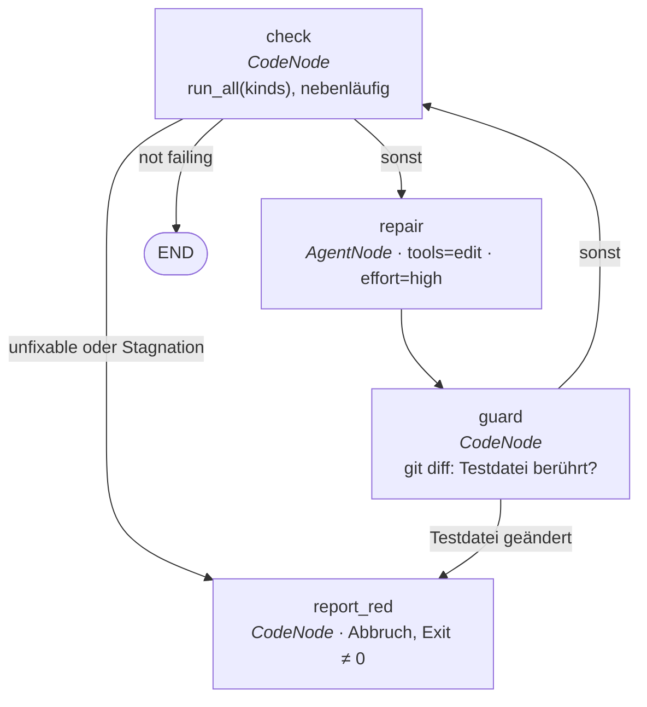

# Teilprojekt 2 — `verify-until-green`

Der erste mitgelieferte Ablauf. Dieses Dokument ist der Vertrag; taucht beim
Bauen eine Frage auf, die es nicht beantwortet, wird sie hier entschieden und
nicht im Code weggeraten.

Vorgänger: `2026-08-21-ultraloom-kern-design.md` (Abschnitt 16, Zeile
„Teilprojekt 2") und `2026-08-21-teilprojekt-2-backlog.md`.

> **Nachtrag.** Die Abschnitte 4, 5, 7.1, 7.3 und 8 sind in der Ausführung von
> diesem Vertrag abgewichen — an mehreren Stellen beschreiben sie den Code
> strenger, als er ist. Was daraus geworden ist, steht in Abschnitt 11; der
> geprüfte aktuelle Stand steht auf `docs/abläufe/verify-until-green.md`.

---

## 1. Was bewiesen werden soll

**Derselbe Ablauf läuft unverändert in zwei Projekten mit unterschiedlichem
Werkzeugsatz, allein über `config.toml` unterschieden.** Das ist die Behauptung
aus Abschnitt 7 des Kern-Designs, und Teilprojekt 2 ist die erste Gelegenheit,
sie zu widerlegen.

Reihenfolge der Abnahme:

1. `verify-until-green` läuft in ultraloom selbst grün (Python, uv, pytest).
2. Derselbe Ablauf läuft in space, in einem eigenen Worktree (Godot, GDScript,
   headless-Suite, Nano-Coverage).
3. Erst dann geht der ultraloom-Branch nach main.

Scheitert Schritt 2 an etwas, das nur mit einer Codeänderung in ultraloom zu
lösen ist, ist das kein Fehlschlag, sondern der Ertrag des Teilprojekts — die
Änderung gehört dann in den Branch, bevor er nach main geht.

---

## 2. Umfang

Im Umfang:

- der Ablauf `verify-until-green` in `src/ultraloom/flows/`
- zwei Kernänderungen: enger geschlüsselter Journal-Cache, auffindbare
  mitgelieferte Abläufe (Abschnitt 3)
- Zeitgrenze für Prüfkommandos (Abschnitt 8)
- Konfigurationsfelder `[verify].tests`, `[verify].timeout`, `[verify.profiles]`
- CLI-Optionen `--checks` und `--max-rounds`
- Ablauf-Dokumentation mit Mermaid-Graph, samt Test, der sie festnagelt
  (Abschnitt 6)

Nicht im Umfang, mit Begründung:

- **Fan-out über mehrere Knoten.** Abschnitt 17 des Kern-Designs hat
  Nebenläufigkeit offengelassen, „bis ein Ablauf sie braucht". Dieser braucht
  sie nicht: `checks.run_all` läuft die Prüfungen bereits nebenläufig in einem
  Prozess, und ein `AgentNode` ist bereits eine eigene SDK-Session. Mehrere
  gleichzeitig schreibende Reparatur-Agenten auf demselben Arbeitsbaum wären
  der teure Teil und lösen ein Problem, das noch niemand gemessen hat.
- **Freigabepunkte in diesem Ablauf.** Der erste Ablauf soll laut Abschnitt 16
  „kaum Urteilsvermögen" fordern. Gates sind Teilprojekt 4.
- **Coverage-Reparatur.** Sie hieße Tests schreiben und kollidiert mit der
  Testsperre (Abschnitt 5).
- **Hook-Verdrahtung.** Teilprojekt 6.

---

## 3. Die zwei Kernänderungen

### 3.1 Der Journal-Cache wird enger geschlüsselt

Heute schlägt `Runner._step` in `journal.lookup(name, input_hash, outcome="ok")`
nach, gleich aus welchem Anlass — auch bei einem frischen `run()`. Das bricht
jede Wiederholschleife: `check` sieht beim zweiten Durchlauf denselben
`input_hash`, weil der Reparatur-Agent Dateien ändert und nicht den Zustand,
und würde aus dem Journal bedient. Der Ablauf sähe grün aus, ohne je erneut
geprüft zu haben — die eine Fehlerart in diesem System, die wirklich Schaden
anrichtet.

**Entscheidung:** Der Cache greift nur, wenn der Lauf einen bestehenden
Journal-Verlauf *nachvollzieht*:

- im Wiedergabe-Modus (`replay`), wo er die Semantik selbst ist;
- in `resume`, für die Rekonstruktion des Verlaufs **vor** dem Freigabepunkt.

Ein frischer `run()` schlägt gar nicht erst nach.

Beim Planen verfeinert: in `resume` wird der Cache beim **ersten Knoten ohne
Eintrag** abgeschaltet, nicht erst am Ende des Laufs. Sonst würde ein Zyklus,
der nach dem Freigabepunkt einen früheren Knoten erneut betritt, wieder aus dem
Journal bedient — derselbe Fehler, nur eine Stelle später.

Betroffen sind `Runner._step`, `Runner._answered`, `Runner._why_it_looped` und
der Golden-Journal-Test. Die Erklärung „aus dem Journal bedient" in der Meldung
der Besuchsgrenze verliert ihren Anlass und fällt weg; dasselbe gilt für den
entsprechenden Absatz im `Runner`-Klassendocstring, in `CodeNode.max_visits`
und in der README.

Verworfene Alternativen: Besuchsnummer in den Schlüssel (semantisch beiläufig),
`cacheable=False` je Knoten (verlagert die Verantwortung auf jeden Ablaufautor,
ein vergessenes Flag ist ein stiller Fehler), Zustand künstlich verändern (eine
Umgehung, über die der nächste Ablauf erneut stolpert).

### 3.2 Mitgelieferte Abläufe werden auffindbar

`discovery` kennt heute nur `<projekt>/.ultraloom/flows`. Es bekommt eine zweite
Quelle: das Paket `ultraloom.flows`.

- Bei Namensgleichheit gewinnt der Projektablauf — ein Projekt darf einen
  mitgelieferten Ablauf ersetzen.
- `list_flows` zeigt beide Quellen und nennt die Herkunft.
- Eine Datei, deren Name kein Identifier ist (`my-flow.py`), wird nicht länger
  verschwiegen, sondern mit dem Grund aufgeführt. Damit ist der entsprechende
  Backlog-Punkt erledigt.

### 3.3 Zwei Lücken, die beim Planen aufgefallen sind

**Ein Ablauf braucht Parameter.** `find_flow` liefert heute ein statisches
`flow` samt `initial` aus dem Modul. Ein *mitgelieferter* Ablauf kennt aber
weder die `Config` des Projekts noch, was auf der Kommandozeile stand. Ein
Ablaufmodul darf deshalb statt `flow`/`initial` ein `build(context) ->
LoadedFlow` definieren; `FlowContext` trägt `root`, `config` und die Optionen.
Beides zugleich zu definieren ist ein Fehler, kein Vorrang.

**Ein Ablauf braucht einen eigenen Exit-Code.** `Result` trägt `status` und
`detail`, und die CLI bildet jeden Fehler auf 1 ab — Exit 4 aus Abschnitt 7.3
wäre damit nicht erreichbar. Ein Knoten wirft dafür `FlowExit(code, message)`;
der Runner reicht den Code über `Result.exit_code` durch, die CLI verwendet ihn.
Ein `FlowExit` bleibt ein Fehler wie jeder andere und wird der `on_error`-Kante
des Knotens angeboten: der Code sagt, wie der *Prozess* endet, nicht dass der
Graph nichts mehr zu tun hat.

---

## 4. Der Graph

*Abgewichen: Zustand, Knoten und Kanten haben sich in der Ausführung
verschoben — siehe Abschnitt 11.*

### 4.1 Zustand

```python
@dataclass(frozen=True, slots=True)
class VerifyState:
    kinds: tuple[str, ...]           # die Prüfungen, die dieser Lauf anfordert
    report: str = ""                 # die roten Prüfungen, für Mensch und Modell gerendert
    failing: tuple[str, ...] = ()    # Namen der roten Prüfungen; leer heißt grün
    unfixable: tuple[str, ...] = ()  # rot, aber außerhalb des Auftrags (coverage)
    touched: tuple[str, ...] = ()    # Dateien, die der letzte Reparaturdurchlauf geändert hat
    rounds: int = 0                  # abgeschlossene Reparaturdurchläufe
```

### 4.2 Knoten

| Knoten | Art | Aufgabe | `max_visits` |
|---|---|---|---|
| `check` | `CodeNode` | ruft `checks.run_all` über `kinds`; füllt `report`, `failing`, `unfixable`; erhöht `rounds` | 6 |
| `repair` | `AgentNode` | `tools="edit"`, `effort="high"`; bekommt `report`, liefert `RepairResult(summary: str, changed: bool)` | 5 |
| `guard` | `CodeNode` | prüft per `git diff --name-only`, ob eine Datei unter `[verify].tests` berührt wurde; füllt `touched` | 5 |
| `report_red` | `CodeNode` | der rote Ausgang: schreibt die Begründung und wirft | 1 |

### 4.3 Kanten

```
check   → END          when: not failing
check   → report_red   when: failing and (unfixable or stagnated)
check   → repair       sonst
repair  → guard
guard   → report_red   when: eine Testdatei wurde geändert
guard   → check        sonst
```

Die Reihenfolge der Kanten ist bedeutungstragend: `Graph.next_name` nimmt die
erste Kante, deren Bedingung hält, und eine Kante ohne Bedingung hält immer.
Eine bedingungslose Kante steht deshalb an letzter Stelle ihres Knotens.

**Stagnation** heißt: `failing` ist unverändert gegenüber dem vorigen Durchlauf
**und** `touched` ist leer. Der Agent hat nichts geändert oder nichts
Wirksames. Der Lauf bricht dann sofort ab, statt `max-rounds` leerzudrehen —
billiger und ehrlicher als fünf gleiche Agent-Aufrufe.

`max_visits=6` auf `check` gegen `5` auf `repair` ist kein Vertipper: `check`
läuft einmal öfter als repariert wird, weil der letzte Durchlauf das Ergebnis
der letzten Reparatur bewertet.

---

## 5. Die Testsperre

*Unvollständig: die Grundlinie, die entscheidet, wem eine Änderung angelastet
wird, fehlt diesem Abschnitt ganz — siehe Abschnitt 11.*

**Der Reparatur-Agent darf Quellcode ändern, Tests nicht.** Ein Agent, der einen
fehlschlagenden Test „repariert", indem er ihn abschwächt oder überspringt,
macht den ganzen Ablauf wertlos.

Durchgesetzt wird das im Knoten `guard`, nicht im Werkzeugprofil. Zwei Gründe:
`tools="edit"` ist eine grobe Berechtigung und kennt keine Pfade; und welche
Pfade Tests sind, weiß nur das Projekt (`tests/` in ultraloom, `test/` in
space). Ein Diff-Vergleich nach dem Zug erwischt außerdem auch, was der Agent
über einen Umweg geändert hat.

Fehlt `[verify].tests`, verweigert der Ablauf den Start, statt ungeschützt zu
reparieren.

Die Variante mit Freigabepunkt — Teständerung erlaubt, aber der Mensch
entscheidet — ist bewusst vertagt. Manchmal *ist* der Test falsch; das zu
behandeln gehört zu Teilprojekt 4.

---

## 6. Ablauf-Dokumentation

Jeder Ablauf bekommt eine Seite unter `docs/abläufe/<name>.md`, für diesen also
`docs/abläufe/verify-until-green.md`. Die Regel gilt ab jetzt für jeden Ablauf,
mitgeliefert wie projektspezifisch.

Jede Seite trägt:

- ein **Mermaid-Diagramm** des Graphen,
- eine Tabelle der Knoten: Art, Aufgabe, `max_visits`,
- die Felder des Zustands mit ihrer Bedeutung,
- Prompt und Rückgabeschema des Agenten,
- die Konfigurationsschlüssel, die der Ablauf liest,
- die Abbruchbedingungen mit ihren Exit-Codes.

Damit die Seite nicht veraltet, ein Test mit Zähnen: er lädt jeden auffindbaren
Ablauf und vergleicht, ob **jeder Knotenname und jede Kante des Graphen im
Mermaid-Block der zugehörigen Seite vorkommt — und umgekehrt**. Ein umbenannter
Knoten oder eine neue Kante bricht dann den Test, nicht erst das Verständnis des
nächsten Lesers. Prosa bleibt ungeprüft; Struktur nicht.

Das Diagramm für diesen Ablauf:



---

## 7. Bedienung und Konfiguration

### 7.1 CLI

| Option von `ultraloom run verify-until-green` | Wirkung |
|---|---|
| `--checks lint,types,test,coverage` | welche Prüfungen der Lauf ausführt; Vorgabe: alle auflösbaren |
| `--max-rounds N` | Obergrenze der Reparaturdurchläufe; Vorgabe 5, überschreibt `max_visits` |

`--checks` nimmt auch einen Profilnamen aus `[verify.profiles]`.

### 7.2 Konfiguration

```toml
[verify]
lint     = "uvx ruff check ."
types    = "uvx mypy ."
test     = "uv run pytest"
coverage = { threshold = 100 }
tests    = ["tests/"]     # was der Reparatur-Agent nicht anfassen darf
timeout  = 600            # Sekunden je Prüfkommando

[verify.profiles]
edit      = ["lint", "types"]
precommit = ["lint", "types", "test", "coverage"]
```

Die Staffelung nach Anlass stammt aus space: dessen `quality.py` führt
`CHECKS` beim Pre-Commit blockierend aus und `WARN_CHECKS` (nur `ruff` und
`mypy`) nach jeder Änderung als Warnung — „Code ist beim Schreiben zu Recht
unfertig". Übernommen wird die Staffelung, nicht die Vermischung: *welche
Prüfungen* steht in der Konfiguration, *ob der Lauf blockiert* ist eine
Eigenschaft des Aufrufs.

Es gibt keine eingebauten Profilnamen. Fehlt `[verify.profiles]`, nimmt
`--checks` nur eine explizite Liste. Ein eingebauter Name, der stillschweigend
etwas anderes bedeutet als das, was das Projekt meint, wäre schlimmer als kein
Name.

### 7.3 Exit-Codes

| Code | Bedeutung |
|---|---|
| 0 | alle angeforderten Prüfungen grün |
| 1 | rot geendet: Stagnation, `--max-rounds` erreicht, oder nur Unreparierbares übrig |
| 3 | wartet an einem Freigabepunkt (bestehend, hier nicht erreichbar) |
| 4 | Abbruch, weil der Agent eine Testdatei geändert hat |

`1` und `4` sind getrennt, weil ein Hook sie unterschiedlich behandeln muss:
`1` heißt „arbeite weiter", `4` heißt „hier ist etwas grundsätzlich
schiefgelaufen".

Coverage endet unter der Testsperre als rote Meldung an den Menschen, nie als
Schleifendurchlauf. Sie ist Teil des Pre-Commit-Profils, aber `unfixable`.

---

## 8. Zeitgrenze für Prüfkommandos

Oberster Punkt des Backlogs, und dieser Ablauf macht ihn scharf: `checks.py`
ruft `subprocess.run` ohne `timeout`, und ein hängender Linter blockiert nicht
einen Aufruf, sondern jede Runde der Schleife.

**Entscheidung:** `[verify].timeout` in Sekunden, projektweit, je Kommando.
Vorgabe 600 — die Größenordnung, die space' headless-Suite braucht. Eine
Überschreitung wird ein **rotes `CheckResult`** mit der Meldung „nach N s
abgebrochen", kein Abbruch des Laufs.

Begründung: eine Zeitüberschreitung ist ein Prüfergebnis wie jedes andere. Sie
als Ausnahme zu werfen, würde den Ablauf um einen Sonderpfad reicher machen,
der genau dasselbe täte.

Ein Kommando mit Messschritt (`Command.measure`) bekommt die Grenze je Schritt,
nicht für beide zusammen: die Schritte sind zwei Prozesse, und eine gemeinsame
Grenze wäre von der Dauer des ersten abhängig.

---

## 9. Testen

### 9.1 Der Ablauf gegen einen Attrappen-Runner

Prüfungen als Funktionen, die eine vorgegebene Folge roter und grüner
Ergebnisse liefern; der Agent über `--no-model`. Geprüfte Wege:

- sofort grün
- rot → repariert → grün
- Stagnation (zweimal dieselben roten Prüfungen, `touched` leer)
- `--max-rounds` erreicht
- Testdatei berührt → Exit 4
- nur Coverage rot → Exit 1, ohne einen einzigen Agent-Aufruf
- `[verify].tests` fehlt → Start verweigert

### 9.2 Der Kern-Umbau

- Der Golden-Journal-Test wird neu geschrieben.
- `run()` zweimal auf demselben Journal führt jetzt wirklich zweimal aus.
- `resume` rekonstruiert den Verlauf vor dem Freigabepunkt weiterhin exakt.
- Ein begrenzter Zyklus mit gleichbleibender Nutzlast läuft bis `max_visits`,
  statt beim Cache zu hängen.
- Ein Wiedergabe-Lauf über ein unvollständiges Journal wirft weiterhin
  `ReplayGapError`.

### 9.3 Zwei echte Läufe

ultraloom auf sich selbst, dann space in eigenem Worktree. Erst wenn beide grün
sind, geht ultraloom nach main.

### 9.4 Die Fixtures dieses Plans sind Vorschläge

Der teuerste Fehler von Teilprojekt 1 überlebte ein Aufgaben-Review, eine
Fix-Runde und zwei darauf aufbauende Aufgaben, weil **jede Gate-Fixture im
Branch dieselbe Sonderlage teilte** — und die Fixture stammte aus dem Plan.

Für diesen Plan heißt das konkret: mindestens eine Variante lässt die Reparatur
**nicht** im ersten Durchlauf gelingen, und mindestens eine startet mit einem
Zustand, in dem `rounds` bereits größer als 0 ist. Wer eine weitere Form
findet, die der Plan nicht vorgemacht hat, baut sie dazu.

---

## 10. Was danach offen bleibt

- Fan-out über mehrere Knoten, falls ein Lauf zeigt, dass ein
  Reparaturdurchgang wirklich der Engpass ist.
- Die Gate-Variante der Testsperre (Teilprojekt 4).
- Schema-Reichtum des Modell-Adapters: verschachtelte Dataclasses, Listen,
  Optionals. `RepairResult` kommt mit Skalaren aus, also fordert dieser Ablauf
  die Entscheidung nicht.
- Der unbestätigte Contract-Test: `usage["output_tokens"]` und
  `structured_output` sind weiterhin nur durch Introspektion belegt. Die zwei
  echten Läufe aus 9.3 sind die erste Gelegenheit, das zu ändern — wenn sie
  laufen, wird die Token-Abrechnung mitgeprüft.
- Ob das Agent SDK space' `coverage_gate.py` als Claude-Code-Hook zusätzlich
  ausführt und damit doppelt prüft. Abschnitt 17 des Kern-Designs hat diese
  Frage an Teilprojekt 2 adressiert; Schritt 2 der Abnahme beantwortet sie.

---

## 11. Was sich in der Ausführung geändert hat

Die Abschnitte oben bleiben, wie sie geschrieben wurden: eine Spec ist ein
historisches Dokument und soll zeigen, was gedacht war. Dieser Abschnitt sagt,
was daraus geworden ist. Er ist an mehreren Stellen nötig, weil die Spec den Code
**strenger** beschreibt, als er ist — und eine Beschreibung, die mehr verspricht
als die Mechanik hält, ist der schlimmere der beiden möglichen Fehler.

**Der aktuelle Stand steht auf `docs/abläufe/verify-until-green.md`.** Die Seite
wird von `tests/test_flow_docs.py` gegen den echten Graphen gehalten; dieser
Abschnitt wird von niemandem geprüft und ist eine Wegbeschreibung dorthin.

### §4.1 — der Zustand hat ein Feld mehr, und `kinds` hat eine Vorgabe

`VerifyState` trägt zusätzlich `previous_failing: tuple[str, ...] = ()`: was die
vorige Runde gefunden hat. Eine Kantenbedingung sieht genau einen Zustand, und
„dieselben Prüfungen sind schon wieder rot" — die Stagnation aus §4.3 — ist ohne
dieses Feld nicht beantwortbar. `kinds` hat inzwischen ebenfalls einen
Standardwert (`()`), damit ein Test einen Zustand ohne Argumente bauen kann; der
leere Fall wird dafür im `check`-Knoten abgefangen und endet rot, statt als
grüner Lauf durchzugehen, der keine einzige Prüfung gestartet hat.

### §4.2 — `guard` misst mit `status`, nicht mit `diff`

Die Spec sagt „prüft per `git diff --name-only`". Tatsächlich liest
`worktree.changed_files` mit `git status --porcelain -z -uall`. Der Grund: ein
Reparateur darf Dateien **anlegen**, und eine neu angelegte, unverfolgte Datei
ist für `diff` unsichtbar — ein beiseite geschriebener Test käme so an der
Sperre vorbei. `-z` hält Pfade mit Nicht-ASCII unquotiert lesbar, `-uall` sorgt
dafür, dass ein unverfolgtes Verzeichnis nicht zu einem einzigen Eintrag
zusammenfällt, der auf keine Datei zeigt.

Dazu kam im Abschlussreview: git meldet seine Pfade relativ zur
**Repository**-Wurzel, nicht zum Aufrufverzeichnis. `changed_files` bezieht sie
über `git rev-parse --show-prefix` auf die Projektwurzel, sonst wäre die
Testsperre bei `--root <unterverzeichnis>` still abgeschaltet.

### §4.2 — alle Zyklusknoten tragen `max_rounds + 1`

Die Tabelle nennt 6/5/5/1. Tatsächlich bekommen `check`, `repair` und `guard`
alle drei `max_rounds + 1`; nur `report_red` bleibt bei 1. Der Grund steht in
`assemble`: die Besuchsgrenze ist der Notnagel des Ausführers gegen eine
entlaufene Schleife, das Tor dieses Ablaufs ist der Rundenzähler, und der
Notnagel muss *über* dem Tor liegen. Läge er gleichauf, wären `repair` und
`guard` bei `--max-rounds 1` Ein-Besuch-Knoten auf einem Zyklus — was `validate()`
rundheraus ablehnt — und jeder Lauf an seiner Obergrenze endete an der Wache des
Ausführers, ohne Exit-Code und mit einer Meldung über `max_visits` statt über den
Grund, aus dem er rot ist.

### §4.3 — die Kante `guard → report_red` gibt es nicht

Die Spec zeichnet sie, und §6 zeichnet sie noch einmal. Der Graph hat sie nicht:
`guard` wirft bei einem berührten geschützten Pfad `FlowExit(4)` direkt, und ein
Exit-Code von 4 ist etwas anderes als der rote Ausgang mit 1. Das Diagramm aus §6
würde damit den Doku-Test, den §6 selbst fordert, nicht bestehen — geprüft wird
die Zeichnung auf der Ablaufseite, und die zeichnet stattdessen
`report_red --> END`, eine Kante, die nie genommen wird und nur existiert, weil
`validate()` einen Knoten ohne Ausgang ablehnt.

### §4.3 — die rote Bedingung ist materiell eine andere

Die Spec schreibt `failing and (unfixable or stagnated)`. Der Code prüft
`_out_of_reach_only(state) or _stagnated(state) or out_of_rounds(state)`, und
`_out_of_reach_only` ist ein **Teilmengentest**: `set(failing) <= set(unfixable)`.
Der Unterschied ist der Punkt. Nach der Fassung der Spec beendete eine einzige
unreparierbare Prüfung neben reparierbaren den ganzen Lauf — ein Projekt, dessen
Coverage-Prüfung über die Tests misst, erreichte bei einem einzigen roten Test
nie eine Reparaturrunde. Genau das ist im echten Lauf 0003 passiert. Dazu zählt
seit dem space-Lauf auch eine Prüfung mit `source="unavailable"` als außer
Reichweite, ohne den Lauf sofort zu beenden: ein Projekt ohne Typechecker soll
seine übrigen Prüfungen trotzdem reparieren dürfen.

### §5 — die Grundlinie fehlt in der Spec ganz

Das Folgenreichste am Guard steht dort nicht, weil es beim Entwurf nicht gesehen
wurde: **eine Grundlinie**, einmal pro Lauf beim Start aufgenommen und im
`.flow`-Marker mitgeführt. `guard` zieht sie ab, bevor er irgendeinen Pfad
bewertet. Ohne sie beantwortet er die Frage „was ist an diesem Baum schmutzig"
und reicht die Antwort als „was hat der Reparateur getan" weiter — jeder Lauf auf
einem Arbeitsbaum, in dem ein geschützter Pfad schon vorher geändert war, endete
mit Exit 4 gegen einen Unschuldigen. Lauf 0004 ist genau das.

Sie wird bewusst **nicht** bei `resume` neu genommen: alles, was der Reparateur
vor der Pause schon geändert hat, stünde sonst in der neuen Grundlinie. Der Preis
läuft in die andere Richtung und ist so gewollt: eine schon vorher schmutzige
Datei, die der Agent zusätzlich anfasst, sieht die Wache nicht mehr. Ein
verpasster Fang kostet eine Reparatur, die nicht gestoppt wurde; ein Fehlalarm
kostet jeden Lauf auf einem nicht makellosen Baum, und das sind die meisten.

### §7.1 — `--checks` ohne Angabe nimmt *alle* Arten

Die Tabelle sagt „Vorgabe: alle auflösbaren". Der Code nimmt `checks.KINDS`,
also alle — auflösbar oder nicht. Eine Art, die sich in diesem Projekt zu keinem
Werkzeug auflösen lässt, kommt als rotes Ergebnis mit `source="unavailable"`
zurück und gilt als unreparierbar. Das ist der Normalfall in einem Projekt, dem
ein Werkzeug dauerhaft fehlt, und keine Ausnahme; wer ihn nicht will, lässt die
Art über `--checks` weg.

Dazu, kleiner: der Ablauf heißt auf der Kommandozeile `verify_until_green`, mit
Unterstrichen. `find_flow` lehnt jeden Namen ab, der kein Python-Identifier ist;
nur der Graph heißt intern weiter `verify-until-green`.

### §7.3 — `resume` ohne wartendes Gate wird abgelehnt

Dieser Ablauf hat kein Gate, also wartet keiner seiner Läufe je auf eine
Antwort. Ein `resume` über ein vollständiges Journal führte null Knoten aus und
meldete `done` mit Exit 0 — grün, ohne dass etwas geprüft worden wäre. Die CLI
lehnt das seit dem Abschlussreview mit Exit 1 ab und nennt `replay`
beziehungsweise einen neuen `run` als das, was gemeint war. Spiegelbild der schon
vorhandenen Regel, die `replay` auf einem pausierten Lauf ablehnt.

### §8 — die Zeitgrenze steht, hält aber nicht gegen Enkelprozesse

`checks._run` übergibt `timeout=config.timeout` wie vorgesehen. Was die Spec
nicht sieht: `subprocess.run` beendet bei Zeitüberschreitung nur den direkten
Kindprozess und sammelt danach dessen Ausgabe ein — an Pipes, die ein
überlebender Enkel noch offen hält. Unter `uv run pytest` oder einem
Godot-Starter kann die Grenze deshalb unbegrenzt hängen. Festgehalten in
`docs/.superpowers/specs/2026-08-21-teilprojekt-2-backlog.md`.
