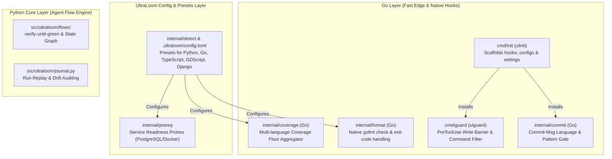

# Ecosystem Integration & Go-Native Tooling Design

**Date:** 2026-08-29  
**Status:** In Review / Ready for Plan  
**Goal:** Consolidate proven quality gates, language filters, multi-ecosystem presets, and write-barriers from sibling repositories (`space`, `iam_backend`, `ultra-brain`, `iam_frontend`) directly into UltraLoom's Go core and config engine.

---

## 1. Context & Objectives

Across the local repository landscape (`#GIT`), individual projects solved critical developer experience and agent reliability challenges independently:
1. **`space`**: Built a dedicated `commit-msg` gate (`commit_language.py`) enforcing English commit messages and blocking non-English agent commits, plus custom GDScript quality gates (`gdlint`, Godot engine testrunner).
2. **`iam_backend`**: Implemented service readiness probes (`ensure_postgres.py`) to guarantee database availability before running test suites, along with strict Django system & migration checks.
3. **`ultra-brain`**: Implemented a strict write-barrier (`wiki_guard.py`) preventing agents from modifying cited source materials outside designated workspaces.
4. **`ultraloom`**: Relied on Python scripts (`hooks/gofmt-check.py`, `hooks/coverage-check.py`) to verify its own Go code, causing latency and Windows/WSL path resolution friction.

This design document unifies these patterns into a **cohesive, high-performance architecture** divided into 4 distinct slices.

---

## 2. Architecture Overview

---

## 3. Detailed Slices (Scheiben)

### Slice 1: Go-Native Format & Dual-Coverage Verifiers
* **Motivation:** Remove reliance on `hooks/gofmt-check.py` and `hooks/coverage-check.py`.
* **Components:**
  1. **Go Formatting Verifier (`internal/verify/gofmt.go`):**
     * Scans Go root directories (`cmd`, `internal`, `pkg`) using `go/parser` or executing `gofmt -l`.
     * Emits non-zero exit code on unformatted files with detailed file list on stderr.
     * Platform-independent, directly resolves Windows executable without WSL bridging.
  2. **Multi-Language Coverage Evaluator (`internal/verify/coverage.go`):**
     * Evaluates Go statement coverage (`go tool cover -func=cover.out`) against configured floor percentage (e.g. 98%).
     * Reads Python coverage output (`coverage json` or summary) against threshold (e.g. 100%).
     * Fails if either language drops below its respective floor.
* **Result:** `hooks/gofmt-check.py` and `hooks/coverage-check.py` are deprecated and replaced by native UltraLoom checks.

---

### Slice 2: Universal `commit-msg` Language & Quality Gate
* **Motivation:** Prevent non-English commit messages and enforce commit style across all repositories.
* **Components:**
  1. **Go Language Scorer (`internal/commit/language.go`):**
     * Port and optimize the heuristic/trigram language detection from `space` and `src/ultraloom/commit/`.
     * Detects German / non-English commit titles with zero external dependencies.
     * Provides clear rejection messages with remediation guidance (`git commit --no-verify` or rewriting).
  2. **Git Hook Integration:**
     * `ulinit` wires `.githooks/commit-msg` when `core.hooksPath` is initialized.
     * Hook executes in <5ms directly via `ulinit hook commit-msg "$1"`.

---

### Slice 3: Multi-Language & Service Presets
* **Motivation:** Enable zero-config or one-line UltraLoom setup in `iam_frontend`, `open-design`, `space`, and `iam_backend`.
* **Components:**
  1. **TypeScript / Web Preset (`internal/detect/web.go`):**
     * Detects `package.json` / `pnpm-workspace.yaml` / `biome.json`.
     * Configures default commands:
       * Lint: `biome check` or `eslint .`
       * Types: `tsc --noEmit`
       * Test: `vitest run`
       * Coverage: `vitest run --coverage`
  2. **GDScript / Godot Preset (`internal/detect/godot.go`):**
     * Detects `project.godot`.
     * Configures default commands: `gdlint .`, Godot headless GUT/GdUnit4 runner.
  3. **Service & Database Prerequisite Hooks (`internal/prereq/postgres.go`):**
     * Allows configuring `[verify.prerequisites]` in `.ultraloom/config.toml`.
     * Supports TCP port probes (e.g., localhost:5432) and optional Docker Compose startup.

---

### Slice 4: Ulguard Policy Engine & Write Barrier Expansion
* **Motivation:** Elevate `wiki_guard.py` protections from `ultra-brain` into the high-performance Go `ulguard` binary.
* **Components:**
  1. **Source & Reference Isolation Rules:**
     * Extend `[policy.paths.rules]` to support workspace write isolation: prevent tools (`Write`, `Edit`, `MultiEdit`) from modifying referenced documentation or external bundles.
  2. **High-Speed Regex Evaluator:**
     * Pre-compiled regex cache in Go for command matching (`git push`, `pip install`, `rm -rf`).
     * Sub-millisecond evaluation guarantee (<1ms).

---

## 4. Verification & Testing Strategy

1. **Unit Tests (Go):**
   * Table-driven unit tests for `internal/verify/gofmt_test.go`, `internal/verify/coverage_test.go`, and `internal/commit/language_test.go`.
   * Test coverage floor maintained at ≥ 98% in Go.
2. **Integration Tests:**
   * Run `ulinit` in temporary mock repositories (Go, Python, TypeScript, Godot) and verify generated configs and hooks.
   * Test `commit-msg` rejection on sample German/English commit messages.
   * Test `ulguard` policy enforcement with mock tool payload JSONs.

---

## 5. Review & Cross-Check Matrix

| Slice | Touched Components | Dependencies / Invariants | Risk Level |
| :--- | :--- | :--- | :--- |
| **Slice 1: Native Verifiers** | `cmd/ultraloom`, `internal/verify/` | Must match existing `coverage-check.py` output format for backward compatibility | Low |
| **Slice 2: Commit Gate** | `cmd/init`, `internal/commit/` | Must strictly respect bilingual rule (Specs/Plans exempt, commit msgs English) | Low |
| **Slice 3: Multi Presets** | `internal/detect/`, `internal/prereq/` | Must not break existing Python/Go auto-detection | Medium |
| **Slice 4: Ulguard Barrier** | `cmd/guard/` | Must execute in <2ms, never block non-matching paths | Low |
