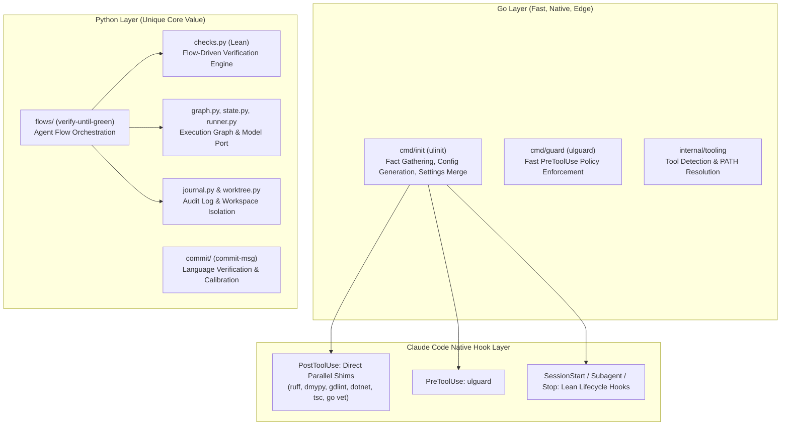

# Legacy Cleanup & Decoupling Design (Python vs. Go Core)

**Date:** 2026-08-29  
**Status:** In Review / Ready for Plan  
**Goal:** Remove legacy Python wrapper layers (monolithic `post-edit` hook, Python policy guard, redundant toolchain lookups) and keep exclusively what is unique to UltraLoom (Agent Flow engine, Superpowers graph/state/journal/worktree, commit message calibration, and lean check pipeline).

---

## 1. Context & Motivation

During Phase 1 & Phase 2, UltraLoom evolved from a monolithic Python harness into a high-performance, multi-layered architecture:
1. **Go Installer & Direct Shims (`cmd/init`, `internal/*`):** Detects facts, tools, and project stacks; configures deterministic, fast Tier-1 direct tool shims (`ruff`, `dmypy`, `gdlint`, `dotnet`, `tsc`, `go vet`) in `.claude/settings.json`.
2. **Go Policy Guard (`cmd/guard`):** Sub-millisecond (<1ms) `PreToolUse` policy validation in native Go, replacing the slow Python policy CLI.
3. **Legacy Python Residue:** The Python codebase still contains obsolete wrappers (`src/ultraloom/hooks/post_edit.py`, `src/ultraloom/policy/`, `src/ultraloom/toolchain.py`) that were superseded by native Go components and direct hook configurations.

This design document conducts a complete inventory of all legacy Python scripts, maps what was superseded, identifies what remains unique, and defines the cleanup.

---

## 2. Comprehensive Inventory & Migration Matrix

| Python Module / Script | Original Purpose | Replacement in New Architecture | Status / Action |
| :--- | :--- | :--- | :--- |
| `src/ultraloom/hooks/post_edit.py` | Monolithic post-edit hook running formatting and `edit` profile checks. | Replaced by direct parallel Tier-1 tool shims in `.claude/settings.json` (`ruff check`, `dmypy run`, `gdlint`, `dotnet format`, etc.). | **Remove** |
| `src/ultraloom/policy/hook.py` | Evaluated tool inputs against policy rules on `PreToolUse`. | Replaced by `cmd/guard/guard.go` (`ulguard`), executing in <1ms without Python startup. | **Remove** |
| `src/ultraloom/policy/rules.py` | Builtin rules and glob/regex matchers for policy. | Replaced by `builtinPathRules` and `matchGlob` in `cmd/guard/guard.go`. | **Remove** |
| `src/ultraloom/policy/config.py` | Parsed `[policy.*]` from `.ultraloom/policy.toml`. | Replaced by `loadPolicy` in `cmd/guard/guard.go`. | **Remove** |
| `src/ultraloom/policy/cli.py` | CLI entry point for `ultraloom policy hook / check`. | Replaced by `cmd/guard/main.go`. | **Remove** |
| `src/ultraloom/toolchain.py` | Project-local tool lookup (`.ultraloom/tools/`) & PATH. | Replaced by `internal/tooling/tooling.go` (`CheckTools`, `DefaultLookPath`). | **Remove** |
| `src/ultraloom/hooks/session_start.py` | Records session base commit; lists paused runs. | Retained as lean session lifecycle hook for agent harness. | **Keep & Consolidate** |
| `src/ultraloom/hooks/stop.py` | Stop gate verifying newly changed files (`changed_since(root, base)`). | Retained as lean stop gate for turn completion. | **Keep & Consolidate** |
| `src/ultraloom/hooks/subagent_start.py` | Records remote/local HEAD snapshot before subagent run. | Retained for subagent drift tracking. | **Keep & Consolidate** |
| `src/ultraloom/hooks/subagent_stop.py` | Compares git refs & commits after subagent run. | Retained for subagent drift tracking. | **Keep & Consolidate** |
| `src/ultraloom/commit/*` | Commit message language scoring & history calibration. | Unique UltraLoom feature (`commit-msg` hook). | **Keep** |
| `src/ultraloom/flows/*` | Multi-turn agent flow loops (`verify-until-green`). | Unique UltraLoom feature (Agent Flow engine). | **Keep** |
| `src/ultraloom/graph.py` & `state.py` | State machine & node execution graph. | Unique UltraLoom feature. | **Keep** |
| `src/ultraloom/journal.py` & `worktree.py`| Structured run journal & isolated worktree runtime. | Unique UltraLoom feature. | **Keep** |
| `src/ultraloom/model/*` & `runner.py` | Model port, fake implementations, Claude SDK runner. | Unique UltraLoom feature. | **Keep** |
| `src/ultraloom/checks.py` | Project check runner (`run_check`, `run_all`). | Keep lean check runner needed by agent flows. | **Keep (Lean)** |

---

## 3. Detailed Architecture After Decoupling

---

## 4. Key Refactoring Steps

### 4.1 Remove Obsolete Python Modules & Tests
1. Remove `src/ultraloom/hooks/post_edit.py` and `tests/hooks/test_post_edit.py`.
2. Remove `src/ultraloom/policy/` package and `tests/policy/` test suite.
3. Remove `src/ultraloom/toolchain.py` and `tests/test_toolchain.py`.
4. Remove `ultraloom policy` and `ultraloom hook post-edit` subcommands from `src/ultraloom/cli.py`.

### 4.2 Consolidate Python Hook Dispatch
1. `src/ultraloom/hooks/cli.py`: Remove `post-edit` dispatch.
2. Ensure `session-start`, `stop`, `subagent-start`, and `subagent-stop` remain lean and strictly import what they need.

### 4.3 Streamline `checks.py` & `.githooks/pre-commit`
1. Remove `toolchain.resolve` calls from `checks.py` since tool resolution and installation are handled by `ulinit` during project setup.
2. In `cmd/init/run.go`: Ensure `.githooks/pre-commit` executes the lean verification command (`uv run ultraloom check all`).

---

## 5. Verification Plan

### 5.1 Automated Quality Gates
1. Run `go test -v ./...` to verify all 13 Go packages pass with $\ge 98.0\%$ statement coverage.
2. Run `uv run pytest` to verify all remaining Python unit and flow tests pass with $100\%$ statement coverage.
3. Run `uv run ultraloom check all` to ensure linting, types, tests, and coverage are 100% green.

### 5.2 End-to-End Integration Verification
1. Build `ulinit.exe` and test against `../space/.worktrees/test-installer` and `../iam_backend/.worktrees/test-installer`.
2. Verify generated `.claude/settings.json`, `.githooks/pre-commit`, and `.ultraloom/*.toml` files.
