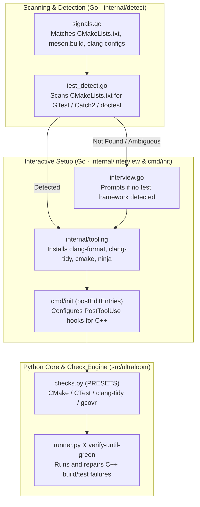

# C++ Stack Integration & Multi-Language Tooling Selection Design

**Date:** 2026-08-30  
**Status:** In Review / Ready for Plan  
**Goal:** Replace legacy C# tooling with a first-class C++ stack (CMake/Ninja, clang-format, clang-tidy, CTest), implement automatic test framework scanning with interactive fallback selection, and define modern tooling alternatives across supported ecosystems.

---

## 1. Context & Objectives

1. **C++ Stack Replacement:** Sibling repositories and base projects (e.g. `space`, native core modules) have transitioned from C#/.NET to modern C++ (CMake + Ninja, Clang tooling). UltraLoom's stack detection, tooling installation, and hook generation must reflect this transition by removing C# and adding C++.
2. **Dynamic Test Framework Scanning:** Projects using C++ vary in their test framework choices (GoogleTest, Catch2, doctest, Boost.UT). UltraLoom should first scan project manifests (e.g. `CMakeLists.txt`, `CMakePresets.json`, package manager manifests). If a framework is detected, it is configured automatically.
3. **Interactive Fallback Interview:** If no test framework is detected or multiple candidates exist, `ulinit` prompts the user during the setup interview with a curated list and clear trade-off descriptions.
4. **Multi-Ecosystem Tooling Matrix (Roadmap / Slice 3):** Establish modern alternatives and signal scanners across Python (Ruff/Pyright), TypeScript (Biome/Vitest), Rust (Nextest/llvm-cov), Go (golangci-lint/gotestsum), and GDScript (gdlint/gdUnit4/GUT).

---

## 2. Architecture Overview

---

## 3. Implementation Slices

### Slice 1: C# Deprecation & C++ Detection + Core Tooling (Immediate)

* **Objective:** Remove all C# signals, tools, and hooks. Integrate C++ detection and Clang tooling.
* **Components:**
  1. **Stack Signals (`internal/detect/signals.go`):**
     * Remove: `.csproj`, `.sln`, `[dotnet]` Godot marker, `csharp`, `gdunit4.api` C# package rules.
     * Add:
       * `{path: "CMakeLists.txt", stacks: []string{"cpp", "cmake"}}`
       * `{path: "CMakePresets.json", stacks: []string{"cpp", "cmake"}}`
       * `{path: "meson.build", stacks: []string{"cpp", "meson"}}`
       * `{path: ".clang-tidy", stacks: []string{"cpp", "clang-tidy"}}`
       * `{path: ".clang-format", stacks: []string{"cpp", "clang-format"}}`
  2. **Tooling Definitions (`internal/tooling/tooling.go`):**
     * Remove `csharp` (`dotnet`).
     * Add `cpp`:
       * `clang-format` (winget: `LLVM.LLVM` / apt: `clang-format`): Formatter
       * `clang-tidy` (winget: `LLVM.LLVM` / apt: `clang-tidy`): Linter & static analysis
       * `cmake` (winget: `Kitware.CMake` / apt: `cmake`): Build system generator
       * `ninja` (winget: `Ninja-build.Ninja` / apt: `ninja-build`): Build executor
  3. **PostToolUse Hook Generation (`cmd/init/run.go`):**
     * Replace `csharp` hooks (`dotnet format`, `dotnet build`) with C++ hooks:
       * `clang-format -i` for edited C++ source/header files (`*.cpp`, `*.hpp`, `*.cc`, `*.cxx`, `*.h`).
       * Fast build gate: `cmake --build build --parallel` (or `ninja -C build`).
  4. **Python Presets (`src/ultraloom/checks.py`):**
     * Add `CMakeLists.txt` preset:
       * `lint`: `("clang-tidy", "-p", "build")`
       * `test`: `("ctest", "--test-dir", "build", "--output-on-failure")`
       * `coverage`: `("gcovr", "--cobertura", "coverage.xml")`

---

### Slice 2: C++ Test Framework Scanning & Interactive Fallback Interview

* **Objective:** Automatically identify C++ test suites from `CMakeLists.txt` or prompt the user if unspecified.
* **Components:**
  1. **Manifest Scanner (`internal/detect/cpp_tests.go`):**
     * Parses `CMakeLists.txt`, `vcpkg.json`, `conanfile.txt`, `conanfile.py`, `CPM.cmake` for:
       * **GoogleTest:** `find_package(GTest`, `GTest::gtest`, `GTest::gtest_main`, `gtest`
       * **Catch2:** `find_package(Catch2`, `Catch2::Catch2`, `Catch2::Catch2WithMain`
       * **doctest:** `find_package(doctest`, `doctest::doctest`
       * **Boost.UT / Boost.Test:** `boost_unit_test_framework`, `boost::ut`
  2. **Interview Question (`internal/interview/`):**
     * Triggered when `cpp` stack is detected but no test framework was found.
     * Options presented to the user:
       1. **GoogleTest (GTest):** *Industry standard, robust mocking (`gmock`), extensive CI integration.*
       2. **Catch2 (v3):** *Modern C++ (C++14/17/20), expressive BDD assertions (`REQUIRE`, `SECTION`).*
       3. **doctest:** *Ultra-fast compilation, lightweight header-only, Catch2-compatible.*
       4. **CTest only / None:** *Generic CTest runner without framework-specific scaffolding.*
  3. **State & Answers Persistence:**
     * Persisted into `.ultraloom/answers.toml` under `[answers] test_framework = "..."`.

---

### Slice 3: Multi-Language Tooling & Modern Alternatives Matrix (Final Slice)

* **Objective:** Expand scanning heuristics and fallback selection to all other ecosystems.
* **Ecosystem Matrix:**
  * **TypeScript / JavaScript:**
    * Scanner: Detect `biome.json` vs `package.json` with `eslint` / `vitest` / `jest`.
    * Fallback: Choice between **Biome + Vitest** (Fast/Modern) and **ESLint + Prettier + Jest** (Classic).
  * **Python:**
    * Scanner: Detect `pyproject.toml` (`tool.mypy` vs `tool.pyright`, `tool.ruff` vs `flake8`).
    * Fallback: Choice between **Ruff + Mypy + Pytest** and **Ruff + Pyright + Pytest**.
  * **Rust:**
    * Scanner: Detect `Cargo.toml` (`nextest` config, `cargo-llvm-cov`).
    * Fallback: Standard `cargo test` vs `cargo-nextest`.
  * **Go:**
    * Scanner: Detect `.golangci.yml`, `testify` in `go.mod`.
    * Fallback: `go test` vs `gotestsum` + `golangci-lint`.
  * **GDScript / Godot:**
    * Scanner: Detect `addons/gut` vs `addons/gdUnit4`.
    * Fallback: `GUT` vs `gdUnit4`.

---

## 4. Verification & Testing Plan

1. **Go Unit & Coverage Tests:**
   * `internal/detect/detect_test.go`: Verify C++ detection for `CMakeLists.txt`, `CMakePresets.json`, and verify zero false positives for removed C# signals.
   * `internal/tooling/tooling_test.go`: Test tool discovery and installation command generation for `clang-format`, `clang-tidy`, `cmake`, `ninja`.
   * `cmd/init/run_test.go`: Verify generated `.claude/settings.json` and `.ultraloom/config.toml` for C++ stack.
2. **Python Check Engine Tests:**
   * `tests/test_checks.py`: Validate `CMakeLists.txt` preset resolution and commands.
3. **End-to-End Git Worktree Validation:**
   * Create an isolated Git worktree: `git worktree add .worktrees/cpp-stack-verify -b feat/cpp-stack-verify`.
   * Run `ulinit` in a sample C++ project with CMake + Catch2 / GTest.
   * Verify PostToolUse hooks and check execution (`uv run ultraloom check all`).
