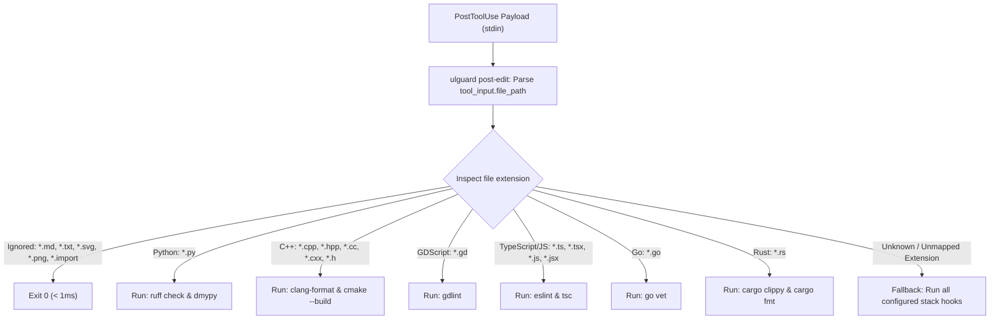

# Selective PostToolUse Hook Dispatching & Latency Optimization Design

**Date:** 2026-08-30  
**Status:** In Review / Ready for Plan  
**Goal:** Replace multiple unconditional `PostToolUse` hooks in `.claude/settings.json` with a single, ultra-fast, Go-native `ulguard post-edit` dispatcher that routes file edits to their specific language tools (with zero latency for docs/assets and a fail-safe full-chain fallback for unknown file extensions).

---

## 1. Context & Problem

1. **Unconditional Execution in Multi-Stack Repositories:** Currently, `.claude/settings.json` registers generic `"matcher": "Write|Edit|NotebookEdit"` hooks for every detected language stack. When an agent edits a single `.py` file in a project with Python, GDScript, C++, and TypeScript, Claude/Gemini sequentially invokes `ruff`, `dmypy`, `gdlint`, `clang-format`, `cmake --build`, `eslint`, and `tsc`.
2. **High Edit Latency:** This causes 5 to 15 seconds of overhead on every single file edit turn. Even modifying `.md`, `.json`, or `.toml` documentation/configuration triggers the full suite of compilers and linters.
3. **The UltraLoom Principle & Fail-Safe Fallback:**
   * Known language extensions (`.py`, `.cpp`, `.gd`, `.ts`, `.go`, `.rs`) must execute *only* their relevant stack tools.
   * Known documentation/asset extensions (`.md`, `.txt`, `.svg`, `.png`, `.import`, `.json`, `.toml`) must exit immediately with 0 in < 1ms.
   * **Fallback:** Any unknown or unmapped extension must trigger the full chain of configured stack hooks, guaranteeing that no defects go unnoticed.

---

## 2. Architecture Overview



---

## 3. Detailed Components

### 1. `ulguard post-edit` Subcommand (`cmd/guard/post_edit.go`)
* Reads `stdin` JSON containing `tool_name` and `tool_input.file_path` (or `notebook_path`).
* Discovers configured stacks (or reads `.ultraloom/answers.toml` / `.ultraloom/config.toml`).
* Filters tool execution:
  * **Explicit Ignore List:** `*.md`, `*.txt`, `*.svg`, `*.png`, `*.import`, `*.json`, `*.yaml`, `*.yml`, `*.toml` $\rightarrow$ Exit 0 immediately.
  * **Language Target Matching:** Executes only tools matching the file's stack. Formatter tools (e.g. `clang-format -i`) can be passed the specific file path.
  * **Fallback:** If the file extension does not match any known stack and is not explicitly ignored, runs all configured stack hooks.

### 2. Scaffolding in `cmd/init/run.go` (`.claude/settings.json`)
* Generates a single, consolidated `PostToolUse` entry:
  ```json
  {
    "matcher": "Write|Edit|NotebookEdit",
    "hooks": [
      {
        "type": "command",
        "command": "ulguard post-edit --root \"${CLAUDE_PROJECT_DIR}\"",
        "timeout": 60
      }
    ],
    "ultraLoomOwned": true
  }
  ```
* Preserves project-owned legacy hooks while delegating UltraLoom-managed post-edit checks to `ulguard post-edit`.

---

## 4. Verification Plan

1. **Go Unit Tests (`cmd/guard/post_edit_test.go`):**
   * Test payload parsing for `Write`, `Edit`, `NotebookEdit`.
   * Test selective dispatching for Python (`.py`), C++ (`.cpp`), GDScript (`.gd`), TypeScript (`.ts`), Go (`.go`), Rust (`.rs`).
   * Test zero-execution fast exit for `.md` / `.txt` / `.svg`.
   * Test fallback execution for unknown file extensions (e.g. `.custom`, `.sh`).
2. **Init Integration Tests (`cmd/init/run_test.go`):**
   * Verify `.claude/settings.json` generates the single `ulguard post-edit` hook.
3. **End-to-End Worktree Benchmark:**
   * Benchmark edit latency for `.py`, `.cpp`, `.md`, and unknown files in an isolated worktree.
