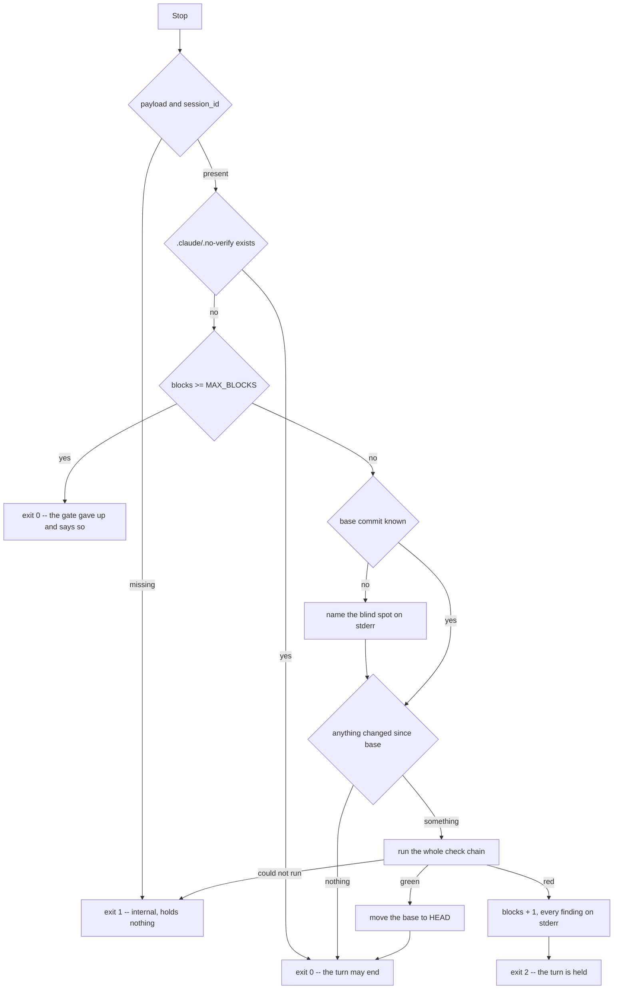

# session-hooks

[English](session-hooks.md)

Fünf Hooks, die eine Sitzung beobachten statt eines einzelnen Werkzeugaufrufs.
Die Policy verweigert einen Aufruf, bevor er geschieht; diese hier stellen
danach fest, was geschehen ist. Beides wird gebraucht: `PreToolUse` sperrt
`git push`, aber nur, wenn der Befehl über ein Werkzeug läuft, dessen Payload
eine Regel versteht. Ein Subagent, der auf einem anderen Weg pusht, wird von
keiner Regel gefasst — von einem Vergleich der Remote-Refs vor und nach seinem
Lauf schon.

Aufruf, je Ereignis einer, jeder liest die Payload von Claude Code über stdin:

```bash
ultraloom hook session-start    # SessionStart
ultraloom hook post-edit        # PostToolUse
ultraloom hook subagent-start   # SubagentStart
ultraloom hook subagent-stop    # SubagentStop
ultraloom hook stop             # Stop
```

## Der Graph

Das Stop-Gate ist der einzige Hook mit einer Entscheidung darin und der
einzige, der einen Zug anhalten kann. Alles oberhalb der Kette ist dazu da, sie
billig zu machen oder von ihr abzulassen.



Die Reihenfolge der Stufen ist nicht beliebig. Die Payload kommt zuerst, denn
ohne Sitzungskennung lässt sich nichts zählen. Der Marker kommt, bevor
irgendetwas gelesen oder gefahren wird — ein Mensch hat bereits entschieden.
Der Zähler kommt **vor** der Kette und nicht danach: eine Minute für ein
Ergebnis, das ohnehin niemanden mehr aufhält, ist eine verlorene Minute. Der
Kurzschluss steht aus demselben Grund im Kleinen vor der Kette. Erst dann läuft
die Kette.

## Die fünf Hooks

| Ereignis | Hook | Was er feststellt | Kann er etwas anhalten |
| --- | --- | --- | --- |
| `SessionStart` | `session-start` | Welche Läufe an einem Gate warten, samt Frage und der `ultraloom resume`-Zeile, die sie beantwortet. Schreibt außerdem den Commit auf, mit dem die Sitzung beginnt. | Nein |
| `PostToolUse` | `post-edit` | Ob die eben geschriebene Datei `ruff format` und das Profil `edit` übersteht. | Nein — das Werkzeug ist gelaufen |
| `SubagentStart` | `subagent-start` | Wo `origin` und der lokale `HEAD` vor diesem Subagenten standen. | Nein |
| `SubagentStop` | `subagent-stop` | Jede Remote-Referenz, die sich bewegt hat, neu ist oder fehlt, und jeden Commit, den `HEAD` dazubekommen hat. | Nein, mit Absicht |
| `Stop` | `stop` | Ob alles grün ist, was seit dem letzten grünen Durchgang dazugekommen ist. | Ja, bis zu dreimal |

### `session-start`

Liest `.ultraloom/runs/`, fragt jedes Journal über `pending_gate` und druckt je
pausiertem Lauf einen Block — die Lauf-ID, den Knoten, an dem er wartet, seine
Frage und die Zeile `ultraloom resume <id> --answer "your answer"`. Ein Journal,
das er nicht lesen kann, wird auf stderr genannt und übersprungen: Eine
beschädigte Datei ist ein Befund für sich, und die übrigen Läufe dahinter zu
verstecken machte aus einem kleinen Defekt einen stillen.

Diese Zeile ist ASCII bis in den Platzhalter. Sie geht auf die Konsole, die der
Harness gerade übergibt, und unter Windows ist das voreingestellt cp1252: Ein
einzelnes `…` sieht dort nicht bloß falsch aus, `print` wirft, und der Hook
stirbt mit einem Code, den das Exit-Protokoll nicht beschreibt.

Er schreibt außerdem `head_commit` als Basis der Sitzung auf, in beiden
Fehlerfällen schweigend — ohne Sitzungskennung gibt es keinen Ort dafür, ohne
Repository nichts abzulegen. Keiner der beiden Fälle ist ein Mangel des
Projekts, und keiner ist eine Zeile in jeder Sitzung jedes Checkouts wert, das
kein Git-Repository ist. Wo das Fehlen zählt, ist das Stop-Gate, und dort wird
es laut gesagt.

### `post-edit`

Fährt den Formatierer über die geschriebene Datei, wenn die Endung `.py` oder
`.pyi` ist, danach das Profil `edit` über das Projekt. `.ipynb` bekommt keinen
Formatierer: Ein Notebook ist JSON, und ein Formatierer, der eine Datei nicht
versteht, räumt sie nicht auf, er macht sie kaputt.

Der Formatierer ist `uvx ruff format`, hinter dem `[exec].prefix` des Projekts
wie jeder Prüfbefehl — ein Projekt, das über eine Containergrenze hinweg prüft,
muss auf derselben Seite formatieren, sonst erreicht der Formatierer eine
Datei, die die Prüfungen nie sehen. Ein Formatierer, der nicht laufen kann, ist
Exit 1 und beendet den Hook: Quelltext zu prüfen, an den der Formatierer nicht
gekommen ist, meldete Befunde über eine Form, die niemand gewählt hat.

Eine Datei, die außerhalb von `--root` aufgelöst wird, bleibt unangetastet. Der
Hook fährt die Prüfungen eines Projekts, und eine Datei anderswo geht ihn
nichts an.

Ein Projekt ohne Profil `edit` bekommt Exit 1 und eine Meldung. Exit 0 wäre von
den dreien das schlimmste — „nichts falsch" über eine Datei, die niemand
angesehen hat, ist genau das Versagen, das diese Kette ausschließen soll.

### `subagent-start` und `subagent-stop`

Der Schnappschuss ist `git ls-remote origin` plus der lokale `HEAD`, abgelegt
unter der `agent_id` des Subagenten im Sitzungszustand. Jeder Fehlschlag — kein
Remote, kein Netz, eine Zeitüberschreitung, gar kein git — ergibt einen leeren
Schnappschuss statt einer Ausnahme: Ein unerreichbares Remote ist eine Tatsache
über die Maschine, kein Befund über den Subagenten. Das Timeout ist 10 s, lang
für ein `ls-remote` gegen einen erreichbaren Host und kurz genug, dass ein toter
nichts kostet, was jemandem auffiele.

`subagent-stop` nennt Unterschiede in beide Richtungen. Ein auf dem Remote
gelöschter Zweig ist so sehr ein Push wie ein dort angelegter, und ein
Vergleich, der nur nach neuen Zeilen sähe, meldete die Löschung als gar nichts.
Hat der Schnappschuss ein `HEAD` festgehalten und `HEAD` sich bewegt, nennt er
zusätzlich die dazugekommenen Commits, je eine Kurzzeile.

Ohne Schnappschuss sagt er das — `no snapshot for this subagent; nothing to
compare`. Der Hook kann mitten in der Sitzung eingeschaltet worden sein, und
Schweigen läse sich als „nichts geschehen", eine Aussage, die niemand geprüft
hat.

### `stop`

`MAX_BLOCKS` ist 3, `MARKER` ist `.claude/.no-verify`. Was als geändert zählt,
kommt aus `changed_since(root, base)` — dieselbe Messung, die der `guard` des
verify-Ablaufs benutzt, und aus demselben Grund: Was ein Zug committet,
verschwindet aus `git status`, und ein Gate allein auf dem Arbeitsbaum schwiege
genau dann, wenn jemand etwas Ungeprüftes committet hat.

Die Basis wandert nur bei einem grünen Durchgang weiter. Sie nach einer
Blockade fortzuschreiben ließe dem nächsten Zug nichts zu messen, und das Gate
hätte sich nach einem einzigen Befund selbst abgeschaltet. Der Zähler wird von
einem grünen Durchgang bewusst **nicht** zurückgesetzt: Eine Sitzung, die
zwischen rot und grün wechselt, erreichte die Grenze sonst nie, und die Grenze
ist es, die eine Uneinigkeit zwischen Agent und Gate davon abhält, ewig zu
laufen.

Das Gate zieht seine eigenen Zustandsdateien von dem ab, was es sieht. Es
schreibt bei jeder Blockade und jedem Durchgang eine, und in der Antwort
belassen ließe diese Datei jeden Zug nach einem grünen als geändert erscheinen
— wegen der Datei, die der grüne geschrieben hat.

`stop_hook_active` steht in der Payload und wird bewusst **nicht** gelesen. Es
sagt „dieser Zug wurde schon einmal geblockt" und nie, wie oft, kann die Grenze
also nicht tragen; und eine zweite Quelle, die dem Zähler widersprechen kann,
machte das Gate genau in dem Moment unerklärlich, in dem jemand aus ihm heraus
will.

## Exit-Codes

    0  in Ordnung, oder bewusst übersprungen
    1  interner Fehler — hält nie etwas auf
    2  ein Befund; was er bewirkt, hängt am Ereignis

Exit 2 hält bei `Stop` den Zug an, überbringt bei `PostToolUse` eine Meldung und
kommt bei den anderen drei nie vor. Eine Kette, die gar nicht laufen konnte, ist
Exit 1, nie Exit 2: Diese Hooks prüfen ultraloom mit ultraloom, und ein kaputtes
`checks.py` darf keine Sitzung einsperren.

## Der Zustand

`.ultraloom/hooks/<session_id>.json`, eine Datei je Sitzung, mit dem
Block-Zähler, dem Basis-Commit und je einem Schnappschuss pro `agent_id`. Zwei
Sitzungen in einem Checkout verstellten sich sonst gegenseitig den Zähler.

Eine Datei, die nicht gelesen werden kann, zählt als leer. Eine Ausnahme
beendete jeden Zug mit einem internen Fehler wegen eines Zählers, dessen
schlimmster Fall drei zusätzliche Runden sind. Die Sitzungskennung kommt von
außen und darf nicht entscheiden, wo die Datei landet: Nur Buchstaben, Ziffern,
`-` und `_` überleben, ein Trenner fällt also auf etwas Harmloses zusammen,
statt aus dem Verzeichnis zu klettern.

Das Verzeichnis gehört in `.gitignore` und in die Pfadregeln der Policy. Ein
Agent, der seinen eigenen Block-Zähler zurücksetzt, hat das Gate abgeschafft.

## Verdrahtung

`.claude/settings.json`, je Ereignis genau ein Eintrag. Mehrere Einträge
desselben Ereignisses starten gleichzeitig, nicht nacheinander — zwei gemessene
`Stop`-Einträge starteten 2 ms auseinander und überlappten vollständig —, ein
auf zwei Einträge verteilter Block-Zähler verliert also Hochzählungen. Was
später dazukommt, gehört in denselben Eintrag.

Timeouts: `post-edit` 60 s, `stop` 300 s, `session-start` 20 s,
`subagent-start` 30 s, `subagent-stop` 30 s. Gemessen am 2026-08-25 im
Hauptcheckout: `post-edit` 1,5 bis 2 s im Median, `stop` 60 bis 62 s für eine
volle Kette und rund 300 ms, wenn der Kurzschluss greift.
