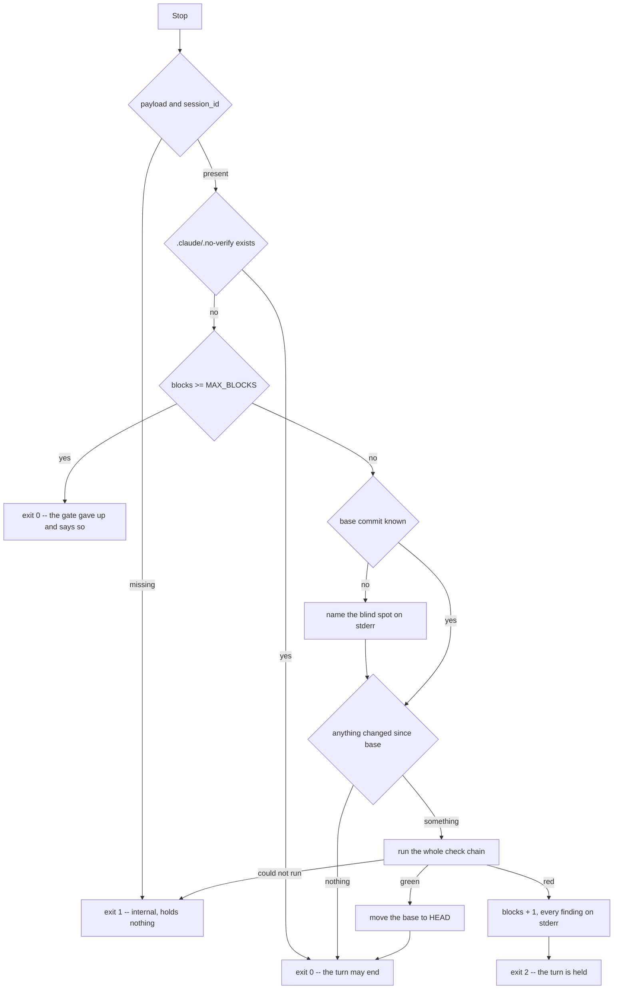

# session-hooks

[Deutsch](session-hooks.de.md)

Five hooks that watch a session rather than a single tool call. The policy
refuses a tool call before it happens; these establish, afterwards, what
happened. Both are needed: `PreToolUse` blocks `git push`, but only when the
command travels through a tool whose payload a rule understands. A subagent
that pushes some other way is caught by no rule — and by a comparison of the
remote's refs before and after its run, it is.

Invocation, one per event, each reading Claude Code's payload from stdin:

```bash
ultraloom hook session-start    # SessionStart
ultraloom hook post-edit        # PostToolUse
ultraloom hook subagent-start   # SubagentStart
ultraloom hook subagent-stop    # SubagentStop
ultraloom hook stop             # Stop
```

## The graph

The stop gate is the only hook with a decision in it, and the only one that
can hold a turn. Everything above the chain exists to make it cheap, or to let
go of it.



The order of the stages is not free. The payload comes first, because without
a session id nothing can be counted. The marker comes before anything is read
or run, because a human has already decided. The counter comes **before** the
chain rather than after it: a minute spent on a verdict that will not hold
anybody up anyway is a minute wasted. The short circuit comes before the chain
for the same reason at a smaller scale. Only then does the chain run.

## The five hooks

| Event | Hook | What it establishes | Can it hold anything |
| --- | --- | --- | --- |
| `SessionStart` | `session-start` | Which runs are paused at a gate, with the question and the `ultraloom resume` line that answers it. Also writes down the commit this session starts on. | No |
| `PostToolUse` | `post-edit` | Whether the file just written survives `ruff format` and the `edit` profile. | No — the tool already ran |
| `SubagentStart` | `subagent-start` | Where `origin` and the local `HEAD` stood before this subagent. | No |
| `SubagentStop` | `subagent-stop` | Every remote ref that moved, appeared or vanished, and every commit `HEAD` gained. | No, on purpose |
| `Stop` | `stop` | Whether everything that arrived since the last green pass is green. | Yes, up to three times |

### `session-start`

Reads `.ultraloom/runs/`, asks `pending_gate` of every journal, and prints one
block per paused run — the run id, the node it waits at, its question, and the
`ultraloom resume <id> --answer "your answer"` line. A journal it cannot read
is named on stderr and skipped: one damaged file is a finding of its own, and
hiding the other runs behind it would turn a small defect into a silent one.

That line is ASCII down to the placeholder. It goes to whatever console the
harness hands over, and on Windows that is cp1252 by default: a single `…`
there does not merely look wrong, `print` raises and the hook dies with a code
the exit protocol does not describe.

It also records `head_commit` as the session's base, silently in both failure
cases — no session id means nowhere to file it, no repository means nothing to
file. Neither is a defect worth a line in every session of every checkout that
is not a git repository. Where the absence matters is the stop gate, and that
is where it is said out loud.

### `post-edit`

Runs the formatter over the written file when the suffix is `.py` or `.pyi`,
then the `edit` profile over the project. `.ipynb` gets no formatter: a
notebook is JSON, and a formatter that does not understand a file does not tidy
it, it breaks it.

The formatter is `uvx ruff format`, behind the project's `[exec].prefix` like
every check command — a project that checks across a container boundary must
format on the same side of it, or the formatter reaches a file the checks never
see. A formatter that cannot run is exit 1, and it stops the hook: checking
source the formatter did not get to would report findings about a shape nobody
chose.

A file resolving outside `--root` is left alone. The hook runs a project's
checks, and a file elsewhere is not its business.

A project without an `edit` profile gets exit 1 and a message. Exit 0 would be
the worst of the three — "nothing wrong" about a file nothing looked at is the
one failure this chain exists to rule out.

### `subagent-start` and `subagent-stop`

The snapshot is `git ls-remote origin` plus the local `HEAD`, stored under the
subagent's `agent_id` in the session state. Every failure — no remote, no
network, a timeout, no git at all — is an empty snapshot rather than a raise:
an unreachable remote is a fact about the machine, not a finding about the
subagent. The timeout is 10 s, long for `ls-remote` against a reachable host
and short enough that a dead one costs nothing anybody notices.

`subagent-stop` names differences in both directions. A branch deleted on the
remote is as much a push as one created there, and a comparison that only
looked for new lines would report the deletion as nothing at all. Where the
snapshot recorded a `HEAD` and `HEAD` has moved, it also lists the commits
gained, one short line each.

Without a snapshot it says so — `no snapshot for this subagent; nothing to
compare`. The hook may have been switched on midway through a session, and
silence would read as "nothing happened", a claim nobody checked.

### `stop`

`MAX_BLOCKS` is 3 and `MARKER` is `.claude/.no-verify`. What counts as changed
comes from `changed_since(root, base)`, the same measurement the verify flow's
guard uses and for the same reason: a turn that commits its work leaves
`git status` with nothing to report, and a gate built on the working tree alone
would go quiet at exactly the moment somebody committed something unverified.

The base moves forward only on a pass. Moving it after a block would leave the
next turn nothing to measure, and the gate would have switched itself off after
a single finding. The counter is deliberately not cleared by a pass: a session
alternating red and green would otherwise never reach the cap, and the cap is
what keeps a disagreement between agent and gate from running forever.

The gate subtracts its own state files from what it sees. It writes one on
every block and every pass, and left in the answer that file would make every
turn after a green one look changed — because of the file the green one wrote.

`stop_hook_active` is in the payload and is deliberately **not** read. It says
"this turn was already blocked once" and never how often, so it cannot carry
the cap; and a second source that can disagree with the counter would make the
gate unexplainable at the moment somebody is trying to get out of it.

## Exit codes

    0  in order, or deliberately skipped
    1  internal error — never holds anything up
    2  a finding; what it causes depends on the event

Exit 2 holds the turn at `Stop`, delivers a message at `PostToolUse`, and never
occurs at the other three. A chain that could not run at all is exit 1, never
exit 2: these hooks check ultraloom with ultraloom, and a broken `checks.py`
must not lock a session in.

## The state

`.ultraloom/hooks/<session_id>.json`, one file per session, holding the block
counter, the base commit, and one snapshot per `agent_id`. Two sessions in one
checkout would otherwise reset each other's counter.

A file that cannot be read counts as empty. Raising would end every turn with
an internal error over a counter whose worst case is three extra rounds. The
session id arrives from outside and may not decide where the file lands: only
alphanumerics, `-` and `_` survive, so a separator collapses to something
harmless rather than climbing out of the directory.

The directory belongs in `.gitignore` and in the policy's path rules. An agent
that resets its own block counter has abolished the gate.

## Wiring

`.claude/settings.json`, one entry per event. Several entries for the same
event start concurrently, not one after another — two measured `Stop` entries
started 2 ms apart and overlapped completely — so a block counter split across
two entries loses increments. Whatever gets added later belongs in the same
entry.

Timeouts: `post-edit` 60 s, `stop` 300 s, `session-start` 20 s,
`subagent-start` 30 s, `subagent-stop` 30 s. Measured on 2026-08-25 in the main
checkout: `post-edit` 1.5 to 2 s in the median, `stop` 60 to 62 s for a full
chain and about 300 ms when the short circuit takes it.
