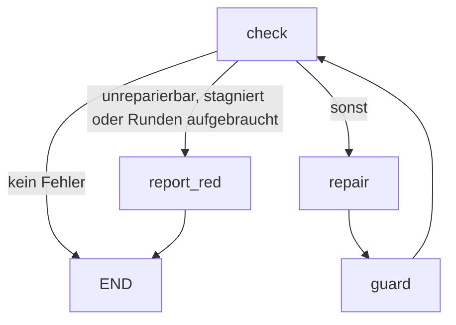

# verify-until-green

Der erste Ablauf, den ultraloom mitliefert. Er führt die Prüfkette aus, lässt
einen Agenten reparieren, was rot ist, prüft danach, ob der Agent sich an die
Regeln gehalten hat, und beginnt von vorn — bis alles grün ist oder ehrlich rot.

Der Ablauf kennt kein einzelnes Projekt: welche Werkzeuge prüfen und wo die
Tests liegen, kommt beides aus `.ultraloom/config.toml`. Genau das erlaubt es,
denselben Ablauf in einem Python-Paket und in einem Godot-Spiel laufen zu
lassen.

Aufruf:

```bash
ultraloom run verify_until_green [--checks <liste|profil>] [--max-rounds <n>]
```

## Der Graph



Die Reihenfolge der Kanten aus `check` ist bedeutungstragend: `next_name` nimmt
die erste Kante, deren Bedingung hält, und eine Kante ohne Bedingung hält immer.
Die unbedingte Kante nach `repair` steht deshalb zuletzt.

Die Kante `report_red --> END` wird nie genommen — `report_red` wirft immer. Sie
steht da, weil `validate()` einen Knoten ohne Ausgang ablehnt und eine Sackgasse
kein Ausgang ist.

## Die Knoten

| Knoten | Art | `max_visits` | Was er tut |
| --- | --- | --- | --- |
| `check` | code | `max_rounds + 1` | Führt die gewählten Prüfungen nebenläufig aus, sammelt die roten, erhöht den Rundenzähler und merkt sich, was die vorige Runde gefunden hatte. |
| `repair` | agent | `max_rounds + 1` | Bekommt den Bericht der roten Prüfungen und repariert die Quellen. Werkzeugprofil `edit`, Effort `high`. |
| `guard` | code | `max_rounds + 1` | Liest den Arbeitsbaum über `git status` und bricht ab, wenn der Reparateur geschützte Pfade angefasst hat. |
| `report_red` | code | 1 | Beendet den Lauf rot und sagt, warum. |

Jede Obergrenze auf dem Zyklus ist `max_rounds + 1`, die von `check`
eingeschlossen. Die Besuchsgrenze ist der Notnagel des Ausführers gegen eine
entlaufene Schleife; das Tor, das dieser Ablauf tatsächlich schließt, ist der
Rundenzähler. Der Notnagel muss deshalb *über* dem Tor liegen und nie auf
gleicher Höhe: gleichauf wären `repair` und `guard` bei `--max-rounds 1`
Ein-Besuch-Knoten auf einem Zyklus — was der Graph rundheraus ablehnt — und
jeder Lauf, der seine Obergrenze erreicht, endete an der Wache des Ausführers,
ohne Exit-Code und mit einer Meldung über `max_visits` statt über den Grund, aus
dem er rot ist.

## Der Zustand

`VerifyState`, eine eingefrorene Dataclass:

| Feld | Typ | Bedeutung |
| --- | --- | --- |
| `kinds` | `tuple[str, ...]` | Welche Prüfungen dieser Lauf ausführt. Kommt aus `--checks` oder ist die volle Liste. |
| `report` | `str` | Der gerenderte Bericht der roten Prüfungen — nach `repair` stattdessen dessen Zusammenfassung. |
| `failing` | `tuple[str, ...]` | Die Arten, die in der letzten Runde rot waren. |
| `unfixable` | `tuple[str, ...]` | Davon die, die keine Reparatur schließen kann. |
| `touched` | `tuple[str, ...]` | Was `git status` nach dem Reparaturlauf als geändert meldet. |
| `rounds` | `int` | Wie oft `check` gelaufen ist. |
| `previous_failing` | `tuple[str, ...]` | Was die vorige Runde gefunden hat. Eine Kantenbedingung sieht nur einen Zustand, und „dieselben Prüfungen schon wieder" ist sonst nicht beantwortbar. |

Zwischen `repair` und dem nächsten `check` liest der Zustand absichtlich
gemischt: `failing` und `unfixable` tragen noch die Werte der alten Runde,
während `report` bereits die Zusammenfassung des Reparateurs hält. `guard` ist
der Knoten, der ihn so sieht.

`changed` — die Behauptung des Modells, es habe etwas geändert — wandert bewusst
*nicht* in den Zustand. Die Wahrheit darüber steht im Arbeitsbaum, und das Wort
des Modells ist daneben nichts wert.

## Unreparierbar

Ein rotes Ergebnis gilt als außer Reichweite, wenn

- seine Art in `UNFIXABLE` steht — derzeit `coverage`: eine Lücke zu schließen
  heißt Tests zu schreiben, und genau das verbietet `guard`; oder
- seine Quelle `"unavailable"` ist, die Prüfung sich also gar nicht auflösen
  ließ. Sie ist rot, aber keine Änderung am Projekt behebt das — für GDScript
  gibt es keinen Typechecker, und einen Agenten zu bitten, ein nicht
  installiertes Werkzeug zu reparieren, heißt ihn zu bitten, es zu erfinden.

## Der Agent

Werkzeugprofil `edit`, Effort `high`, Schema `RepairResult` mit den Feldern
`summary: str` und `changed: bool`. Nur Skalare, weil das ist, was ein
Modell-Adapter als JSON-Schema beschreiben kann.

Der Prompt (`REPAIR_PROMPT`) übergibt den Bericht und die geschützten Pfade und
stellt vier Regeln auf:

1. Keinen der geschützten Pfade bearbeiten, schwächen, überspringen oder
   löschen. Ein fehlschlagender Test ist ein Befund über die Quelle, kein
   Problem des Tests.
2. Eine Prüfung nicht stummschalten statt sie zu beheben: kein neues `# noqa`,
   `# type: ignore`, `# pragma: no cover` oder sonstige Unterdrückung, und keine
   Änderung an einer Konfigurationsdatei, die eine Schwelle oder ein Regelwerk
   setzt (`pyproject.toml`, `setup.cfg`, `.ruff.toml`, `mypy.ini` und
   dergleichen). Bereits vorhandene, begründete Unterdrückungen dürfen bleiben.
   Wäre eine Prüfung nur durch Stummschalten grün zu bekommen, gehört das in die
   Zusammenfassung und der Code bleibt, wie er ist.
3. So wenig ändern wie möglich. Eine enge Korrektur schlägt eine Neufassung.
4. Was in der Quelle nicht behebbar ist, in der Zusammenfassung sagen und nichts
   ändern.

## Die Wache

`guard` liest `git status --porcelain -z -uall` unter der Projektwurzel — nicht
`diff`, denn ein Reparateur darf Dateien anlegen, und eine unverfolgte Datei ist
für `diff` unsichtbar. Eine Umbenennung meldet git als *zwei* Felder, von denen
nur das erste das Drei-Zeichen-Präfix trägt; schnitte man auch vom zweiten drei
Zeichen ab, liefe ein beiseite umbenannter Test an der Wache vorbei.

Pfade werden segmentweise verglichen (`PurePosixPath`), damit `tests/` nicht
`testsuite/thing.py` einfängt, und die Groß-/Kleinschreibung wird exakt
verglichen, auch unter Windows.

Ist der Arbeitsbaum nicht lesbar — git bricht ab oder lässt sich gar nicht
starten —, endet der Lauf. Eine unbeantwortbare Frage als „nichts geändert" zu
lesen, hebelte genau die Regel aus, für die dieser Knoten da ist.

## Konfiguration

Aus `.ultraloom/config.toml`:

| Schlüssel | Wirkung |
| --- | --- |
| `[verify].tests` | Die Pfade, die der Reparateur nicht anfassen darf. **Pflicht** — ohne sie startet der Ablauf nicht. |
| `[verify].lint`, `.types`, `.test` | Die Kommandos der jeweiligen Prüfung. Fehlen sie, greifen die Sprachpresets. |
| `[verify].timeout` | Sekunden pro Prüfkommando. |
| `[verify.profiles].<name>` | Benannte Listen von Prüfarten, die `--checks <name>` auswählen kann. |
| `[verify.coverage].threshold`, `.report` | Schwelle und Berichtskommando der Coverage-Prüfung. |
| `[exec].prefix` | Präfix, mit dem jedes Prüfkommando ausgeführt wird. |
| `[agent].mcp_servers` | MCP-Server, die dem Reparateur zur Verfügung stehen. |

Auf der Kommandozeile:

| Option | Wirkung |
| --- | --- |
| `--checks` | Eine kommaseparierte Liste von Arten oder der Name eines Profils. Ohne sie laufen alle. Eine Auswahl, die keine Prüfung benennt, wird abgelehnt. |
| `--max-rounds` | Wie viele Reparaturrunden erlaubt sind. Standard 5, Minimum 1. |

Beide werden beim Start neben dem `.flow`-Marker des Laufs vermerkt, damit
`ultraloom resume` und `ultraloom replay` denselben Graphen mit denselben
Parametern aufbauen wie der ursprüngliche Lauf.

## Abbruchbedingungen und Exit-Codes

| Ausgang | Exit-Code | Wann |
| --- | --- | --- |
| grün | 0 | `check` findet keine rote Prüfung. |
| rot, außer Reichweite | 1 | Mindestens eine rote Prüfung ist unreparierbar. |
| rot, Runden aufgebraucht | 1 | `rounds > max_rounds`. |
| rot, stagniert | 1 | Dieselben Prüfungen sind wieder rot, und der Reparaturlauf dazwischen hat keine Datei geändert. |
| rot, keine Prüfung | 1 | Der Zustand benennt keine Prüfart. Ein grünes Ergebnis, nach dem niemand gesehen hat, ist der eine Fehler, den dieser Ablauf nie erzeugen darf. |
| abgebrochen, Tests angefasst | 4 | Der Reparateur hat einen geschützten Pfad geändert, oder der Arbeitsbaum ist nicht lesbar. |

Die Gründe für einen roten Ausgang schließen einander in dieser Reihenfolge aus:
zuerst „außer Reichweite", dann „Runden aufgebraucht", sonst „stagniert".

## Warum diese Seite geprüft wird

`tests/test_flow_docs.py` hält das Mermaid-Diagramm oben gegen den Graphen, den
`verify_until_green.build` tatsächlich baut — in beide Richtungen: kein Knoten
und keine Kante darf fehlen, und die Zeichnung darf keinen Knoten führen, den
der Graph nicht hat. Der Test gilt für jeden mitgelieferten Ablauf, nicht nur
für diesen. Eine Dokumentationsseite, die niemand prüft, ist in sechs Monaten
eine Lüge.
