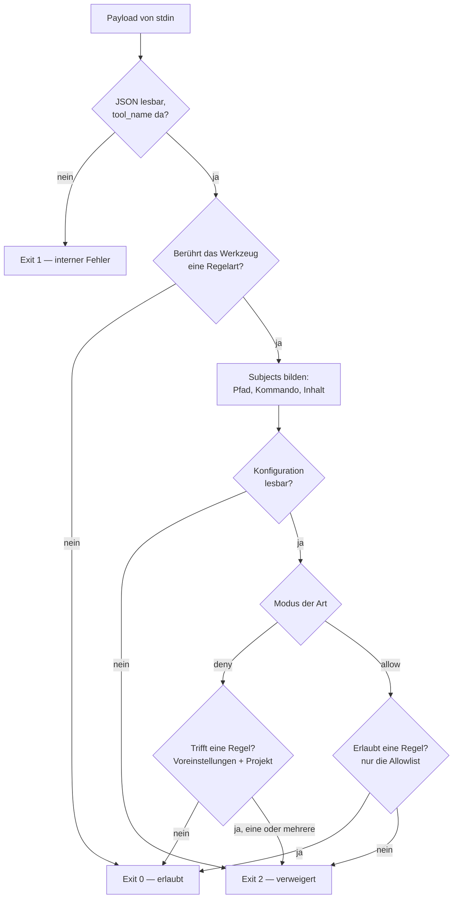

# policy

[English](policy.md)

Kein Ablauf des Harness, sondern der Weg einer einzelnen Entscheidung: Claude
Code oder Gemini fragt vor einem Werkzeugaufruf, und `ulguard` antwortet mit
einem Exit-Code. Die Verzweigung aus Art, Modus, Voreinstellungen und Treffern
ist als Prosa unlesbar; darum steht sie hier als Bild.

Aufruf:

```bash
ulguard --root .                        # Payload von stdin (PreToolUse-Hook)
```

Die Regeln selbst, ihr Schema und die vollständige Liste der Voreinstellungen
stehen in `.ultraloom/policy.toml` und in der [README](../../README.de.md#policy).

## Der Weg einer Entscheidung



## Was die Verzweigungen bedeuten

**`tool_name` zuerst.** Der Hook liest den Werkzeugnamen und endet mit 0, bevor
er eine Konfigurationsdatei anfasst, wenn das Werkzeug keine Regelart berührt.
Er läuft vor jedem `Write`, `Edit`, `MultiEdit`, `NotebookEdit`, `Bash` und `PowerShell`;
sein Aufwand ist
eine Anforderung und keine Nebensache.

**Ein Aufruf, mehrere Subjects.** Jedes Dateiwerkzeug ergibt ein Pfad- und ein
Inhalts-Subjekt, nur heißen die beiden Schlüssel je Werkzeug anders:
`file_path`/`content` bei `Write`, `file_path`/`new_string` bei `Edit`,
`notebook_path`/`new_source` bei `NotebookEdit`. Deshalb steht das im Code als
Tabelle und nicht als Verzweigung — ein neues Werkzeug ist eine Zeile.
`NotebookEdit` mit `edit_mode = "delete"` ergibt nur den Pfad: `new_source` ist
laut Schema Pflicht, wird beim Löschen aber nie geschrieben, eine dort
greifende Inhaltsregel wäre eine Falschmeldung.
`Bash` und `PowerShell` ergeben beide ihr `command` — dieselbe Art `commands`,
derselbe Weg, denn beide führen Kommandos aus. Geprüft werden alle, und die
Begründungen aller landen zusammen auf stderr.

**Die kaputte Konfiguration blockt.** Sie ist Exit 2 und nicht Exit 1. Eine
Policy, die stillschweigend durchlässt, sobald ihre eigene Konfiguration
unlesbar ist, wäre genau die Sperre, die man für vorhanden hält und die nicht
da ist. Exit 1 bleibt echten Innenfehlern vorbehalten: unlesbare Payload,
leeres stdin — und er blockt nie, weil eine defekte Policy keine Sitzung
einsperren darf.

**Deny sammelt, Allow bricht ab.** Im Deny-Modus werden alle treffenden Regeln
ausgewertet, die Voreinstellungen zuerst und danach die Projektregeln in der
Reihenfolge der Datei. Sonst räumte der Agent einen Grund aus, liefe in den
nächsten und bräuchte eine Runde je Regel. Im Allow-Modus beendet die erste
passende Erlaubnis die Prüfung — ein zweiter Grund, warum etwas erlaubt ist,
ändert die Antwort nicht.

**Im Allow-Modus fallen die Voreinstellungen weg.** Dort zählt allein die
Allowlist, auch gegenüber den eingebauten Sperren. Wer den Modus umdreht,
übernimmt die Verantwortung ganz.

## Fehlt die Konfiguration ganz

Dann greifen die Voreinstellungen, und der Weg durch das Bild ist derselbe: die
Datei fehlt, das ist kein Fehler, der Modus ist `deny`, und geprüft wird gegen
die eingebauten Regeln. Ein Repo ohne `.ultraloom/config.toml` ist damit
geschützt, ohne dass jemand etwas eingerichtet hat.
