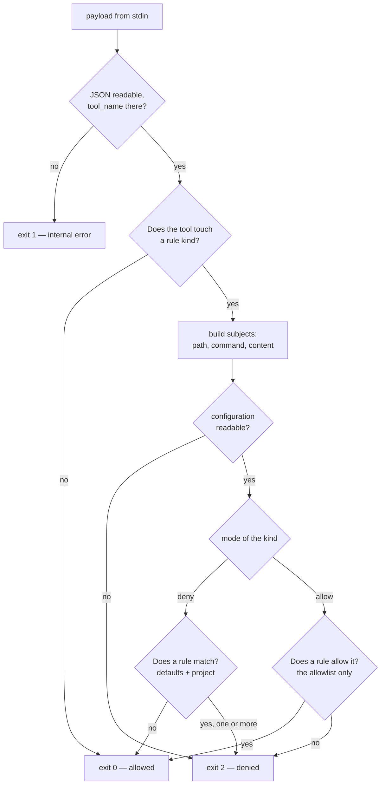

# policy

[Deutsch](policy.de.md)

Not a flow of the harness, but the path of a single decision: Claude Code
or Gemini asks before a tool call, and `ulguard` answers with an exit code. The
branching out of kind, mode, defaults and matches is unreadable as prose; so it
stands here as a picture.

Invocation:

```bash
ulguard --root .                         # payload from stdin (PreToolUse hook)
```

The rules themselves, their schema and the full list of defaults are in `.ultraloom/policy.toml` and the
[README](../../README.md#policy).

## The path of a decision



## What the branches mean

**`tool_name` first.** The hook reads the tool name and ends with 0, before it
touches a configuration file, when the tool touches no rule kind. It runs
before every `Write`, `Edit`, `MultiEdit`, `NotebookEdit`, `Bash` and `PowerShell`; its cost
is a requirement, not an afterthought.

**One call, several subjects.** Every file tool yields a path subject and a
content subject, only the two keys are named differently per tool:
`file_path`/`content` for `Write`, `file_path`/`new_string` for `Edit`,
`notebook_path`/`new_source` for `NotebookEdit`. That is why the code holds
this as a table and not as a branch — a new tool is one line. `NotebookEdit`
with `edit_mode = "delete"` yields only the path: `new_source` is required by
the schema, but is never written on a deletion, and a content rule biting there
would be a false report. `Bash` and `PowerShell` both yield their `command` —
the same kind `commands`, the same path, because both execute commands. All of
them are checked, and the reasons of all of them land on stderr together.

**A broken configuration blocks.** It is exit 2 and not exit 1. A policy that
silently waves things through as soon as its own configuration is unreadable
would be exactly the barrier one believes to be there and which is not. Exit 1
stays reserved for genuine internal errors: an unreadable payload, empty stdin
— and it never blocks, because a broken policy must not lock a session in.

**Deny collects, allow stops.** In deny mode every matching rule is evaluated,
the defaults first and the project rules after them in the order of the file.
Otherwise the agent would clear one reason away, run into the next, and need a
round per rule. In allow mode the first fitting permission ends the check — a
second reason why something is allowed does not change the answer.

**In allow mode the defaults fall away.** There the allowlist alone counts,
including against the built-in barriers. Whoever inverts the mode takes the
responsibility whole.

## When the configuration is missing entirely

Then the defaults apply, and the path through the picture is the same: the file
is absent, that is no error, the mode is `deny`, and the check runs against the
built-in rules. A repo without `.ultraloom/config.toml` is thereby protected,
without anyone having set anything up.
