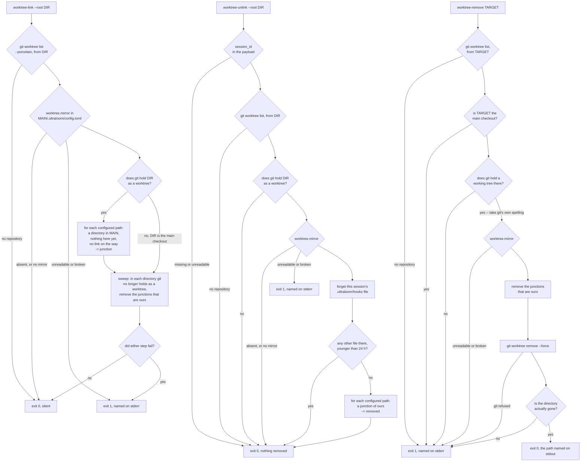

# worktree-mirror

[English](worktree-mirror.md)

Kein Ablauf des Harness und auch keine Entscheidung, sondern die Reparatur
einer Lücke, die `git worktree` lässt: ein neuer Arbeitsbaum bekommt nur, was
Git kennt, also fehlt darin jedes gitignorierte Verzeichnis. In diesem Umfeld
sind das genau die Verzeichnisse, ohne die nichts läuft — die Entwurfsspec
nennt `space/.tools` mit 4,2 GB Godot-Editor, JDK, Android-SDK und dotnet, und
`.ultraloom/vendor`, eine gepinnte Python-Laufzeit, die die erzeugten Hooks
früher aufgerufen haben. Sie tun es nicht mehr: `hookCommand`
(`cmd/init/run.go`, heute bei `:742`) baut sie als blankes `ultraloom` über
PATH, und das hat ein frischer Worktree. Ohne `.tools` kann ein Worktree also
nicht arbeiten; der Vendor-Eintrag ist ein
Pfad, den `space/.ultraloom/config.toml` weiterhin aufführt.

Die Reparatur ist eine Windows-Junction pro konfiguriertem Pfad, die auf den
Haupt-Checkout zeigt, beim Sitzungsstart angelegt und wieder entfernt, wenn die
letzte Sitzung auf diesem Baum endet. Drei Subkommandos von `ulguard`:

```bash
# SessionStart: make the junctions, and sweep what gone worktrees left behind
ulguard worktree-link --root .

# SessionEnd: take them out, but only if no other session stands on this tree
# (reads Claude Code's JSON payload on stdin -- it needs the session id)
ulguard worktree-unlink --root .

# By hand: unlink first, then ask git
ulguard worktree-remove <worktree path>
```

Die Konfiguration ist eine Tabelle in `.ultraloom/config.toml`, gelesen aus dem
Haupt-Checkout:

```toml
[worktree]
mirror = [".tools", ".ultraloom/vendor"]
```

Dieses Repository erklärt keine solche Tabelle, der Mechanismus liegt hier also
still; das Projekt, für das er gebaut wurde, ist `space`.

## Der Graph

`tests/test_flow_docs.py` prüft diese Seite **nicht**. Dieses Modul hält die
Seite jedes *gebündelten Flow-Moduls* gegen den Graphen, den das Modul baut,
und `worktree-mirror` ist ein Hook und kein Flow — aus demselben Grund tragen
`policy.md` und `session-hooks.md` ebenfalls kein geprüftes Diagramm. Also
hält niemand das Bild unten gegen `cmd/guard/worktree.go`: wer die drei
Subkommandos ändert, muss es von Hand mitziehen.



Drei Dinge in diesem Bild zeichnet man leicht falsch, und der Code entscheidet
sie:

- **Der Sweep hängt nicht daran, ob dies ein Worktree ist.** `worktree-link`
  klammert nur den *Link*-Schritt in `topology.IsWorktree(root)`; der Sweep
  läuft in beiden Fällen (`cmd/guard/worktree.go:59-70`). Eine Sitzung im
  Haupt-Checkout ist der gewöhnliche Weg zu merken, dass ein Worktree weg ist,
  und den Sweep daran zu hängen hieße, dass er nur dort liefe, wo er nicht
  gebraucht wird.
- **Ein gescheiterter Link stoppt den Sweep nicht.** Beide Schritte laufen, und
  jeder von ihnen setzt im Fehlerfall den Exit-Code; der zweite wird nicht
  übersprungen, weil der erste schiefging (dieselben Zeilen).
- **`worktree-unlink` vergisst die eigene Datei, bevor es die anderen zählt**
  (`:141-149`). Die andere Reihenfolge zählte die eigene Sitzung als eine
  fremde, und die letzte Sitzung auf einem Baum löste dann nie etwas.

## Warum die Erklärung in einer getrackten Datei steht

`.ultraloom/config.toml` ist getrackt — `git ls-files .ultraloom/config.toml`
listet sie —, sie reist also von sich aus in jeden Worktree, sobald Git ihn
anlegt. Und das ist das Einzige, was in einem Baum verlässlich gilt, in dem
alles Gitignorierte fehlt. Eine zweite Datei oder ein Schlüssel in
`.claude/settings.json` wäre eine zweite Quelle für dieselbe Auskunft, müsste
selbst gespiegelt werden und nützte allem, was nicht Claude Code ist, nichts.

Alle drei Subkommandos lesen sie aus dem *Haupt-Checkout* und nicht aus dem
Arbeitsverzeichnis — jeweils `mirrorcfg.Mirror(topology.Main)`. Die Kopie im
frischen Worktree liegt auch da; welche der beiden gefragt wird, begründet der
Code an keiner Stelle.

Drei Arten, nichts zu tun zu haben, enden alle mit Exit 0 und ohne Ausgabe:
keine `config.toml`, eine ohne `[worktree]`, und eine mit leerem `mirror`
(`internal/mirrorcfg/mirrorcfg.go:37-52`). Ein global verdrahteter Hook trifft
alle drei in jedem fremden Projekt der Maschine. Eine *beschädigte* Datei ist
der umgekehrte Fall und wird gemeldet: als „nichts zu spiegeln" gelesen,
schaltete sie genau den Mechanismus ab, der die konfigurierten Pfade in
Position bringt — und das nächste Symptom wäre eine fehlende Werkzeugkette,
die aus einem scheinbar unverwandten Grund fällt.

## Warum das Go-Binary und kein Python-Hook

Bis zum 2026-09-08 war das Argument kurz und zirkulär: jeder ultraloom-Hook
ist Python, jeder von ihnen lief über `.ultraloom/vendor` — genau das
Verzeichnis, das fehlt —, ein Python-Hook, der das reparieren soll, bräuchte
es also, bevor er anfängt. Die vier Hooks, die `ulinit` erzeugt, laufen nicht
mehr so: `hookCommand` (`cmd/init/run.go`, heute bei `:742`) baut sie als
blankes `ultraloom` über PATH, für sie ist der Kreis damit aufgebrochen.

„Hängt von nichts im Baum ab, den er reparieren soll" unterscheidet nicht mehr:
ein `ultraloom` über PATH erfüllt das genauso — genau das sind diese vier
Hooks jetzt. Es entscheiden noch zwei andere Dinge, und keines davon ist die
Sprache:

* **`ulinit` kann es nicht sein.** `cmd/init/main.go:37` zweigt
  `args[0] == "check"` ab und sonst nichts; jeder andere Aufruf fällt in das
  Flagset des Installers und weiter in
  `run(Options{... Interactive: terminal(stdin), ...})` (`:41-80`). Ein
  Binary, dessen Standardpfad Fragen stellt, darf nie an einem
  `SessionStart`-Hook hängen. `ulguard` ist die Gegenseite: es verteilt schon
  echte Subkommandos, sein `--root`-Vertrag ist etabliert, und es liest
  bereits eine TOML-Datei unter `.ultraloom/`.
* **Den Preis zahlt jedes Projekt der Maschine bei jedem Sitzungsstart.**
  Am 08.09.2026 warm in einer Shell gemessen, je fünf Läufe, brauchte das
  ganze `ultraloom hook session-start` ohne offene Gates 197-341 ms gegen
  97-147 ms für `ulguard worktree-link` — die Hälfte bis zwei Drittel
  (`docs/benchmarks.de.md`, Eintrag 15:05). Dieser `ulguard`-Fall ist der
  stille frühe Ausgang, weil `ultraloom` keine `[worktree]`-Tabelle
  deklariert; der Sweep über neun Kandidatenverzeichnisse, in `space` mit
  besserem Messrahmen gemessen, kostet 136 / 156 / 148 ms (Eintrag 00:30).
  Keine der Zahlen ist die Arbeit der anderen, und einig sind sie sich darin,
  dass in beiden der Prozessstart dominiert.

Ein Hook, den ein Projekt selbst über einen *gespiegelten* Interpreter
verdrahtet, hat das alte Zirkelproblem weiterhin in voller Höhe.

Beide Hook-Subkommandos sind im Erfolgsfall still und schreiben nur Fehler,
diese auf stderr. `worktree-remove` ist die Ausnahme und schreibt den
entfernten Pfad auf stdout: es wird von Hand aufgerufen, und wer etwas löscht,
soll lesen können, was gelöscht wurde.

## Warum das Sitzungsende erst zählt und dann löst

`CLAUDE.md` dokumentiert Sitzungen, die sich einen Checkout teilen — darunter
Verzeichnisse unter `.claude/worktrees/`, die den Haupt-Index mitbenutzen.
Löste das Kommando bedingungslos, verschwände `.tools` unter einer noch
laufenden Sitzung oder unter einem offenen Godot-Editor, und die 4,2 GB hinter
der Junction sind genau das, woraus dieser Editor liest.

Also zählt es zuerst. ultraloom führt schon eine Zustandsdatei pro Sitzung
unter `.ultraloom/hooks/`, und `internal/sessions` liest dieses Verzeichnis
direkt statt über das Python, das dort schreibt — aus dem Grund darüber. Die
Junctions kommen nur heraus, wenn keine andere Datei mehr liegt.

Die Asymmetrie entscheidet, in welche Richtung man irren darf. Eine
stehengelassene Junction kostet nichts: sie belegt keinen Platz, `link`
überspringt sie beim nächsten Sitzungsstart als schon vorhanden, und `sweep`
nimmt sie heraus, sobald Git den Baum nicht mehr hält — genau der Zustand, den
`link` ohnehin absichtlich herstellt. Eine zu früh entfernte kostet eine
laufende Sitzung ihre Toolchain. Jede Regel hier neigt darum zur langen Seite,
und `junction.Remove` benutzt `os.Remove` und nie `os.RemoveAll`
(`internal/junction/junction.go:63-79`): auf einem Reparse-Point entfernt das
Erste den Punkt, und das Zweite ist der Aufruf, der in fremde 4,2 GB
hineinliefe.

## Warum `git worktree remove` einen Wrapper braucht

Viermal gemessen am 2026-09-07, jeder Lauf im Ledger dieses Zweigs
festgehalten, tut `git worktree remove --force` auf einem Worktree mit
Junction darin Folgendes:

- Exit 0,
- keine Ausgabe,
- der Porcelain-Eintrag ist weg, und
- das Verzeichnis **und** die Junction bleiben stehen.

Das Ziel im Haupt-Checkout war jedes Mal intakt, und kein gemessener Löschweg
griff durch die Junction hindurch. Das Ergebnis ist also Müll und keine
Gefahr: ein Verzeichnis, das Git nicht mehr kennt, mit einem Link in den
Haupt-Checkout darin, als Erfolg gemeldet.

`worktree-remove` ist diese Reihenfolge richtiggestellt — erst lösen, dann Git
fragen — plus zwei Verweigerungen davor und eine Prüfung danach
(`cmd/guard/worktree.go:181-244`):

1. Der **Haupt-Checkout** wird als Erstes und aus eigenem Recht verweigert. Ein
   Wrapper, dessen schlimmster Ausgang das Löschen des Repositorys ist, sagt zu
   diesem Fall vor allem anderen Nein.
2. Ein Verzeichnis, an dem **Git keinen Arbeitsbaum hält**, wird als Zweites
   verweigert: dann ist hier nichts zu entfernen, und jeder Kandidat sind
   fremde Daten.
3. Der Pfad, den Git bekommt, ist **Gits eigene Schreibweise** aus dem
   Porcelain und nicht das Argument des Aufrufers. Der Git-Aufruf läuft mit
   seinem Arbeitsverzeichnis im Haupt-Checkout, ein relatives Argument löste
   also *dort* auf, während die Verweigerungen es hier aufgelöst haben — in
   einem Verzeichnis geprüft und in einem anderen gelöscht.
4. Nach Gits Exit 0 fragt `os.Lstat`, ob das Verzeichnis wirklich weg ist. Bei
   einer Junction, die die Konfiguration nicht nennt — keine
   `[worktree]`-Tabelle, oder ein Link, der aus dem Haupt-Checkout
   hinauszeigt, was `unlink` beides absichtlich liegen lässt —, endet Git mit 0
   und der Baum bleibt stehen; ohne diese Prüfung meldete das Kommando Erfolg
   über genau dem Rest, den es verhindern soll.

Verweigert Git, sind die Junctions schon heraus, und nichts hier legt sie
wieder an; das tut `worktree-link` beim nächsten Sitzungsstart.

## Drei Folgen, die man kennen sollte

### Ein lebendes Verzeichnis, das Git nicht hält, wird trotzdem gefegt

„Unsere" Junction ist eine, für die drei Bedingungen zusammen gelten: ein
Reparse-Point, an einem konfigurierten `mirror`-Pfad, in einem Verzeichnis, das
Git nicht mehr als Worktree hält, und mit Ziel im Haupt-Checkout. Alle drei
sind tragend, und keine wird gelockert.

Die Folge ist gewollt, und sie ist die überraschende: ein Verzeichnis unter
`.claude/worktrees/`, das Git **nicht** als Worktree hält, in dem aber eine
passende Junction liegt, wird gefegt, **während jemand darin arbeitet** — und
`worktree-link` legt sie dort nicht wieder an, weil `IsWorktree` für so ein
Verzeichnis falsch ist. `CLAUDE.md` beschreibt genau diese Sorte Verzeichnis:
es teilt den Haupt-Index, `git worktree list` kann es also nicht nennen, und
`Orphans` liest es als unregistriert.

Jede der drei Bedingungen zu lockern wäre das, was den Sweep *unsicher*
machte — ein echtes Verzeichnis an einem `mirror`-Pfad sind fremde Daten, und
eine Junction, die woandershin zeigt, ist fremde Absicht. Was die Regel in
dieser Form kostet, ist eine Junction, die von Hand neu gelegt werden muss, und
nie Daten: `sweep` entfernt den Reparse-Point und sonst nichts.

Es gibt auch kein Verzeichnis der selbst angelegten Junctions. Das wäre ein
zweiter Zustand, der abweichen kann, und nach einem `Remove-Item -Recurse` auf
einen Worktree wäre er sofort falsch. Der Preis ist, dass von Hand gelegte
Junctions an denselben Stellen und mit demselben Ziel adoptiert werden — was
richtig ist, denn sie sind von den eigenen nicht unterscheidbar und wurden aus
demselben Grund gelegt.

### Die 24-Stunden-Grenze ist eine Grenze und keine Lösung

Vor `sessions.Forget` hat niemand diese Zustandsdateien gelöscht, ihre mtime
ist also die einzige Lebendigkeit, die zu lesen ist, und eine Datei, die älter
ist als `sessionStale = 24 * time.Hour`, wird nicht gezählt
(`cmd/guard/worktree.go:74-94`).

Die Zahl ist nur so gut wie die Schreibvorgänge dahinter, und es sind vier:
`src/ultraloom/hooks/session_start.py:59` beim Sitzungsstart, `stop.py:250` bei
jeder Blockade und `:283` bei jedem Durchlauf, und `subagent_start.py:38` bei
jedem Subagentenstart — der Letzte allein an der Payload und an keiner
Konfiguration hängend. Die Datei ist also so jung wie der letzte beendete Zug
oder der letzte losgeschickte Subagent. Nur eine lange interaktive Sitzung, die
keinen Subagenten schickt, in einem Projekt ohne konfiguriertes Stop-Gate,
altert über ihren eigenen Start hinaus.

**Keine Zahl schließt dieses Loch, und diese auch nicht.** Die eigentliche
Lösung ist ein Schreibvorgang auf der lebenden Seite — `worktree-link` fasst
beim Sitzungsstart die Zustandsdatei an, oder es wird von der
`SessionEnd`-Seite geschrieben. Das ist Folgearbeit und nicht gebaut.

Von den zwei verfügbaren Vermutungen sind 24 Stunden dennoch die bessere, wegen
der Asymmetrie von oben: lang zu irren lässt eine Junction stehen, die nichts
kostet, kurz zu irren zieht sie einer laufenden Sitzung weg. Ein Arbeitstag ist
außerdem die Einheit, in der ein Mensch die Frage „ist diese Sitzung noch
meine?" beantwortet.

### Keine der beiden Präfix-Schreibweisen ist die richtige, also vergleicht nichts als Text

Ein Reparse-Point speichert einen Pfad in NT-Form, und die genaue Schreibweise
hängt daran, wer die Junction gelegt hat. Gemessen am 2026-09-07: das
`junction.Create` dieses Projekts speichert `\??\C:\dir\` **mit** abschließendem
Trenner, `mklink /J` speichert `\??\C:\dir` **ohne**, und beides löst auf
(`internal/junction/junction.go:35-38`,
`internal/junction/junction_windows.go:55-62`). Windows verlangt keine der
beiden Formen, der Trenner hier ist also eine Wahl und keine Vorschrift — und
er wird absichtlich nicht an `mklink` angeglichen, denn die von Hand gelegten
Links, die dieser Mechanismus erbt, kommen von `mklink`, und beide Formen
müssen ohnehin gelesen werden.

Darum vergleicht dieser Code überall über Identität — zweimal `os.Stat` und
`os.SameFile` — oder über Pfade, die auf **beiden** Seiten durch
`filepath.Clean` gelaufen sind, und nie als Text. `sameDir`, `leadsInto` und
`stripNTPrefix` (`cmd/guard/worktree.go:474-527`) sind die drei Stellen, die
diese Linie halten, und `worktreetopo` hält sie für Gits eigene Pfade, die aus
dem Porcelain unter Windows mit Vorwärtsschrägstrichen kommen.

Das ist tragend, und ein Test beweist es: mit einem Textvergleich anstelle von
`sameDir` rutscht der Pfad des Haupt-Checkouts plus ein Pfadtrenner an
**beiden** Verweigerungen von `worktree-remove` vorbei und erreicht
`git worktree remove --force` mit dem Haupt-Checkout als Ziel — danach steht
nur noch Gits eigenes „is a main working tree" zwischen dem Wrapper und dem
Repository. `TestWorktreeRemoveRefusesTheMainCheckout`
(`cmd/guard/worktree_test.go:1078-1102`) nagelt alle drei Schreibweisen fest.

Die verwandte Falle ist, dass die Schreibweise eines Pfades auch nicht
entscheidet, *wohin* er führt. Ein Open mit `FILE_FLAG_OPEN_REPARSE_POINT`
bewahrt nur die **letzte** Komponente davor, verfolgt zu werden; eine Junction
an `<tree>/.ultraloom` ließe also `<tree>/.ultraloom/vendor` den Reparse-Point
von `<main>/.ultraloom/vendor` lesen und entfernen — die gepinnte Laufzeit,
herausgenommen von dem Mechanismus, der sie hinlegen soll. `sweep` und `unlink`
rufen darum beide `standsInside`, bevor sie überhaupt fragen, ob ein Pfad eine
Junction ist: jede Komponente strikt zwischen dem Baum und dem Kandidaten muss
ein einfaches Verzeichnis sein, und eine Komponente, die sich nicht statten
lässt, gilt als keines (`cmd/guard/worktree.go:392-429`).

`link` braucht denselben Schutz und eine schwächere Regel, denn es darf
fehlende Elternverzeichnisse anlegen: jede Komponente strikt zwischen dem
Worktree und dem Kandidaten muss ein einfaches Verzeichnis **oder abwesend**
sein (`parentsPlainOrAbsent`, `cmd/guard/worktree.go:431-472`). Ohne das ließ
eine Junction an `<worktree>/.tools` das Lstat von `<worktree>/.tools/godot`
nach dem Ziel dieser Junction fragen, „abwesend" dort las sich als „unser zum
Anlegen", und das folgende `MkdirAll` samt `junction.Create` schrieb
*außerhalb* des Worktrees, an eine Stelle, die kein Sweep von uns je ansieht.
Gemessen am 2026-09-08 vor der Korrektur: Exit 0, keine Ausgabe, eine Junction
an `<main>/elsewhere/godot`.

## Exit-Codes

    0  in Ordnung, oder absichtlich nichts zu tun
    1  ein Fehler, auf stderr benannt

Einen dritten Code gibt es hier nicht: `cmd/guard/guard.go:17-19` definiert
`ExitOK = 0`, `ExitInternal = 1` und `ExitDenied = 2`, und diese drei
Subkommandos benutzen nur die ersten beiden — `ExitDenied` gehört dem
Policy-Guard. Keines von ihnen kann einen Zug anhalten, und keines soll es — einer
Sitzung, deren Spiegelung nicht angelegt werden konnte, sagt man das, statt sie
zu stoppen.

## Verdrahtung

**Nicht Teil dieses Commits.** `~/.claude/settings.json` ist ein eigenes
Repository außerhalb dieses Projekts, und die beiden Einträge unten sind der
Vorschlag, der an dessen Eigentümer geht:

```json
"SessionStart": [
  { "hooks": [
    { "type": "command", "command": "ulguard worktree-link --root \"${CLAUDE_PROJECT_DIR}\"", "timeout": 20 }
  ] }
],
"SessionEnd": [
  { "hooks": [
    { "type": "command", "command": "ulguard worktree-unlink --root \"${CLAUDE_PROJECT_DIR}\"", "timeout": 20 }
  ] }
]
```

Zwei Dinge daran sind ungemessen und als offen zu lesen. Erstens ist **nicht**
beobachtet, dass ein `SessionEnd`-Ereignis hier tatsächlich bei
`worktree-unlink` ankommt. Der Name steckt im Produkt — im gebündelten
`claude.exe` am 2026-09-08 ausgezählt kommt die Zeichenkette 36-mal vor, neben
`SessionStart` mit 95 und `SubagentStop` mit 55 —, was zeigt, dass es das
Ereignis gibt, und nicht, dass es hier ankommt. Kommt es nicht an, ist
`worktree-unlink` nicht wertlos, aber es verliert seinen Aufhänger, und der
Sweep in `worktree-link` sowie `worktree-remove` sind dann die einzigen zwei
Aufräumwege. Zweitens ist das Timeout von 20 s geraten: die Zeiten in
`session-hooks.md` sind gemessen, diese zwei nicht.

Was später zu einem dieser Ereignisse hinzukommt, gehört in **denselben**
Eintrag, wo es Zustand teilt: mehrere Einträge zu einem Ereignis starten
gleichzeitig und nicht hintereinander. Was diese Gleichzeitigkeit für den
eigenen `SessionStart`-Hook eines Projekts bedeutet, der einen Pfad braucht,
den `worktree-link` gerade erst anlegt, ist ungemessen. Der
`SessionStart`-Hook von ultraloom ist kein solcher Fall mehr: er ruft das
`ultraloom` über PATH auf.
