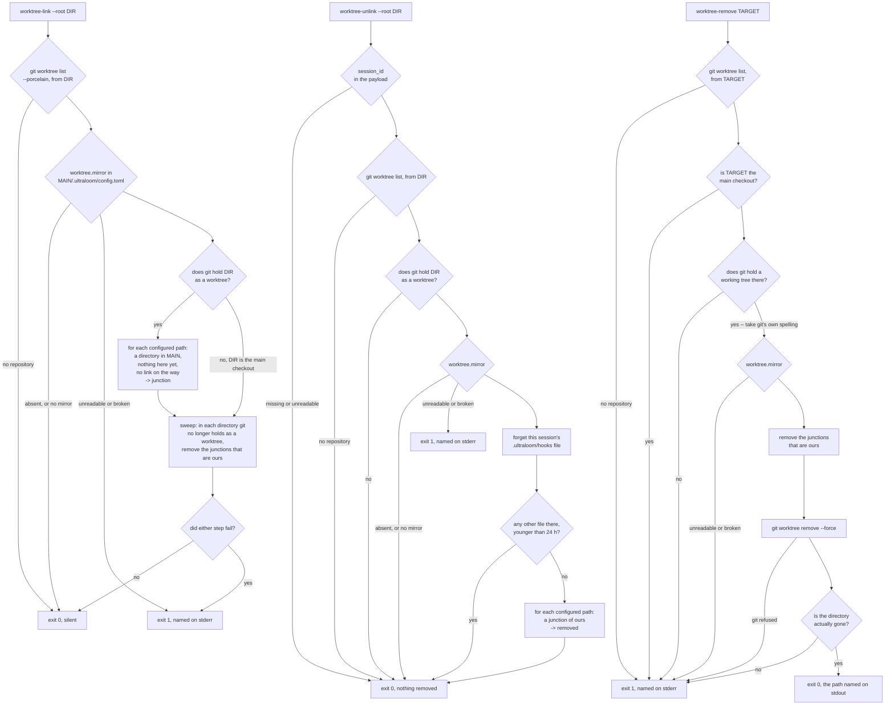

# worktree-mirror

[Deutsch](worktree-mirror.de.md)

Not a flow of the harness and not a decision either, but the repair of a hole
`git worktree` leaves: a new working tree gets only what git tracks, so every
gitignored directory is missing in it. In this environment those are the
directories without which nothing runs — the design spec records
`space/.tools` at 4.2 GB of Godot editor, JDK, Android SDK and dotnet, and
`.ultraloom/vendor`, a pinned Python runtime the generated hooks used to call.
They no longer do: `hookCommand` (`cmd/init/run.go`, at `:742`) builds them
as a bare `ultraloom` looked up on PATH, which a fresh worktree has. So
`.tools` is what a worktree cannot do without; the vendor entry is a path
`space/.ultraloom/config.toml` still lists.

The repair is a Windows junction per configured path, pointing at the main
checkout, made at session start and taken back out when the last session on
that tree ends. Three subcommands of `ulguard`:

```bash
# SessionStart: make the junctions, and sweep what gone worktrees left behind
ulguard worktree-link --root .

# SessionEnd: take them out, but only if no other session stands on this tree
# (reads Claude Code's JSON payload on stdin -- it needs the session id)
ulguard worktree-unlink --root .

# By hand: unlink first, then ask git
ulguard worktree-remove <worktree path>
```

The configuration is one table in `.ultraloom/config.toml`, read out of the
main checkout:

```toml
[worktree]
mirror = [".tools", ".ultraloom/vendor"]
```

This repository declares no such table, so the mechanism is inert here; the
project it was built for is `space`.

## The graph

`tests/test_flow_docs.py` does **not** check this page. That module holds the
page of every *bundled flow module* against the graph the module builds, and
`worktree-mirror` is a hook, not a flow — the same reason `policy.md` and
`session-hooks.md` carry no checked diagram either. So nothing holds the
picture below against `cmd/guard/worktree.go`: whoever changes the three
subcommands has to pull it along by hand.



Three things in that picture are easy to draw wrong, and the code decides them:

- **The sweep is not gated on being a worktree.** `worktree-link` wraps only
  the *link* step in `topology.IsWorktree(root)`; the sweep runs either way
  (`cmd/guard/worktree.go:59-70`). A session in the main checkout is the
  ordinary way to notice that a worktree is gone, and gating the sweep would
  mean the cleanup only ever ran where it is not needed.
- **A failed link does not stop the sweep.** Both steps run, and either one
  failing sets the exit code; the second is not skipped because the first went
  wrong (same lines).
- **`worktree-unlink` forgets its own file before it counts the others**
  (`:141-149`). The other order would count our own session as somebody else,
  so the last session on a tree would never unlink anything.

## Why the declaration lives in a tracked file

`.ultraloom/config.toml` is tracked — `git ls-files .ultraloom/config.toml`
lists it — so it travels into every worktree the moment git creates one, which
is the one thing reliably true in a tree where everything gitignored is
missing. A second file, or a key in `.claude/settings.json`, would be a second
source for the same answer, would have to be mirrored itself, and would be
useless to anything that is not Claude Code.

All three subcommands read it out of the *main checkout* and not out of the
working directory — `mirrorcfg.Mirror(topology.Main)` in each. The copy in a
fresh worktree is there too; which of the two is asked is not a question the
code answers in a comment.

Three ways of having nothing to do are all exit 0 and silent — no
`config.toml`, one without `[worktree]`, and one whose `mirror` is empty
(`internal/mirrorcfg/mirrorcfg.go:37-52`). A globally wired hook meets all
three in every unrelated project on the machine. A *damaged* file is the
opposite case and is reported: read as "nothing to mirror", it would switch off
the mechanism that puts the configured paths in place, and the next symptom
would be a missing toolchain failing for an unrelated-looking reason.

## Why the Go binary and not a Python hook

Until 2026-09-08 the argument was circular and short: every ultraloom hook is
Python, every one of them ran through `.ultraloom/vendor` — precisely the
directory that is missing — so a Python hook asked to repair it would need
it to exist already. The four hooks `ulinit` generates no longer run that way:
`hookCommand` (`cmd/init/run.go`, at `:742`) builds them as a bare
`ultraloom` on PATH, so the circle is broken for them.

"Nothing inside the tree it repairs" is no longer the discriminator, because
an `ultraloom` on PATH satisfies that as well — that is exactly what those
four hooks now are. What still decides it is two things, and neither is about
the language:

* **`ulinit` cannot be the one to do it.** `cmd/init/main.go:37` intercepts
  `args[0] == "check"` and nothing else; every other invocation falls into the
  installer's own flag set and on to
  `run(Options{... Interactive: terminal(stdin), ...})` (`:41-80`). A binary
  whose default path asks questions must never hang on a `SessionStart` hook.
  `ulguard` is the other side of that: it already dispatches real subcommands,
  its `--root` contract is established, and it already reads a TOML file under
  `.ultraloom/`.
* **The price is paid in every project on the machine, on every session
  start.** Measured warm on 2026-09-08 in one shell, five runs each, the
  whole `ultraloom hook session-start` with nothing pending took 197-341 ms
  against 97-147 ms for `ulguard worktree-link` — half to two thirds
  (`docs/benchmarks.md`, entry 15:05). That `ulguard` case is the silent early
  exit, because `ultraloom` declares no `[worktree]` table; the sweep over
  nine candidate directories, measured in `space` with a better harness, costs
  136 / 156 / 148 ms (entry 00:30). Neither number is the other's workload,
  and what they agree on is that process start dominates both.

A hook that a project wires through a *mirrored* interpreter of its own still
has the old circular problem in full.

Both hook subcommands are silent on success and write only faults, to stderr.
`worktree-remove` is the exception and writes the removed path to stdout: it is
run by hand, and somebody deleting something should get to read what was
deleted.

## Why session end counts before it unlinks

`CLAUDE.md` documents sessions sharing one checkout, including directories
under `.claude/worktrees/` that share the main index. Unlinking
unconditionally would pull `.tools` out from under a session still running, or
from under an open Godot editor — and the 4.2 GB behind the link is exactly
what that editor reads from.

So the count comes first. ultraloom already keeps one state file per session
under `.ultraloom/hooks/`, and `internal/sessions` reads that directory
directly rather than through the Python that writes it, for the reason above.
The junctions come out only when no other file is left there.

The asymmetry decides which way to err. Leaving a junction standing costs
nothing: it occupies no disk, `link` skips it at the next session start as
already present, and `sweep` takes it out once git stops holding the tree —
which is the state `link` deliberately creates anyway. Taking one out too early
costs a live session its toolchain. Every rule here therefore leans long, and
`junction.Remove` uses `os.Remove` and never `os.RemoveAll`
(`internal/junction/junction.go:63-79`): on a reparse point the first removes
the point, and the second is the call that would walk into somebody else's
4.2 GB.

## Why `git worktree remove` needs a wrapper

Measured four times on 2026-09-07, each run recorded in the branch's ledger:
`git worktree remove --force` on a worktree holding a junction

- exits 0,
- prints nothing,
- drops the porcelain entry, and
- leaves the directory **and** the junction standing.

The target in the main checkout was intact every time, and no delete path
measured reached through the junction. So the result is rubbish rather than
danger: a directory git no longer knows, with a link into the main checkout
still in it, reported as a success.

`worktree-remove` is that order put right — unlink first, then ask git — plus
two refusals ahead of everything and one check afterwards
(`cmd/guard/worktree.go:181-244`):

1. The **main checkout** is refused in its own right, before anything else. A
   wrapper whose worst outcome is deleting the repository says no to that one
   first.
2. A directory **git holds no working tree at** is refused next: there is then
   nothing here to remove, and every candidate is somebody's data.
3. The path handed to git is **git's own spelling** out of the porcelain and
   not the caller's argument. The git call runs with its working directory in
   the main checkout, so a relative argument would resolve *there* while the
   refusals resolved it here — checked in one directory and deleted in
   another.
4. After git exits 0, `os.Lstat` asks whether the directory is actually gone.
   For a junction the configuration does not name — no `[worktree]` table, or
   a link pointing outside the main checkout, both of which `unlink`
   deliberately leaves alone — git exits 0 and the tree stays, and without this
   check the command would report success over exactly the leftover it exists
   to prevent.

If git refuses, the junctions are already out and nothing here puts them back;
the next session start's `worktree-link` does.

## Three consequences worth knowing

### A live directory git does not hold is swept anyway

What makes a junction ours is three conditions together: a reparse point, at a
configured `mirror` path, inside a directory git no longer holds as a worktree,
leading into the main checkout. All three are load-bearing and none is relaxed.

The consequence is deliberate, and it is the surprising one: a directory under
`.claude/worktrees/` that git does **not** hold as a worktree but that carries
a matching junction is swept **even while somebody is working in it** — and
`worktree-link` will not put it back there, because `IsWorktree` is false for
such a directory. `CLAUDE.md` describes exactly this kind of directory: it
shares the main index, so `git worktree list` cannot name it and the sweep's
`Orphans` reads it as unregistered.

Relaxing any of the three conditions is what would make the sweep *unsafe* — a
real directory at a mirror path is somebody's data, and a junction pointing
somewhere else is somebody's own arrangement. What the rule as it stands costs
is a junction that has to be made again by hand, never data: `sweep` removes
the reparse point and nothing else.

There is also no ledger of the junctions we made. That would be a second state
that can drift, and after a `Remove-Item -Recurse` on a worktree it would be
wrong immediately. The price is that hand-made junctions at the same places,
pointing at the same target, are adopted — which is right, since they are
indistinguishable from ours and were made for the same reason.

### The 24-hour cutoff is a cutoff, not a fix

Nothing deleted these state files before `sessions.Forget`, so their mtime is
the only liveness there is to read, and a file older than
`sessionStale = 24 * time.Hour` is not counted
(`cmd/guard/worktree.go:74-94`).

The number is only as good as the writes behind it, and there are four:
`src/ultraloom/hooks/session_start.py:59` at session start, `stop.py:250` on
every block and `:283` on every pass, and `subagent_start.py:38` on every
subagent dispatch — the last gated on the payload alone and on no
configuration at all. So the file is as young as the last turn that ended or
the last subagent dispatched. Only a long interactive session that dispatches
no subagent, in a project without a configured stop gate, ages past its own
start.

**No number closes that hole, and 24 hours does not either.** The real fix is a
write on the live side — `worktree-link` touching the session's state file at
session start, or a write from the `SessionEnd` side. That is follow-up work
and is not built.

Twenty-four hours is nevertheless the better of the two guesses available, for
the asymmetry named above: erring long leaves a junction that costs nothing,
erring short pulls one out from under a live session. A working day is also the
unit in which a human answers "is that session still mine?".

### Neither prefix spelling is canonical, so nothing compares as text

A reparse point stores an NT-form path, and its exact spelling depends on who
made the junction. Measured on 2026-09-07: this project's `junction.Create`
stores `\??\C:\dir\` **with** a trailing separator, `mklink /J` stores
`\??\C:\dir` **without** one, and both resolve
(`internal/junction/junction.go:35-38`,
`internal/junction/junction_windows.go:55-62`). Windows does not insist either
way, so the trailing separator here is a choice and not a requirement — and it
is deliberately not changed to match `mklink`, because the hand-made links this
mechanism inherits came from `mklink` and both forms have to be read anyway.

Therefore every comparison in this code is by identity — `os.Stat` twice and
`os.SameFile` — or on paths run through `filepath.Clean` on **both** sides, and
never on text. `sameDir`, `leadsInto` and `stripNTPrefix`
(`cmd/guard/worktree.go:474-527`) are the three places that hold that line, and
`worktreetopo` holds it for git's own paths, which come out of the porcelain
with forward slashes on Windows.

It is load-bearing, and a test proves it: with a text comparison instead of
`sameDir`, the main checkout's path plus a path separator slips past **both**
of `worktree-remove`'s refusals and reaches `git worktree remove --force`
aimed at the main checkout, after which only git's own "is a main working
tree" refusal stands between the wrapper and the repository.
`TestWorktreeRemoveRefusesTheMainCheckout`
(`cmd/guard/worktree_test.go:1078-1102`) pins all three spellings.

The related trap is that a path's spelling does not decide where it *goes*
either. An open with `FILE_FLAG_OPEN_REPARSE_POINT` keeps only the **final**
component from being followed, so a junction at `<tree>/.ultraloom` would make
`<tree>/.ultraloom/vendor` read and remove the reparse point of
`<main>/.ultraloom/vendor` — the pinned runtime, taken out by the mechanism
that exists to put it there. Both `sweep` and `unlink` therefore call
`standsInside` before they ask whether a path is a junction at all: every
component strictly between the tree and the candidate must be a plain
directory, and a component that cannot be stat'ed counts as not one
(`cmd/guard/worktree.go:392-429`).

`link` needs the same guard and a weaker rule, because it is allowed to create
missing parents: every component strictly between the worktree and the
candidate must be a plain directory **or absent**
(`parentsPlainOrAbsent`, `cmd/guard/worktree.go:431-472`). Without it a
junction at `<worktree>/.tools` made the Lstat of `<worktree>/.tools/godot`
ask about the junction's target, absent there read as "ours to fill", and the
`MkdirAll` and `junction.Create` that followed wrote *outside* the worktree, at
a path no sweep of ours ever looks at. Measured on 2026-09-08 before the fix:
exit 0, no output, a junction standing at `<main>/elsewhere/godot`.

## Exit codes

    0  in order, or deliberately nothing to do
    1  a fault, named on stderr

There is no third code here: `cmd/guard/guard.go:17-19` defines `ExitOK = 0`,
`ExitInternal = 1` and `ExitDenied = 2`, and these three subcommands use only
the first two — `ExitDenied` belongs to the policy guard. None of them
can hold a turn, and none is meant to — a session whose mirror could not be
made should be told so, not stopped.

## Wiring

**Not part of this commit.** `~/.claude/settings.json` is a repository of its
own, outside this project, and the two entries below are the proposal that goes
to its owner:

```json
"SessionStart": [
  { "hooks": [
    { "type": "command", "command": "ulguard worktree-link --root \"${CLAUDE_PROJECT_DIR}\"", "timeout": 20 }
  ] }
],
"SessionEnd": [
  { "hooks": [
    { "type": "command", "command": "ulguard worktree-unlink --root \"${CLAUDE_PROJECT_DIR}\"", "timeout": 20 }
  ] }
]
```

Two things about this are unmeasured and should be read as open. First, that a
`SessionEnd` event actually reaches `worktree-unlink` here has **not** been
observed. The name is in the product — counted in the bundled `claude.exe` on
2026-09-08, the string occurs 36 times, beside `SessionStart` at 95 and
`SubagentStop` at 55 — which shows the event exists and not that it arrives
here. If it does not, `worktree-unlink` is not worthless, but it loses its
trigger, and the sweep inside `worktree-link` plus `worktree-remove` are then
the only two cleanup paths. Second, the 20 s timeout is a guess: the durations
in `session-hooks.md` were measured, these two were not.

Whatever gets added to one of these events later belongs in the **same** entry
where it shares state: several entries for one event start concurrently, not
one after another. What that concurrency means for a project's own
`SessionStart` hook that needs a path `worktree-link` is at that moment
creating is unmeasured. The ultraloom `SessionStart` hook is no longer such a
case: it calls the `ultraloom` on PATH.
