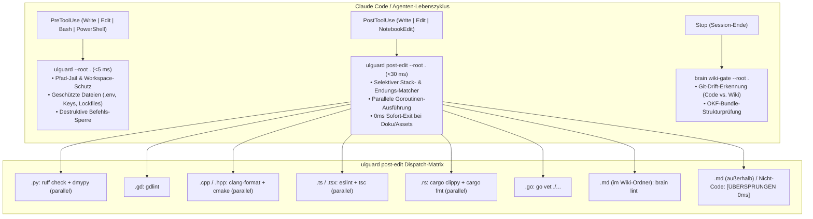

# UltraLoom Hook-Architektur & Toolchain-Referenz

[English Version](hooks.md)

UltraLoom ersetzt fragmentierte, langsame Python- und Bash-Wrapperskripte durch eine hochperformante, Go-native Hook-Architektur. Alle Sicherheits- und Linting-Prüfungen laufen in Millisekunden ab, ohne die Arbeitsabläufe von KI-Agenten zu blockieren.

---

## Architektur-Übersicht



---

## Unterstützte Lifecycle-Events

### 1. `PreToolUse` — Sicherheits- & Policy-Wächter
* **Hook-Befehl:** `ulguard --root "${CLAUDE_PROJECT_DIR}"`
* **Matcher:** `Write|Edit|NotebookEdit|Bash|PowerShell`
* **Laufzeit:** $<5\text{ ms}$
* **Aufgaben & Garantien:**
  * **Path-Jail:** Verhindert das Ausbrechen aus dem Projekt-Workspace.
  * **Geschützte Dateien:** Blockiert das Überschreiben oder Modifizieren sensibler Dateien (`.env`, `*.pem`, `*.key`, `id_rsa`, `*.p12`, AWS-Secrets, `uv.lock`, `package-lock.json`, etc.).
  * **Befehlssperre:** Fängt destruktive oder gefährliche Terminalbefehle ab (z. B. `git push`, unbedachte Clean-Befehle oder benutzerdefinierte Muster aus `.ultraloom/config.toml`).

### 2. `PostToolUse` — Selektive parallele Qualitätsprüfung
* **Hook-Befehl:** `ulguard post-edit --root "${CLAUDE_PROJECT_DIR}"`
* **Matcher:** `Write|Edit|NotebookEdit`
* **Laufzeit:** ~25–35 ms (warm)
* **Aufgaben & Garantien:**
  * **Selektive Ausführung:** Liest den Pfad der geänderten Datei über `stdin` und führt *nur* die Linter aus, die zu diesem spezifischen Sprach-Stack gehören.
  * **Goroutine-Parallelität:** Formatierer, Linter und Typprüfer laufen gleichzeitig in parallelen Threads.
  * **Null-Overhead-Bypass:** Nicht-Code-Dateien (`.json`, `.yaml`, `.toml`, Bilder) sowie Markdown-Dateien außerhalb des Wikis beenden sofort in $0\text{ ms}$ ohne Prozess-Start.

### 3. `SessionStart` — Initialisierung & Kontext-Injektion
* **Hook-Befehl:** `uv run --project .ultraloom/vendor/ultraloom ultraloom hook session-start --root "${CLAUDE_PROJECT_DIR}"`
* **Aufgaben:** Injiziert zu Beginn jeder Session den aktuellen Projektstatus, die letzten Wiki-Logeinträge und Git-Informationen in den Agenten-Kontext.

### 4. `SubagentStart` & `SubagentStop` — Multi-Agenten-Synchronisation
* **Hook-Befehle:** `ultraloom hook subagent-start` / `subagent-stop`
* **Aufgaben:** Koordiniert und synchronisiert den Status zwischen Haupt- und Subagenten.

### 5. `Stop` — Abschluss-Gates
* **Hook-Befehl:** `brain wiki-gate --root "${CLAUDE_PROJECT_DIR}"` (wenn UltraBrain aktiv ist)
* **Laufzeit:** ~0,9–1,1 s
* **Aufgaben & Garantien:**
  * **Git-Drift-Erkennung:** Stellt sicher, dass bei Code-Änderungen die Dokumentation im Wiki entsprechend nachgeführt wurde.
  * **OKF-Bundle-Linting:** Validiert Querverweise, Frontmatter und Index-Konsistenz vor dem Session-Abschluss.

---

## Unterstützte Stacks & Toolchains

| Stack | Dateiendungen | Ausgeführte Befehle (Parallel) | Beschreibung |
| :--- | :--- | :--- | :--- |
| **Python** | `.py` | `ruff check --output-format=concise .`<br>`dmypy run -- --no-error-summary --no-pretty` | Schnelles Linting & inkrementeller Daemon-Typencheck |
| **GDScript** | `.gd` | `gdlint <file>` | Gezieltes GDScript-Linting auf Dateiebene |
| **C++ / C** | `.cpp`, `.hpp`, `.cc`, `.cxx`, `.c`, `.h` | `clang-format -i <file>`<br>`cmake --build build --parallel` | Formatierung und paralleler Build-Check |
| **TypeScript / JS** | `.ts`, `.tsx`, `.js`, `.jsx` | `npx eslint .`<br>`npx tsc --noEmit` | Paralleler ESLint- und TypeScript-Check |
| **Vue** | `.vue` | `npx vue-tsc --noEmit` | Statische Typenprüfung für Vue Single-File Components |
| **Svelte** | `.svelte` | `npx svelte-check` | Svelte-Komponentendiagnose und Typenprüfung |
| **CSS / SCSS** | `.css`, `.scss`, `.sass`, `.less` | `npx stylelint <file>` | CSS/SCSS-Linting auf Selektoren und Property-Fehler |
| **HTML** | `.html`, `.htm` | `npx htmlhint <file>` | HTML-Syntax- und Markup-Validierung |
| **Shell / Bash** | `.sh`, `.bash`, `.zsh` | `shellcheck <file>` | Statische Shell-Analyse für POSIX-Konformität |
| **SQL** | `.sql` | `sqlfluff lint <file>` | SQL-Dialekt-Syntaxprüfung und Formatvalidierung |
| **Rust** | `.rs` | `cargo clippy -- -D warnings`<br>`cargo fmt --check` | Clippy-Linter (Zero-Warning) und Format-Check |
| **Go** | `.go` | `go vet ./...` | Statische Analyse via `go vet` |
| **Wiki (UltraBrain)** | `.md` *(im Wiki-Verzeichnis)* | `brain lint <file>` | Schnelle Einzeldatei-Prüfung auf OKF-Typ & Frontmatter |
| **Dokumentation** | `.md` *(außerhalb des Wikis)* | *[ÜBERSPRUNGEN]* | 0ms Sofort-Exit; freies Markdown-Format |
| **Assets & Daten** | `.txt`, `.json`, `.yaml`, `.toml`, `.png`, ... | *[ÜBERSPRUNGEN]* | 0ms Sofort-Exit |

---

## Konfiguration & Quellen der Wahrheit

UltraLoom folgt einer klaren Hierarchie:

1. **UltraBrain (`.brain.toml`):**
   * Definiert, ob das Repository ein Brain-Bereich mit Wiki-Ebene ist (`[area] wiki = true`) und legt das Layout fest.
   * Fehlt die `.brain.toml` oder ist `wiki = false`, bleiben Wiki-Hooks standardmäßig deaktiviert.
2. **UltraLoom-Konfiguration (`.ultraloom/config.toml` & `.ultraloom/answers.toml`):**
   * Verwaltet Policies, geschützte Dateipfade, Ziel-Agenten (`claude`, `gemini`) und Schwellenwerte.
3. **Claude Code Settings (`.claude/settings.json`):**
   * Enthält die schlanken Hook-Verweise auf `ulguard` und `ulguard post-edit`.

---

## Diagnose & Hook-Prüfung (`ulguard status`)

Um jederzeit zu sehen, welche Hooks und Toolchains im aktuellen Projekt aktiv sind, genügt der Befehl:

```bash
ulguard status
# oder
ulguard explain
```

Dieser Befehl gibt eine übersichtliche Matrix aller erkannten Stacks, der aktiven Tools und ein Audit auf veraltete/doppelte Hooks in `.claude/settings.json` aus.
