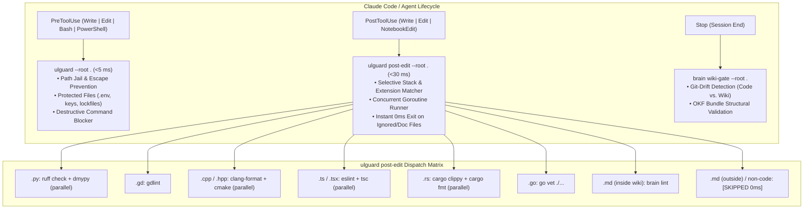

# UltraLoom Hook Architecture & Tooling Reference

[Deutsche Version](hooks.de.md)

UltraLoom replaces fragmented, slow Python and Bash wrapper scripts with a high-performance, Go-native hook execution architecture. All enforcement and linting operations complete in milliseconds without blocking agent execution turns.

---

## Architecture Overview



---

## Supported Lifecycle Events

### 1. `PreToolUse` — Security & Policy Enforcement
* **Hook Binary:** `ulguard --root "${CLAUDE_PROJECT_DIR}"`
* **Matcher:** `Write|Edit|NotebookEdit|Bash|PowerShell`
* **Execution Time:** $<5\text{ ms}$
* **Guarantees:**
  * **Path-Jail:** Blocks path traversals outside the repository workspace root.
  * **Protected Files:** Prevents accidental modification or overwrite of critical secrets (`.env`, `*.pem`, `*.key`, `id_rsa`, `*.p12`, AWS credentials, `uv.lock`, `package-lock.json`, etc.).
  * **Command Blocker:** Intercepts forbidden bash/PowerShell commands (e.g. `git push`, destructive clean commands, or custom forbidden patterns configured in `.ultraloom/config.toml`).

### 2. `PostToolUse` — Selective Concurrent Quality Enforcement
* **Hook Binary:** `ulguard post-edit --root "${CLAUDE_PROJECT_DIR}"`
* **Matcher:** `Write|Edit|NotebookEdit`
* **Execution Time:** ~25–35 ms (warm)
* **Guarantees:**
  * **Selective Execution:** Evaluates the edited file path from stdin and runs *only* the linters corresponding to that specific file's language stack.
  * **Goroutine Concurrency:** Language tools (e.g. formatting, linting, and type checking) execute in parallel threads.
  * **Zero-Overhead Bypass:** Non-code files (`.json`, `.yaml`, `.toml`, images) and non-wiki markdown documents exit immediately in $0\text{ ms}$ without spawning subprocesses.

### 3. `SessionStart` — Session Initialization & Context Injection
* **Hook Command:** `uv run --project .ultraloom/vendor/ultraloom ultraloom hook session-start --root "${CLAUDE_PROJECT_DIR}"`
* **Guarantees:** Injects active project context, latest wiki log entries, and git status into the agent prompt at the beginning of each session.

### 4. `SubagentStart` & `SubagentStop` — Multi-Agent Coordination
* **Hook Commands:** `ultraloom hook subagent-start` / `subagent-stop`
* **Guarantees:** Synchronizes workspace context and state between parent and subagent executions.

### 5. `Stop` — Session-End Integrity Gates
* **Hook Binary:** `brain wiki-gate --root "${CLAUDE_PROJECT_DIR}"` (when UltraBrain is configured)
* **Execution Time:** ~0.9–1.1 s
* **Guarantees:**
  * **Git-Drift Detection:** Verifies that if codebase modifications were made, corresponding documentation or log entries were committed in the wiki.
  * **OKF Bundle Linting:** Validates complete wiki structure, cross-links, catalog entries, and frontmatter consistency before session handover.

---

## Supported Language Stacks & Toolchains

| Stack | File Extensions | Triggered Commands (Parallel) | Description |
| :--- | :--- | :--- | :--- |
| **Python** | `.py` | `ruff check --output-format=concise .`<br>`dmypy run -- --no-error-summary --no-pretty` | Fast parallel linting and incremental daemon typechecking |
| **GDScript** | `.gd` | `gdlint <file>` | Targeted file-level GDScript linting |
| **C++ / C** | `.cpp`, `.hpp`, `.cc`, `.cxx`, `.c`, `.h` | `clang-format -i <file>`<br>`cmake --build build --parallel` | Code formatting and parallel build check |
| **TypeScript / JS** | `.ts`, `.tsx`, `.js`, `.jsx` | `npx eslint .`<br>`npx tsc --noEmit` | Parallel ESLint and TypeScript compilation check |
| **Vue** | `.vue` | `npx vue-tsc --noEmit` | Vue Single-File Component static type checking |
| **Svelte** | `.svelte` | `npx svelte-check` | Svelte component diagnostics and type verification |
| **CSS / SCSS** | `.css`, `.scss`, `.sass`, `.less` | `npx stylelint <file>` | CSS/SCSS linting for invalid selectors and property errors |
| **HTML** | `.html`, `.htm` | `npx htmlhint <file>` | HTML syntax and markup validation |
| **Shell / Bash** | `.sh`, `.bash`, `.zsh` | `shellcheck <file>` | Shell script static analysis for POSIX compliance and pitfalls |
| **SQL** | `.sql` | `sqlfluff lint <file>` | SQL dialect syntax validation and formatting check |
| **Rust** | `.rs` | `cargo clippy -- -D warnings`<br>`cargo fmt --check` | Clippy linter with zero-warning gate and formatting check |
| **Go** | `.go` | `go vet ./...` | Go static analysis verification |
| **Wiki (UltraBrain)** | `.md` *(inside wiki dir)* | `brain lint <file>` | Single-file OKF type and frontmatter validation |
| **Documentation** | `.md` *(outside wiki dir)* | *[SKIPPED]* | Instant 0ms exit; unrestricted markdown prose |
| **Assets & Data** | `.txt`, `.json`, `.yaml`, `.toml`, `.png`, ... | *[SKIPPED]* | Instant 0ms exit |

---

## Configuration & Sources of Truth

UltraLoom adheres to a strict hierarchy of configuration sources:

1. **UltraBrain (`.brain.toml`):**
   * Declares whether the repository has an active wiki layer (`[area] wiki = true`) and specifies the layout directory.
   * If `.brain.toml` is absent or `wiki = false`, all wiki gates remain disabled by default.
2. **UltraLoom Config (`.ultraloom/config.toml` & `.ultraloom/answers.toml`):**
   * Configures policy rules, protected files, allowed agents (`claude`, `gemini`), and gate thresholds.
3. **Claude Code Settings (`.claude/settings.json`):**
   * Houses the lightweight agent hook registrations pointing to `ulguard` and `ulguard post-edit`.

---

## Introspection & Diagnostics

To inspect which tools and hooks are active in your repository, run:

```bash
ulguard status
# or
ulguard explain
```

This outputs the complete inspection matrix, detected stacks, active UltraBrain settings, and audits `.claude/settings.json` for any obsolete legacy wrapper scripts.
